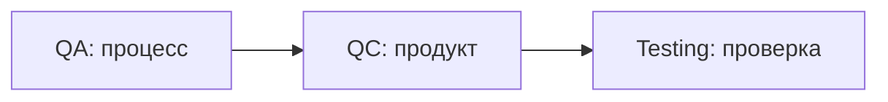
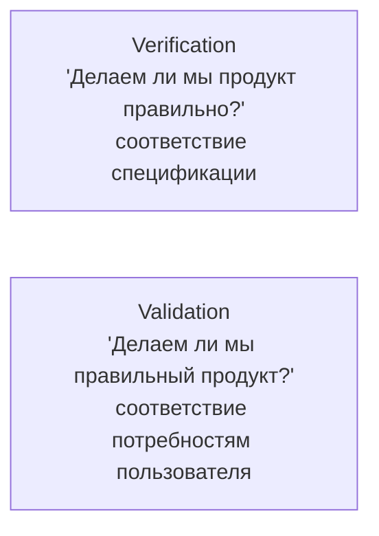
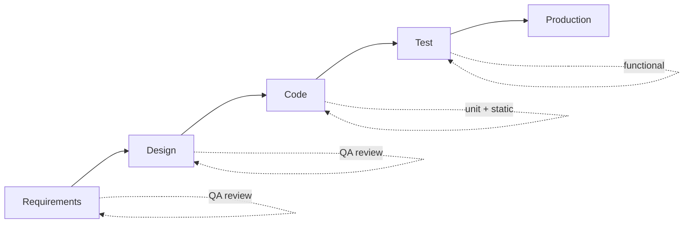
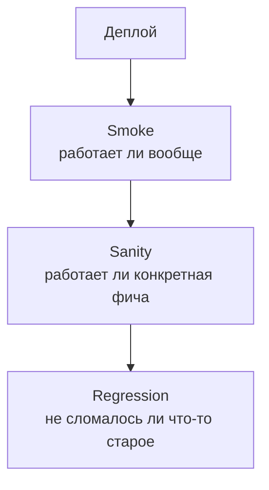
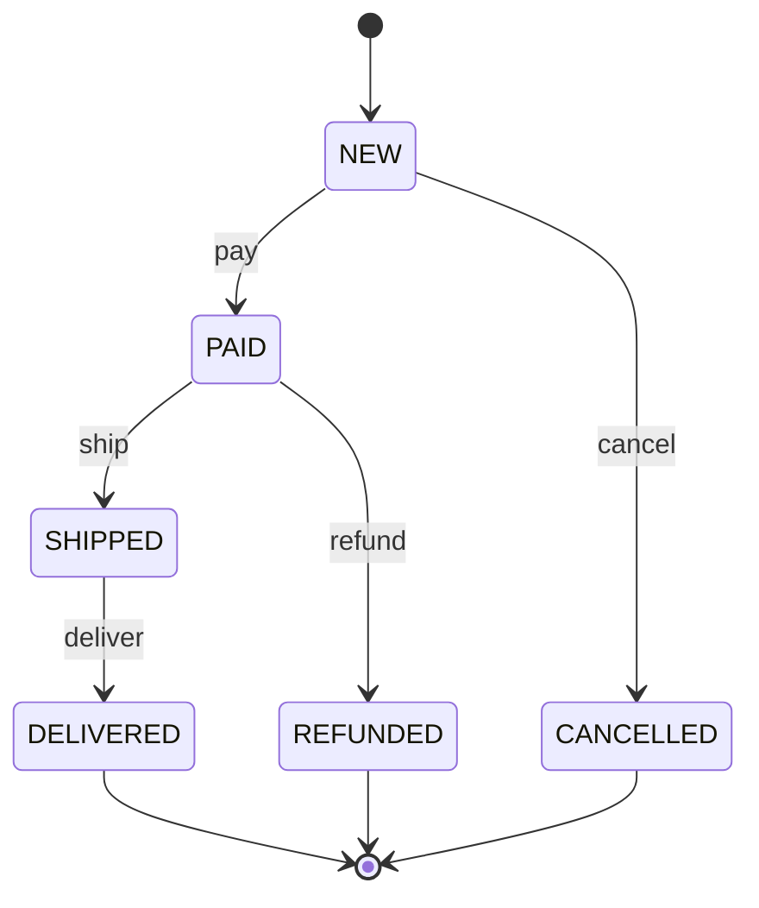
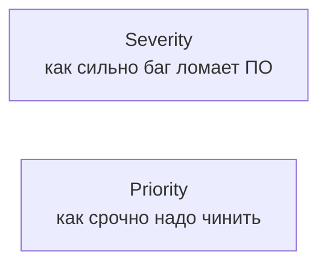
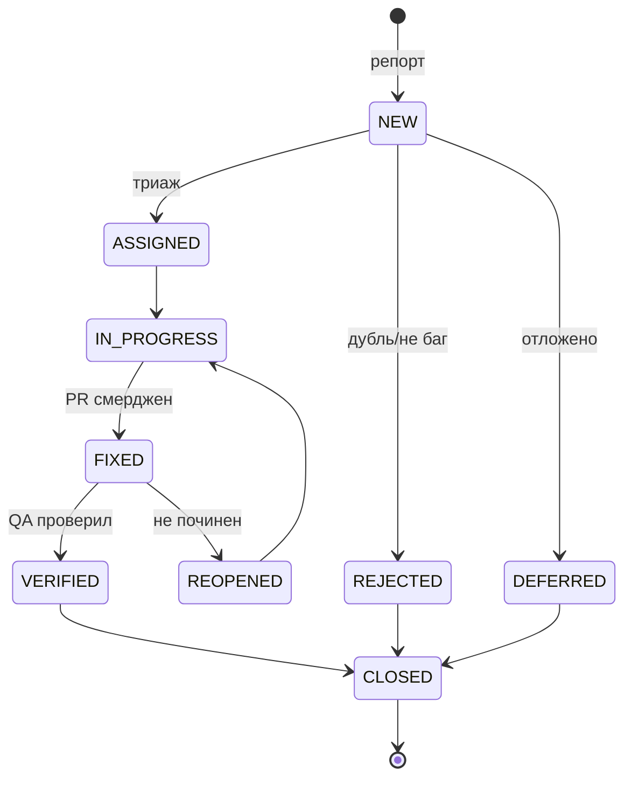
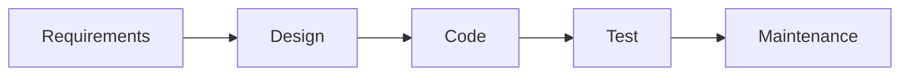
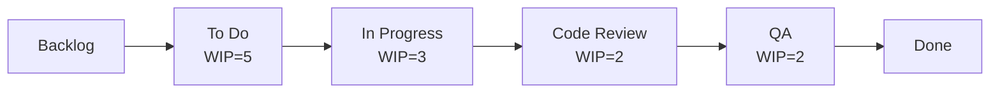
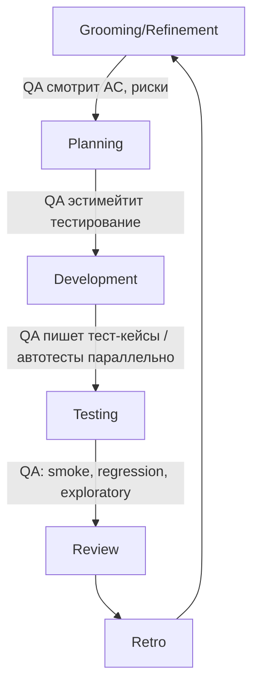

# 01. Теория тестирования

> **Цель главы:** покрыть теоретическую базу, которую спрашивают на любом QA-собесе:
> определения, виды тестов, техники тест-дизайна, баг-репорты, метрики качества.
> Без воды и устаревшего ISTQB-зубрёжа — только то, что реально нужно на работе и в интервью.

---

## Содержание

1. [Часть 1. Основы тестирования](#часть-1-основы-тестирования)
2. [Часть 2. Виды и уровни тестирования](#часть-2-виды-и-уровни-тестирования)
3. [Часть 3. Техники тест-дизайна](#часть-3-техники-тест-дизайна)
4. [Часть 4. Тест-документация](#часть-4-тест-документация)
5. [Часть 5. Баг-репорты и жизненный цикл бага](#часть-5-баг-репорты-и-жизненный-цикл-бага)
6. [Часть 6. Метрики качества](#часть-6-метрики-качества)
7. [Часть 7. Процессы: Agile, Scrum, Kanban](#часть-7-процессы-agile-scrum-kanban)
8. [Чек-лист самопроверки](#чек-лист-самопроверки)
9. [Видеоматериалы](#видеоматериалы)

---

## Часть 1. Основы тестирования

### Q1. Что такое тестирование и зачем оно нужно?

**Тестирование ПО** — процесс исследования продукта с целью получения информации о его качестве и соответствии требованиям.

**Цели:**
1. Найти дефекты до того, как их найдут пользователи
2. Подтвердить соответствие требованиям
3. Снизить риск релиза
4. Дать обратную связь команде о качестве
5. Помочь принять решение о готовности к релизу

> **Ключевая фраза для собеса:** *«Тестирование не доказывает отсутствие багов. Оно повышает уверенность в качестве».*

---

### Q2. Quality Assurance vs Quality Control vs Testing

| Термин | Расшифровка                  | Что делает                                                |
| ------ | ---------------------------- | --------------------------------------------------------- |
| **QA** | Quality Assurance            | **Процесс**: предотвращение багов, улучшение процессов    |
| **QC** | Quality Control              | **Продукт**: проверка готового результата (тестирование)  |
| **Testing** | —                       | Часть QC: исполнение тестов                               |



> На практике в РФ роли «QA Engineer» и «Tester» часто смешивают. На собесе можно сказать: *«QA — про процесс предотвращения, QC — про обнаружение в продукте, тестирование — практика QC».*

---

### Q3. 7 принципов тестирования (ISTQB)

1. **Тестирование показывает наличие, а не отсутствие багов**
2. **Исчерпывающее тестирование невозможно** (нельзя проверить все комбинации)
3. **Раннее тестирование экономит деньги** (shift-left)
4. **Кластеризация дефектов** — большинство багов в небольшой части кода
5. **Парадокс пестицида** — одни и те же тесты со временем перестают находить баги → нужно ревизовать
6. **Тестирование зависит от контекста** — банк ≠ игра ≠ медицинский прибор
7. **Заблуждение об отсутствии ошибок** — даже если багов мало, продукт может не решать задачу пользователя

---

### Q4. Verification vs Validation



| Verification              | Validation                  |
| ------------------------- | --------------------------- |
| Соответствие требованиям  | Решение задачи пользователя |
| Reviews, walkthrough      | UAT, beta-тесты             |
| Спецификация → код        | Код → реальные нужды        |

---

### Q5. Тестирование «слева направо» (shift-left)

**Shift-left** — сдвиг тестирования на ранние этапы:



- Чем раньше нашли баг — тем дешевле исправить
- На этапе требований баг стоит копейки, в проде — может стоить миллионы
- Поэтому современный QA участвует в груминге, ревью PR, парном программировании

---

### Q6. Шкала стоимости исправления бага

| Этап обнаружения       | Относительная стоимость |
| ---------------------- | ----------------------- |
| Требования             | 1×                      |
| Дизайн                 | 5×                      |
| Кодирование            | 10×                     |
| Тестирование           | 20–50×                  |
| Прод                   | 100–1000×               |

В fintech цена бага в проде может быть катастрофой (потеря денег клиентов, регуляторные штрафы, потеря лицензии).

---

## Часть 2. Виды и уровни тестирования

### Q7. Уровни тестирования

> Подробнее в главе [09. Архитектура](./09-test-architecture.md), Q3.

| Уровень           | Объект                   | Кто пишет             |
| ----------------- | ------------------------ | --------------------- |
| **Unit**          | Метод/класс              | Разработчик           |
| **Integration**   | Несколько модулей        | Разработчик / QA Auto |
| **System**        | Вся система              | QA / QA Auto          |
| **Acceptance** (UAT) | Соответствие бизнес-требованиям | Заказчик / Product |

---

### Q8. Виды тестирования по целям

**Функциональные:**
- **Smoke** — критичный минимум после деплоя
- **Sanity** — точечная проверка узкой функциональности
- **Regression** — что не сломалось после изменений
- **Re-test (confirmation)** — проверка исправленного бага
- **Acceptance** — соответствие требованиям бизнеса

**Нефункциональные:**
- **Performance** — нагрузка, throughput, latency (см. JMeter, Gatling, k6)
- **Load** — поведение под обычной нагрузкой
- **Stress** — поведение под пиковой нагрузкой и за её пределами
- **Security** — XSS, SQL injection, authn/authz, OWASP
- **Usability** — удобство использования
- **Compatibility** — работа в разных браузерах/ОС/устройствах
- **Accessibility** — доступность (WCAG, ARIA)
- **Localization / i18n** — языки, форматы дат

---

### Q9. Smoke vs Sanity vs Regression — путаница



| Тип        | Когда                              | Покрытие                | Глубина              |
| ---------- | ---------------------------------- | ----------------------- | -------------------- |
| Smoke      | После деплоя                       | Широкое (вся система)   | Мелкое (главное)     |
| Sanity     | После хотфикса / точечного фикса   | Узкое (одна фича)       | Среднее              |
| Regression | После релиза / больших изменений   | Полное                  | Глубокое             |

---

### Q10. Positive / Negative / Boundary

**Positive** — система работает в ожидаемых условиях.
```
вход: возраст 25 → принять
```

**Negative** — система корректно реагирует на ошибки.
```
вход: возраст -5 → ошибка валидации
вход: возраст "abc" → ошибка типа
вход: null → ошибка обязательности
```

**Boundary** — граничные значения.
```
вход: возраст 17 → отказать (несовершеннолетний)
вход: возраст 18 → принять (граница)
вход: возраст 99 → принять
вход: возраст 100 → отказать (граница верхняя)
```

> **Соотношение позитивных к негативным** обычно 1 : 2-3. Негативных кейсов больше — багов в краях больше.

---

### Q11. Black-box / White-box / Grey-box

| Тип       | Что знает тестировщик          | Кто и когда                 |
| --------- | ------------------------------ | --------------------------- |
| Black-box | Только спецификацию            | QA-functional, UAT          |
| White-box | Код, внутренности              | Разработчик (unit-tests)    |
| Grey-box  | Часть архитектуры (БД, очереди)| QA Auto в продуктовых командах |

В современном QA Auto чаще всего **grey-box**: знаем что после API-вызова появится запись в БД и event в Kafka — проверяем оба.

---

### Q12. Manual vs Automated — где грань

**Что хорошо автоматизировать:**
- Регрессионные сценарии, которые гонят постоянно
- Тесты, требующие точности (10 знаков после запятой в финансах)
- Долгие сценарии с предсказуемым результатом
- Smoke-тесты в CI

**Что лучше оставить ручному QA:**
- Usability, accessibility (нужен глаз/мозг)
- Exploratory testing
- One-shot фичи перед удалением
- Сложные edge-cases, ради 1-2 запусков

> **Не автоматизировать ради автоматизации.** ROI рассчитывают: «сколько раз будут гнать × экономия времени − стоимость написания и поддержки».

---

### Q13. Static vs Dynamic testing

- **Static** — без запуска кода: code review, статический анализ (SonarQube, Checkstyle, SpotBugs), линтеры, проверка документации
- **Dynamic** — с запуском: unit, integration, e2e

> Static testing — часть shift-left и часто экономит больше всего времени.

---

### Q14. Exploratory testing

**Exploratory testing** — параллельные процессы дизайна тестов, исполнения и обучения. Не из чек-листа, а с любопытством.

**Когда применять:**
- Новая фича без полной спецификации
- Поиск нестандартных багов (вне happy-path сценариев тест-кейсов)
- Тестирование UX
- Регрессия после серьёзного рефакторинга

**Подход «Sessions»:**
- 60–90 минут целевого исследования с заранее заданным charter (мандатом)
- Заметки в реальном времени (Notepad++, Markdown)
- В конце — дебриф: что нашли, что покрыто, какие риски остались

---

## Часть 3. Техники тест-дизайна

### Q15. Equivalence Partitioning (классы эквивалентности)

Разделить вход на группы, в которых система ведёт себя одинаково. Тестируем по одному представителю из каждой группы.

**Пример:** возраст 0–120, скидка для 18+
- Класс 1: < 0 (невалидный)
- Класс 2: 0–17 (без скидки)
- Класс 3: 18–120 (со скидкой)
- Класс 4: > 120 (невалидный)

→ 4 теста (по одному из каждого класса) вместо 121.

---

### Q16. Boundary Value Analysis (граничные значения)

Тестируем **на границах** классов эквивалентности, потому что баги чаще всего там.

Для возраста 0–17 / 18–120:
- Тестируем: −1, 0, 17, 18, 120, 121
- 6 значений вместо проверки всех 122

> **Совмещают:** EP даёт классы, BVA — точки на границах.

---

### Q17. Decision Table (таблица решений)

Для бизнес-логики со множеством условий.

**Пример:** скидка зависит от типа клиента и суммы заказа.

| Условие        | T1   | T2   | T3   | T4    |
| -------------- | ---- | ---- | ---- | ----- |
| Premium client | Y    | Y    | N    | N     |
| Order > 10000  | Y    | N    | Y    | N     |
| **Скидка**     | 20%  | 10%  | 5%   | 0%    |

Каждый столбец = тест-кейс.

---

### Q18. State Transition Testing

Для систем с состояниями (заказ: NEW → PAID → SHIPPED → DELIVERED).



**Тесты:** все валидные переходы + все НЕвалидные (например, попытка `pay` из `DELIVERED` → ошибка).

---

### Q19. Pairwise / Combinatorial testing

При большом числе параметров полная комбинация = взрыв. **Pairwise** — покрытие всех **пар** значений (статистика: ~80% багов ловятся на парах).

**Пример:** 3 ОС × 3 браузера × 4 локали = 36 комбинаций.
Pairwise → ~12 комбинаций (PICT, AllPairs).

Инструменты:
- **PICT (Microsoft)** — https://github.com/Microsoft/pict
- **AllPairs** — https://www.satisfice.com/tools

---

### Q20. Use Case Testing / User Story Testing

Тесты по сценариям пользователя:

```
US: «Как клиент, я хочу оплатить заказ, чтобы получить услугу»

Acceptance criteria:
1. Доступны методы: карта, СБП
2. После успешной оплаты — статус заказа PAID
3. При отказе банка — статус FAILED, можно повторить
4. Email-уведомление в течение 1 минуты
```

→ тесты на каждый AC + boundary + negative.

---

### Q21. Error Guessing — интуитивный поиск багов

Опытный тестировщик «угадывает» места багов:
- Пустые поля, null
- Очень длинные строки
- Спецсимволы, emoji, unicode
- SQL/HTML injection
- Отрицательные числа, ноль, переполнение
- Параллельные запросы
- Прерывание середины операции (закрытие вкладки)
- Race condition при двойном клике

Эта техника не заменяет систематическую, но дополняет её.

---

## Часть 4. Тест-документация

### Q22. Виды тест-документации

| Документ                 | Что в нём                                     |
| ------------------------ | --------------------------------------------- |
| **Test Plan**            | Стратегия, scope, риски, расписание           |
| **Test Strategy**        | Высокоуровневый подход (на проект)            |
| **Test Case**            | Шаги для конкретной проверки                  |
| **Checklist**            | Список «что проверить» без пошаговых деталей  |
| **Test Suite**           | Группа связанных тест-кейсов                  |
| **Bug Report**           | Описание дефекта                              |
| **Test Report**          | Итоги прогона                                 |
| **Traceability Matrix**  | Связь требований ↔ тестов                     |

---

### Q23. Структура тест-кейса

```yaml
ID: TC-001
Title: Успешная авторизация валидными данными
Module: Authentication
Priority: High
Type: Positive

Preconditions:
  - Пользователь зарегистрирован: test@bank.ru / Pass123!
  - Аккаунт активен

Steps:
  1. Открыть https://app.bank.ru/login
  2. Ввести email "test@bank.ru"
  3. Ввести пароль "Pass123!"
  4. Нажать "Sign in"

Expected Result:
  - Происходит редирект на /dashboard
  - В шапке отображается имя пользователя
  - В localStorage записан токен

Postconditions:
  - Пользователь залогинен
```

---

### Q24. Test Plan — что должно быть

**По IEEE 829 (минимально достаточный):**
1. Цели и scope
2. Что тестируем / что не тестируем (in scope / out of scope)
3. Критерии входа и выхода (entry/exit)
4. Подход (виды тестирования, инструменты)
5. Расписание и веха (milestones)
6. Риски и митигации
7. Роли и ответственности
8. Ресурсы (среды, данные, доступы)

В Agile часто заменяется кратким **Test Strategy** на 1 страницу.

---

### Q25. Чек-лист vs Тест-кейс

| Критерий            | Чек-лист                          | Тест-кейс                      |
| ------------------- | --------------------------------- | ------------------------------ |
| Детальность         | Высокоуровневый                   | Пошаговый                      |
| Время на написание  | 5 мин                             | 15–30 мин                      |
| Когда лучше         | Стабильная фича, опытная команда | Новая фича, регрессия, аутсорс |
| Воспроизводимость   | Низкая                            | Высокая                        |

В современных продуктовых командах **чаще чек-листы** + автотесты вместо детальных тест-кейсов.

---

## Часть 5. Баг-репорты и жизненный цикл бага

### Q26. Структура хорошего баг-репорта

```yaml
ID: BUG-1234
Title: [Login] Сессия не сохраняется после "Запомнить меня" в Safari 17

Severity: Major
Priority: High
Component: Authentication
Affected version: 2.5.1
Found in: Stage
Environment: macOS 14.4, Safari 17.4

Steps to reproduce:
  1. Открыть /login
  2. Ввести валидные креды
  3. Поставить галку "Запомнить меня"
  4. Залогиниться → попадаем на /dashboard
  5. Закрыть вкладку
  6. Открыть https://app.bank.ru снова

Expected:
  - Пользователь остаётся залогинен, попадает на /dashboard

Actual:
  - Редирект на /login, требуется повторно ввести креды

Logs / Screenshots / Traces:
  - [screenshot.png]
  - [trace.zip]
  - В консоли: "Cookie SameSite=Strict rejected"

Reproducibility: 100%
Workaround: использовать Chrome / Firefox

Notes:
  - В Chrome 121 баг не воспроизводится
  - В Safari 16 не воспроизводится
  - Связано с изменением SameSite policy в Safari 17
```

---

### Q27. Severity vs Priority



**Severity (степень влияния):**
- Blocker — система не работает, нет workaround
- Critical — критичная функция сломана
- Major — важная функция работает с ограничениями
- Minor — некритично, есть workaround
- Trivial — косметика (опечатка в подсказке)

**Priority (срочность):**
- Immediate / P0 — фиксим прямо сейчас
- High / P1 — в ближайший спринт
- Medium / P2 — в ближайшие релизы
- Low / P3 — когда-нибудь

**Примеры комбинаций:**
- Severity: Critical, Priority: Low → банк не открывается на Internet Explorer 6 (никто не использует)
- Severity: Trivial, Priority: High → опечатка в логотипе на главной (PR-ущерб)

---

### Q28. Жизненный цикл бага



В реальных трекерах (Jira, YouTrack) workflow можно настроить под команду — это **типовой**.

---

### Q29. Когда баг — не баг (Won't Fix / Not a Bug / By Design)

- **By Design** — поведение соответствует требованиям (но юзеру может не нравиться → задача для PM)
- **Not a Bug** — спека не нарушена, баг был в воспроизведении
- **Won't Fix** — баг есть, но чинить не будем (дорого, малое влияние, скоро удалим фичу)
- **Cannot Reproduce** — не воспроизводится → нужны доп. данные, иначе закрыть
- **Duplicate** — уже есть в трекере

---

## Часть 6. Метрики качества

### Q30. Метрики продуктового качества

| Метрика                            | Формула                                    | Что показывает              |
| ---------------------------------- | ------------------------------------------ | --------------------------- |
| **Defect Density**                 | багов / KLOC                               | Качество кода               |
| **Defect Removal Efficiency (DRE)** | (Найдено до прода) / (всего найдено)      | Эффективность QA            |
| **Defect Escape Rate**             | Багов в проде / всего багов                | Сколько утекло              |
| **Test Coverage**                  | Покрытие кода unit-тестами (%)             | Качество автотестов         |
| **Passed/Failed Test Ratio**       | Проходят / всего                           | Стабильность билда          |
| **Mean Time To Detect (MTTD)**     | Сколько времени проходит до обнаружения    | Скорость детекции           |
| **Mean Time To Repair (MTTR)**     | Сколько времени до исправления             | Скорость реакции            |
| **Flaky Rate**                     | Flaky-тестов / всего                       | Здоровье тест-сьюта         |

> **Ловушка:** Code Coverage 100% не = качество. Можно покрыть всё пустыми тестами без assertions. Coverage — sanity check, не цель.

---

### Q31. Метрики команды QA

- **Velocity** — сколько тест-кейсов / сценариев закрыли за спринт
- **Bug Find Rate** — багов на час тестирования
- **Reopen Rate** — % багов, которые QA пришлось переоткрывать
- **Automation Coverage** — % тест-кейсов автоматизированы
- **CI Pipeline Time** — сколько идёт прогон автотестов

> Метрики — инструмент, не цель. На метриках легко устроить cargo cult.

---

## Часть 7. Процессы: Agile, Scrum, Kanban

### Q32. Waterfall vs Agile

**Waterfall:**

- Длинный цикл, одна большая поставка
- QA подключается в конце
- В РФ почти не используется (кроме госов / военных)

**Agile** — итерации, быстрые релизы, постоянная обратная связь.

> **Manifesto Agile:**
> - Люди и взаимодействие важнее процессов и инструментов
> - Работающий продукт важнее исчерпывающей документации
> - Сотрудничество с клиентом важнее формальных контрактов
> - Готовность к изменениям важнее следования плану

---

### Q33. Scrum: артефакты, события, роли

**Роли:**
- **Product Owner** — владелец бэклога, приоритеты
- **Scrum Master** — фасилитатор, убирает блокеры
- **Development Team** — кросс-функциональная команда (включая QA)

**Артефакты:**
- **Product Backlog** — список фич/багов
- **Sprint Backlog** — что взяли в спринт
- **Increment** — готовая фича к концу спринта

**События (ceremonies):**
- **Sprint Planning** — что берём в спринт
- **Daily Standup** — 15 мин синхронизации
- **Sprint Review** — демо результатов
- **Retrospective** — что улучшить в процессе

---

### Q34. Kanban — что и когда

**Kanban** — поток задач без фиксированных спринтов, с лимитами WIP (work in progress).



**Когда лучше:**
- Поддержка / hotfix-команды
- Команды с непредсказуемым потоком (входящие баги)
- Когда нет смысла в фиксированных итерациях

---

### Q35. DoR / DoD — Definition of Ready / Done

**Definition of Ready** — критерии, что задача **готова в работу**:
- Acceptance criteria есть
- Дизайн сделан
- Зависимости понятны
- Эстимейт дан
- QA понимает как проверять

**Definition of Done** — критерии, что задача **сделана**:
- Код смерджен
- Code review прошёл
- Unit-тесты написаны и зелёные
- Автотесты на acceptance criteria есть
- Документация обновлена
- На stage задача проверена

---

### Q36. Где QA в Scrum (типичные практики)



**Best practices:**
- **Three Amigos** (PO + Dev + QA) — обсуждают AC до старта работ
- **Shift-left** — QA подключается на грумминге
- **In-sprint testing** — тестирование внутри спринта, не после
- **TDD/BDD** — тесты пишутся вместе или до кода

---

## Чек-лист самопроверки

- [ ] Объясняю что такое тестирование и его 7 принципов
- [ ] Различаю QA / QC / Testing, Verification / Validation
- [ ] Знаю shift-left и обоснование «чем раньше — тем дешевле»
- [ ] Различаю unit / integration / system / acceptance уровни
- [ ] Различаю smoke / sanity / regression / re-test
- [ ] Объясняю функциональные и нефункциональные виды
- [ ] Различаю black/white/grey-box
- [ ] Применяю Equivalence Partitioning + Boundary Value Analysis на задаче
- [ ] Строю Decision Table для бизнес-логики
- [ ] Применяю State Transition для систем с состояниями
- [ ] Знаю про pairwise testing и его инструменты
- [ ] Пишу тест-кейс по структуре (preconditions / steps / expected)
- [ ] Пишу баг-репорт со всеми важными полями
- [ ] Различаю severity и priority, могу привести «странные» комбинации
- [ ] Знаю жизненный цикл бага
- [ ] Объясняю основные метрики качества (DRE, escape rate, coverage)
- [ ] Знаю Scrum-роли, артефакты, события
- [ ] Понимаю где QA в Scrum, Three Amigos, in-sprint testing
- [ ] Различаю DoR и DoD, могу составить для своей команды

---

## Видеоматериалы

### Русскоязычные

- **Heisenbug — теория тестирования** — https://www.youtube.com/@HeisenbugConf
- **Школа тестировщиков (Stepik)** — https://stepik.org/course/575
- **«Software-testing.ru», Алексей Баранцев** — http://software-testing.ru
- **«Тестирование, qa и аналитика», Артём Русов** на YouTube.

### Англоязычные

- **«Software Testing» Cem Kaner / James Bach** — лекции Black Box Testing School.
- **Test Automation University — Foundations** — https://testautomationu.applitools.com
- **«ISTQB Foundation Level Course», ISTQB official** — на YouTube.

### Книги

- **«Тестирование dot com», Роман Савин** — классика для русскоязычных QA.
- **«Lessons Learned in Software Testing», Cem Kaner et al.** — 293 урока из практики.
- **«Agile Testing», Lisa Crispin & Janet Gregory** — про QA в Agile.
- **«The Art of Software Testing», Glenford Myers** — фундамент.

### Сертификации (для общего развития)

- **ISTQB Foundation Level** — https://www.istqb.org — хорошо для CV, но не главное.
- **Стоит ли сдавать?** На senior-уровне в РФ — спрашивают редко. На middle и junior — может выделить из толпы.

---

[← К оглавлению](./README.md) · [Следующая: 02. Java Core →](./02-java-core.md)
