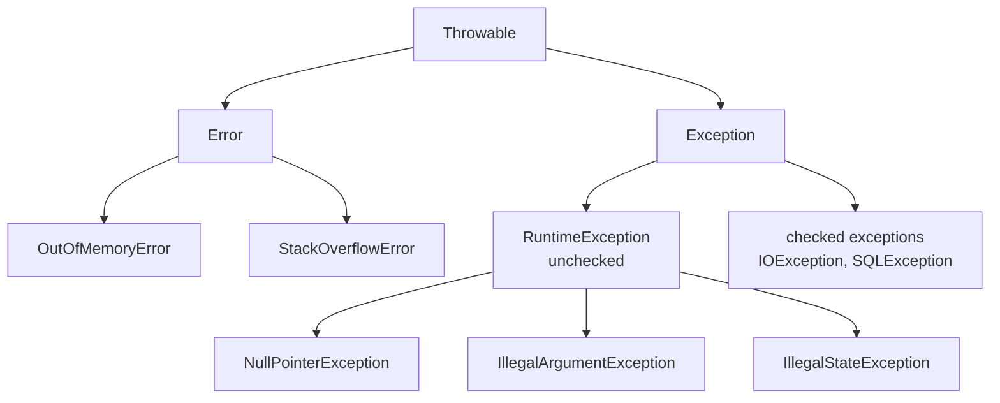
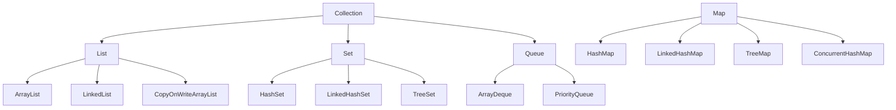
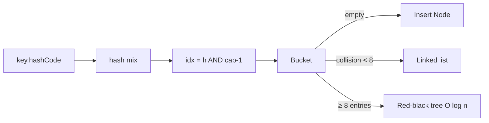
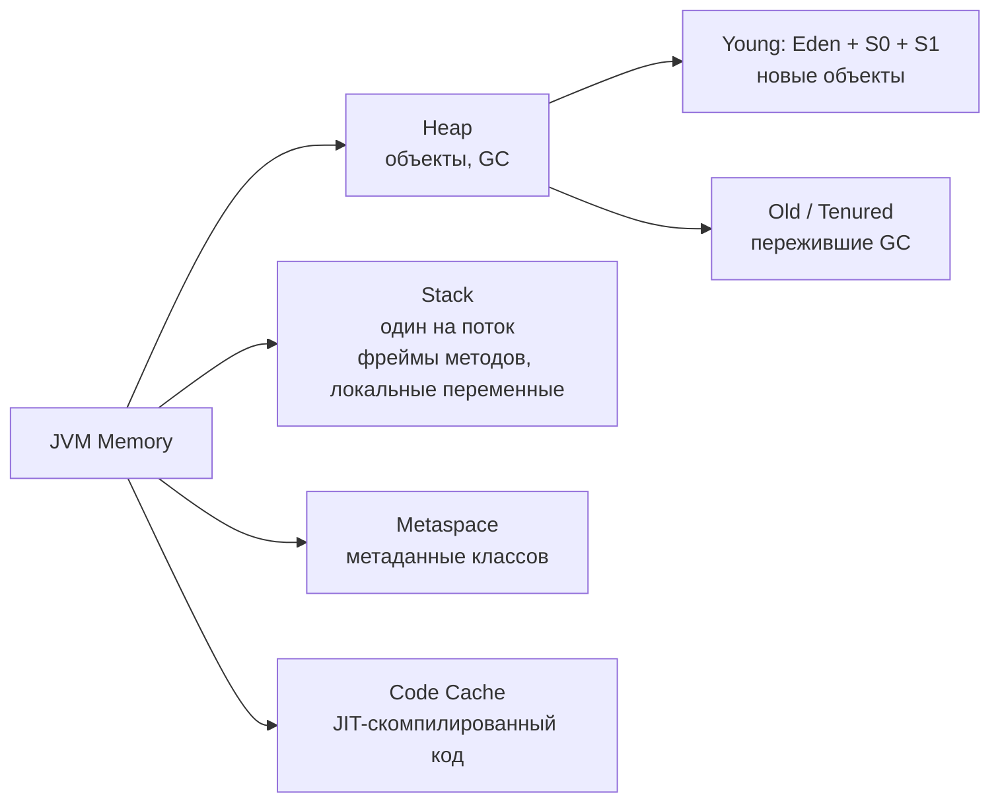

# 02. Java Core (средний уровень)

> **Цель главы:** покрыть базу Java, которую обязательно спросят на интервью на QA Auto Middle+/Senior.
> Современная Java (17+ LTS, актуально и для 21). Уклон в практику и нюансы, которые отличают senior'а.

---

## Содержание

1. [Часть 1. ООП и базовые концепции](#часть-1-ооп-и-базовые-концепции)
2. [Часть 2. Equals / hashCode / immutable / records](#часть-2-equals--hashcode--immutable--records)
3. [Часть 3. Исключения](#часть-3-исключения)
4. [Часть 4. Generics и wildcards](#часть-4-generics-и-wildcards)
5. [Часть 5. Коллекции](#часть-5-коллекции)
6. [Часть 6. Stream API и функциональные интерфейсы](#часть-6-stream-api-и-функциональные-интерфейсы)
7. [Часть 7. Многопоточность (базово)](#часть-7-многопоточность-базово)
8. [Часть 8. JVM и память (базово)](#часть-8-jvm-и-память-базово)
9. [Часть 9. Современная Java: var, sealed, pattern matching, switch expressions](#часть-9-современная-java)
10. [Чек-лист самопроверки](#чек-лист-самопроверки)
11. [Видеоматериалы](#видеоматериалы)

---

## Часть 1. ООП и базовые концепции

### Q1. Что такое четыре принципа ООП?

| Принцип            | Суть                                                  | Пример Java                                       |
| ------------------ | ----------------------------------------------------- | ------------------------------------------------- |
| **Инкапсуляция**   | Скрытие данных, доступ через методы                   | `private` поля + `public` геттеры                 |
| **Наследование**   | Класс наследует поведение другого                     | `class Dog extends Animal`                        |
| **Полиморфизм**    | Один интерфейс — разные реализации                    | `Animal a = new Dog(); a.sound()` → "woof"        |
| **Абстракция**     | Скрытие деталей реализации за интерфейсом             | `interface Repo`, имплементации скрыты            |

**Бонус — SOLID** (часто спрашивают вместе):

- **S**ingle Responsibility — один класс, одна причина меняться
- **O**pen/Closed — открыт для расширения, закрыт для изменения
- **L**iskov Substitution — наследник заменяем родителем без сюрпризов
- **I**nterface Segregation — много мелких интерфейсов лучше одного жирного
- **D**ependency Inversion — зависим от абстракций, не от реализаций

---

### Q2. В чём разница между класс, интерфейс и абстрактный класс?

| Критерий                  | Класс                  | Абстрактный класс       | Интерфейс                              |
| ------------------------- | ---------------------- | ----------------------- | -------------------------------------- |
| Можно создать `new`       | да                     | нет                     | нет                                    |
| Конструктор               | да                     | да                      | нет                                    |
| Состояние (поля)          | да                     | да                      | только `static final`                  |
| Множественное наследование| `extends` 1 класс      | `extends` 1             | `implements` много                     |
| Default методы            | n/a                    | обычные методы          | `default` (Java 8+)                    |
| Private методы            | да                     | да                      | да (Java 9+)                           |
| Static методы             | да                     | да                      | да (Java 8+)                           |

**Когда что:**
- **Интерфейс** — контракт, шаблон. Дефолт для абстракции в современной Java.
- **Абстрактный класс** — общая реализация + хук-методы для подклассов (template method).
- **Класс** — конкретная реализация.

---

### Q3. Что такое Полиморфизм и в чём разница между его видами: статический и динамический?

**Static (compile-time)** — overloading: разные методы с одним именем, разные параметры.
```java
int sum(int a, int b) { return a + b; }
double sum(double a, double b) { return a + b; }
```
Какой метод — выбирается **на этапе компиляции** по типам аргументов.

**Dynamic (runtime)** — overriding: подкласс переопределяет метод родителя.
```java
class Animal { String sound() { return "..."; } }
class Dog extends Animal { @Override String sound() { return "woof"; } }

Animal a = new Dog();
a.sound(); // "woof" — на runtime по реальному классу
```

> На собесе: **«Override — динамический, overload — статический»**.

---

### Q4. Что такое final, static, abstract?

```java
// final — нельзя переопределить / переприсвоить
final class String { }                  // нельзя унаследовать
final void method() { }                 // нельзя переопределить
final int x = 10;                       // нельзя переприсвоить (immutable variable)
final List<String> list = new ArrayList<>(); // ссылка финальна, СОДЕРЖИМОЕ можно менять (!)

// static — принадлежит классу, не экземпляру
class Counter {
    static int total = 0;               // общая переменная
    static int total() { return total; } // вызов: Counter.total()
}

// abstract — нет реализации, реализуют наследники
abstract class Shape { abstract double area(); }
```

> **Ловушка:** `final List<String>` — лист **изменяемый**, его контейнер `final`. Чтобы быть immutable, нужен `List.of(...)` или `Collections.unmodifiableList(...)`.

---

### Q5. В чём разница между перегрузка и переопределение?

**Overloading (перегрузка):** одно имя, разные параметры.
- Возвращаемый тип НЕ участвует в выборе
- Может быть в одном классе или в наследнике

**Overriding (переопределение):** наследник переопределяет родительский метод.
- Сигнатура **должна совпадать** (имя, параметры)
- Возвращаемый тип может быть covariant (наследник того, что у родителя)
- Видимость **не уже**, чем у родителя
- `throws` — только проверяемые исключения родителя или их подтипы
- `@Override` — не обязательная аннотация, но крайне рекомендуется

```java
class A {
    public Number get() throws Exception { return 1; }
}
class B extends A {
    @Override
    public Integer get() throws IOException { return 2; }   // OK: уже тип, уже throws
}
```

---

## Часть 2. Equals / hashCode / immutable / records

### Q6. Что такое контракт equals и hashCode?

**Контракт `equals`:**
1. **Рефлексивность:** `x.equals(x)` → true
2. **Симметричность:** `x.equals(y)` ↔ `y.equals(x)`
3. **Транзитивность:** `x.equals(y) && y.equals(z)` → `x.equals(z)`
4. **Постоянство:** результат не меняется без изменения полей
5. **`x.equals(null)` → false**

**Контракт `hashCode`:**
1. Если `equals(b)` → `hashCode == b.hashCode()` (**ОБЯЗАТЕЛЬНО**)
2. Обратное НЕ обязательно (могут быть коллизии)
3. Постоянен в течение жизни объекта (если неизменяемый)

**Что ломается при нарушении:**
- В `HashMap`/`HashSet` объект «теряется»: `put(key, v)` положил, `get(key)` не нашёл

---

### Q7. Что такое современные equals/hashCode?

```java
// Старый стиль (если используешь IDE-генератор):
@Override
public boolean equals(Object o) {
    if (this == o) return true;
    if (!(o instanceof User user)) return false; // pattern matching, Java 16+
    return id == user.id && Objects.equals(email, user.email);
}

@Override
public int hashCode() {
    return Objects.hash(id, email);
}
```

**Новый стиль — `record`:**
```java
public record User(long id, String email) { }
// equals, hashCode, toString — генерятся компилятором
```

> Для DTO/value-объектов в современной Java — **records** по умолчанию.

---

### Q8. Что такое immutable объект и зачем?

**Immutable** — поля окончательны после конструктора, объект не меняется.

**Признаки:**
- Все поля `private final`
- Нет setter'ов
- Класс `final` (нельзя унаследовать и подкинуть mutable subclass)
- В конструкторе делать **defensive copy** для mutable полей (`new ArrayList<>(input)`)
- Геттеры возвращают копии, а не ссылки (для mutable полей)

**Преимущества:**
- Thread-safe бесплатно
- Безопасны как ключи `HashMap`
- Нельзя сломать инвариант после создания
- Легко рассуждать о коде

**Примеры в JDK:**
- `String`, `Integer/Long/...` (boxed primitives)
- `LocalDate`, `LocalDateTime`, `Duration` (java.time)
- `List.of(...)`, `Map.of(...)` — unmodifiable views

---

### Q9. Что такое Records?

```java
public record User(long id, String email, List<String> roles) {

    // Валидация в compact constructor
    public User {
        Objects.requireNonNull(email, "email");
        if (id < 0) throw new IllegalArgumentException("id must be >= 0");
        roles = List.copyOf(roles);    // defensive copy
    }

    // Доп. методы можно добавлять
    public boolean isAdmin() { return roles.contains("admin"); }

    // Static factory
    public static User anonymous() { return new User(0, "anon@example.com", List.of()); }
}
```

**Ограничения:**
- Не наследуют от других классов (`extends Object` неявно)
- Все поля `final`
- Не могут иметь instance-полей вне header

**Когда НЕ использовать record:**
- Нужно изменяемое состояние
- Нужен сложный жизненный цикл (Spring bean)

---

### Q10. В чём разница между == и equals для строк?

```java
String a = "hello";
String b = "hello";
String c = new String("hello");
String d = c.intern();

a == b      // true  — обе из string pool
a == c      // false — c в куче, a в pool
a == d      // true  — intern() возвращает каноническую ссылку
a.equals(c) // true
```

**На собесе:** `==` для объектов сравнивает **ссылки**. Для содержимого строк — **только `equals`**.

---

## Часть 3. Исключения

### Q11. Что такое иерархия исключений?



| Тип               | Compile check     | Кто бросает                          |
| ----------------- | ----------------- | ------------------------------------ |
| `Error`           | unchecked         | JVM (нечасто ловят)                  |
| `RuntimeException`| unchecked         | Логические ошибки кода               |
| Checked Exception | **обязан throws** | I/O, сеть, БД                        |

---

### Q12. В чём разница между try, catch, finally и try-with-resources?

```java
// Классический try-finally
FileReader fr = null;
try {
    fr = new FileReader("file.txt");
    // ...
} catch (FileNotFoundException e) {
    log.error("file not found", e);
} finally {
    if (fr != null) try { fr.close(); } catch (IOException ignored) {}
}

// try-with-resources (Java 7+) — авто-закрытие AutoCloseable
try (FileReader fr = new FileReader("file.txt");
     BufferedReader br = new BufferedReader(fr)) {
    return br.readLine();
} catch (IOException e) {
    log.error("read error", e);
    return null;
}
```

**Multi-catch (Java 7+):**
```java
try { } catch (IOException | SQLException e) { /* общая обработка */ }
```

> Современный код **всегда** использует try-with-resources для `AutoCloseable`.

---

### Q13. В чём разница между Checked и unchecked?

**Checked (`throws IOException`)** — клиент **обязан** обработать или пробросить.
- Спорный концепт. В современной Java тренд — **минимизировать checked**.
- Spring оборачивает все checked в `DataAccessException` (unchecked).

**Unchecked (`RuntimeException`)** — программные ошибки.
- `IllegalArgumentException` — невалидные аргументы метода
- `IllegalStateException` — объект в неподходящем состоянии
- `NullPointerException` — null там, где не должно
- `UnsupportedOperationException` — операция не реализована

**Best practice для тестов:**
- В тестах не ловить исключения «на всякий случай» — пусть тест **упадёт с правильным сообщением**, тогда видно где проблема
- Для негативных кейсов — `assertThrows` (JUnit 5) или AssertJ:
```java
assertThatThrownBy(() -> client.getUser(-1))
    .isInstanceOf(IllegalArgumentException.class)
    .hasMessageContaining("id must be positive");
```

---

### Q14. Что такое кастомные исключения?

```java
public class PaymentException extends RuntimeException {
    private final String orderId;

    public PaymentException(String orderId, String message, Throwable cause) {
        super(message, cause);
        this.orderId = orderId;
    }

    public String orderId() { return orderId; }
}
```

**Правила:**
- Расширять `RuntimeException` (если не библиотека с явной обработкой)
- Конструктор с `(message, cause)` — обязательно сохранять причину
- Можно добавлять контекст полями

---

### Q15. Что такое подавление исключений (suppressed exceptions)?

В try-with-resources, если основной блок и `close()` оба бросили исключение — `close()`-исключение **подавляется** и сохраняется в `e.getSuppressed()`:

```java
try {
    try (Resource r = new Resource()) {
        throw new RuntimeException("primary");
    }
} catch (Exception e) {
    System.out.println(e.getMessage());                  // "primary"
    System.out.println(e.getSuppressed()[0].getMessage()); // "close failed"
}
```

---

## Часть 4. Generics и wildcards

### Q16. Зачем нужны generics?

**Без generics (до Java 5):**
```java
List list = new ArrayList();
list.add("hello");
String s = (String) list.get(0); // явное приведение, runtime-error возможен
```

**С generics:**
```java
List<String> list = new ArrayList<>();
list.add("hello");
String s = list.get(0); // type-safe на этапе компиляции
```

**Типизация — на этапе компиляции (type erasure):** в runtime `List<String>` и `List<Integer>` одинаковы.

---

### Q17. Что такое wildcards в Java Generics и в чём разница между ?, ? extends T и ? super T?

**PECS — Producer Extends, Consumer Super.**

```java
// Producer — берём данные, читаем (extends)
void readAll(List<? extends Number> source) {
    for (Number n : source) System.out.println(n);
    // source.add(...) — ЗАПРЕЩЕНО, кроме null
}

// Consumer — кладём данные (super)
void addNumbers(List<? super Integer> target) {
    target.add(1); target.add(2);
    // Object o = target.get(0); — берём только Object
}

// Безграничный wildcard
void printSize(List<?> any) {
    System.out.println(any.size());
    // any.add(...) — нельзя кроме null
}
```

**Запоминание:**
- `<? extends T>` — иерархия **вниз** от T (читаем как T)
- `<? super T>` — иерархия **вверх** от T (пишем T)
- `<?>` — что угодно, только читаем

---

### Q18. Что такое Bounded type parameters и зачем это нужно?

```java
// T должен быть Number или его наследником
public static <T extends Number> double sum(List<T> list) {
    double s = 0;
    for (T x : list) s += x.doubleValue();
    return s;
}

// Несколько границ через &
public static <T extends Comparable<T> & Serializable> T max(List<T> list) {
    return Collections.max(list);
}
```

---

### Q19. Что такое Type erasure?

В runtime generic-типы стираются: `List<String>` → `List`, `T` → `Object` (или верхняя граница).

**Последствия:**
1. Нельзя `new T()` — нет информации о типе
2. Нельзя `if (x instanceof List<String>)` — только `instanceof List<?>`
3. Перегрузка по generic-типу не работает: `void m(List<String>)` и `void m(List<Integer>)` имеют ту же signature после erasure

**Workaround — `Class<T>` параметром:**
```java
public <T> T parse(String json, Class<T> type) {
    return mapper.readValue(json, type);
}
parse(jsonStr, User.class);
```

---

## Часть 5. Коллекции

> Сложности коллекций — см. главу [13. Алгоритмы](./13-algorithms.md), Q4-Q8.

### Q20. Что такое List, Set, Map?



> **Важно:** `Map` НЕ наследует `Collection`.

---

### Q21. В чём разница между ArrayList и LinkedList?

В **99%** случаев — `ArrayList`. `LinkedList` уступает по скорости из-за плохой cache locality (узлы разбросаны в памяти). Преимущество `LinkedList` — `O(1)` вставка/удаление **по итератору**, но `ArrayDeque` обычно лучше.

**Внутренняя структура:**

- `ArrayList` — динамический массив. Элементы лежат в памяти подряд. При заполнении создаётся новый массив ×1.5 и данные копируются.
- `LinkedList` — двусвязный список. Каждый узел хранит `prev`, `next` и значение. Элементы разбросаны в куче → cache miss при каждом переходе.

**Сложность операций:**

| Операция                     | ArrayList | LinkedList |
| ----------------------------- | --------- | ---------- |
| `get(i)` по индексу          | **O(1)**  | O(n)       |
| `add` в конец                | O(1) amortized | O(1)  |
| `add(i, e)` / `remove(i)` в середину | O(n) (сдвиг) | O(n) (поиск) + O(1) (вставка) |
| `add(0, e)` в начало         | O(n)      | **O(1)**   |
| Итерация последовательно      | **быстро** (cache-friendly) | медленно |

> **На собесе:** `LinkedList.get(i)` медленнее потому что нет прямого адреса — нужно идти от head. `ArrayList.add(i)` медленнее потому что нужно сдвигать все элементы правее индекса.

---

### Q22. Как устроен HashMap внутри изнутри?

**Алгоритм `put`:**
1. `hash(key)` — комбинирует `hashCode` со старшими битами для лучшего распределения
2. `idx = hash & (capacity - 1)` (capacity всегда степень двойки)
3. Если bucket пустой — кладём `Node(key, value)`
4. Если коллизия — список / treeify (≥ 8 элементов и capacity ≥ 64) → красно-чёрное дерево
5. После `put` если `size > threshold` (capacity × loadFactor, default 0.75) → `resize()` ×2



**`HashMap` НЕ thread-safe.** Параллельный `put` может зациклить `next`-ссылки (до Java 8) или просто потерять данные.

---

### Q23. Что такое iterator и ConcurrentModificationException?

```java
List<String> list = new ArrayList<>(List.of("a", "b", "c"));
for (String s : list) {
    if (s.equals("b")) list.remove(s); // ❌ ConcurrentModificationException
}

// Правильно — через Iterator
Iterator<String> it = list.iterator();
while (it.hasNext()) {
    if (it.next().equals("b")) it.remove();
}

// Или Stream
list = list.stream().filter(s -> !s.equals("b")).toList();
```

---

### Q24. В чём разница между Comparable и Comparator?

```java
// Comparable — естественный порядок класса
public class User implements Comparable<User> {
    @Override public int compareTo(User other) {
        return Long.compare(this.id, other.id);
    }
}
Collections.sort(users); // используется compareTo

// Comparator — пользовательский порядок
Comparator<User> byEmail = Comparator.comparing(User::email);
Comparator<User> byEmailDesc = byEmail.reversed();
Comparator<User> byEmailThenId = byEmail.thenComparingLong(User::id);

users.sort(byEmail);
users.sort(Comparator.comparing(User::email).thenComparingLong(User::id));
```

---

## Часть 6. Stream API и функциональные интерфейсы

### Q25. Что такое Functional interfaces?

| Интерфейс            | Сигнатура                  | Пример                                |
| -------------------- | -------------------------- | ------------------------------------- |
| `Supplier<T>`        | `T get()`                  | `() -> "hello"`                       |
| `Consumer<T>`        | `void accept(T t)`         | `s -> System.out.println(s)`          |
| `Function<T,R>`      | `R apply(T t)`             | `s -> s.length()`                     |
| `Predicate<T>`       | `boolean test(T t)`        | `s -> s.startsWith("a")`              |
| `BiFunction<T,U,R>`  | `R apply(T,U)`             | `(a, b) -> a + b`                     |
| `UnaryOperator<T>`   | `T apply(T)`               | `s -> s.toUpperCase()`                |
| `Runnable`           | `void run()`               | `() -> doWork()`                      |

---

### Q26. Что такое Method references и зачем это нужно?

```java
// Static
Function<String, Integer> parse = Integer::parseInt;

// Instance method
String s = "hello";
Supplier<Integer> len = s::length;

// Method on parameter type
Function<String, Integer> length = String::length;

// Constructor
Supplier<List<String>> newList = ArrayList::new;
```

---

### Q27. Что такое Stream API?

```java
List<String> emails = users.stream()
    .filter(u -> u.age() >= 18)              // intermediate
    .map(User::email)                         // intermediate
    .filter(e -> e.endsWith("@bank.ru"))     // intermediate
    .sorted()                                 // intermediate
    .distinct()                               // intermediate
    .limit(100)                               // intermediate
    .collect(Collectors.toList());            // terminal
```

**Lazy:** intermediate-операции не выполняются, пока не вызвана **terminal**.

---

### Q28. Что такое Terminal операции?

```java
// Сбор в коллекцию
.collect(Collectors.toList())
.toList()                                    // Java 16+, неизменяемый

// Группировка
.collect(Collectors.groupingBy(User::city))
.collect(Collectors.groupingBy(User::city, Collectors.counting()))

// Maps
.collect(Collectors.toMap(User::id, User::email))
// → IllegalStateException при дубликатах ключей; используй mergeFunction

// Числовые
.count()
.mapToInt(User::age).sum()
.mapToInt(User::age).average().orElse(0)
.max(Comparator.comparing(User::age))
```

> **Типичная ошибка:** `stream.map(Order::getAmount).sum()` — **не компилируется**.  
> `map()` возвращает `Stream<Double>`, у которого нет `.sum()`.  
> Правильно: `.mapToDouble(Order::getAmount).sum()` — возвращает `DoubleStream`, у него есть `.sum()`, `.average()`, `.min()`, `.max()`.
>
> ```java
> // Пример: сумма COMPLETED-заказов
> double total = orders.stream()
>     .filter(o -> "COMPLETED".equals(o.getStatus()))
>     .mapToDouble(Order::getAmount)
>     .sum();
> ```

```java

// Пред. проверки
.anyMatch(u -> u.age() < 18)
.allMatch(u -> u.email() != null)
.noneMatch(u -> u.banned())

// Получить первый
.findFirst().orElse(null)
.findAny()                                   // для параллельных, может вернуть любой

// Действие
.forEach(System.out::println)
.forEachOrdered(...)                         // сохраняет порядок в parallel
```

---

### Q29. Что такое Stream API?

```java
// ❌ Stream нельзя использовать дважды
Stream<String> s = list.stream();
s.count();
s.count(); // IllegalStateException: stream has already been operated upon

// ❌ stream().forEach() для модификации списка вне stream
list.stream().forEach(items::add); // SE — без гарантий, лучше map+collect

// ❌ Излишний parallel()
list.stream().parallel().filter(...) // когда список 100 элементов — медленнее sequential
// parallel оправдан для CPU-bound + большие коллекции

// ❌ Collectors.toMap без merge function
.collect(toMap(User::email, u -> u))   // упадёт на дубликатах
.collect(toMap(User::email, u -> u, (a, b) -> a)) // оставить первый
```

---

### Q30. Что такое Optional и зачем это нужно?

```java
Optional<User> u = repo.findById(1);

u.isPresent();
u.ifPresent(user -> log.info("found {}", user));
u.orElse(User.guest());
u.orElseThrow(() -> new NotFoundException("user 1"));
u.map(User::email).orElse("anon@x.ru");

// ❌ Антипаттерны
if (u.isPresent()) { return u.get(); } // → используй orElseThrow / orElse
return null;                            // → не используй null с Optional
```

**Optional — для возвращаемых значений.** НЕ для полей класса, НЕ для параметров метода.

---

## Часть 7. Многопоточность (базово)

### Q31. В чём разница между Thread, Runnable и Callable?

```java
// Runnable — нет результата, нет throws
Thread t1 = new Thread(() -> doWork());
t1.start();

// Callable — возвращает результат, может throw checked
ExecutorService es = Executors.newFixedThreadPool(4);
Future<Integer> f = es.submit(() -> { Thread.sleep(1000); return 42; });
Integer result = f.get(); // блокирует
es.shutdown();
```

**Современно — `CompletableFuture`:**
```java
CompletableFuture<String> cf = CompletableFuture
    .supplyAsync(() -> fetchUser(1))
    .thenApply(User::email)
    .exceptionally(ex -> "fallback@x.ru");

String email = cf.get();
```

---

### Q32. Что такое synchronized, volatile, atomic и зачем это нужно?

**`synchronized`** — мьютекс на объекте/классе. Один поток в блоке, остальные ждут.
```java
class Counter {
    private int value;
    synchronized void inc() { value++; }
    synchronized int get() { return value; }
}
```

**`volatile`** — гарантирует **видимость** записи в другие потоки. НЕ atomic.
```java
volatile boolean running = true; // другой поток увидит изменение
```

**Atomic** — атомарные операции без блокировок (CAS).
```java
AtomicInteger counter = new AtomicInteger(0);
counter.incrementAndGet(); // атомарно
counter.compareAndSet(0, 1);
```

| Сценарий                              | Использовать         |
| ------------------------------------- | -------------------- |
| Простой счётчик                       | `AtomicInteger`      |
| Флаг (один пишет, многие читают)      | `volatile boolean`   |
| Сложная логика (несколько полей)      | `synchronized` block |
| Высокая нагрузка                      | `ReentrantLock`/CAS  |

---

### Q33. В чём разница между ConcurrentHashMap и synchronized HashMap?

```java
Map<String, Integer> m1 = Collections.synchronizedMap(new HashMap<>());
Map<String, Integer> m2 = new ConcurrentHashMap<>();
```

| Критерий               | `synchronizedMap`         | `ConcurrentHashMap`                |
| ---------------------- | ------------------------- | ---------------------------------- |
| Lock                   | один глобальный           | по-bucket-ный (Java 8+: CAS + sync) |
| Thread-safety          | да                        | да                                 |
| Параллелизм            | низкий                    | высокий                            |
| Итерация               | требует внешний `synchronized` | weakly consistent (без CME)   |
| `null` ключ/значение   | разрешены                 | **запрещены**                      |

В современном коде — **только `ConcurrentHashMap`**.

---

### Q34. Что такое ExecutorService?

```java
ExecutorService fixed   = Executors.newFixedThreadPool(4);
ExecutorService cached  = Executors.newCachedThreadPool();        // динамический рост
ExecutorService single  = Executors.newSingleThreadExecutor();
ScheduledExecutorService scheduled = Executors.newScheduledThreadPool(2);

// Современная альтернатива
ExecutorService virtual = Executors.newVirtualThreadPerTaskExecutor(); // Java 21+

// Завершение
es.shutdown();                    // больше не принимает задач, ждёт текущие
es.shutdownNow();                 // прерывает текущие
es.awaitTermination(10, SECONDS);
```

**Try-with-resources (Java 19+):**
```java
try (ExecutorService es = Executors.newVirtualThreadPerTaskExecutor()) {
    es.submit(() -> doWork());
} // авто-shutdown
```

---

### Q35. Объясни ключевые концепции Race condition / deadlock?

**Race condition** — результат зависит от того, в каком порядке потоки выполнят операции.
```java
if (!map.containsKey(k)) map.put(k, v); // не атомарно
// Правильно:
map.computeIfAbsent(k, key -> v);       // атомарно в ConcurrentHashMap
```

**Deadlock** — два потока ждут друг друга бесконечно.
```java
// Поток 1
synchronized (a) { synchronized (b) { ... } }
// Поток 2
synchronized (b) { synchronized (a) { ... } }
// → DEADLOCK при пересечении
```

**Профилактика deadlock'а:**
- Всегда захватывать локи в одном порядке
- `tryLock(timeout)` вместо вечного ожидания
- Не звать чужой код под локом

---

### Q35a. Как работает ThreadLocal?

**Что это:** контейнер, который хранит **отдельное значение для каждого потока**. Поток A и поток B обращаются к одному `ThreadLocal`-объекту, но получают разные значения.

```java
ThreadLocal<String> currentUser = new ThreadLocal<>();

// В потоке 1
currentUser.set("alice");
currentUser.get(); // "alice"

// В потоке 2 (параллельно)
currentUser.set("bob");
currentUser.get(); // "bob" — не видит значение потока 1
```

**Инициализация с дефолтом:**
```java
ThreadLocal<List<String>> logs = ThreadLocal.withInitial(ArrayList::new);
```

**Классический кейс в тест-автоматизации — изолировать WebDriver по потоку:**
```java
public class DriverHolder {
    private static final ThreadLocal<WebDriver> DRIVER = new ThreadLocal<>();

    public static void set(WebDriver driver) { DRIVER.set(driver); }
    public static WebDriver get() { return DRIVER.get(); }

    public static void remove() {
        WebDriver d = DRIVER.get();
        if (d != null) d.quit();
        DRIVER.remove(); // обязательно! иначе утечка в пуле потоков
    }
}
```

**Обязательно вызывать `remove()`** — в пуле потоков (JUnit параллельный запуск, ExecutorService) поток не умирает, он возвращается в пул. Без `remove()` значение из прошлого теста попадёт в следующий тест другого потока.

**Аналогия для Playwright:**  
В Playwright эту задачу решает `BrowserContext` — каждый тест получает свой контекст с отдельными cookies/session. Это концептуальный эквивалент `ThreadLocal<WebDriver>` из Selenium-мира.

> **Ответ на собесе:** *«ThreadLocal — хранилище с отдельным значением для каждого потока. В Selenium используется для изоляции WebDriver при параллельном запуске тестов. В Playwright аналогичную задачу решает BrowserContext. Ключевое правило — всегда вызывать `remove()` после теста, иначе будет утечка в thread pool.»*

---

## Часть 8. JVM и память (базово)

### Q36. В чём разница между Heap, Stack и Metaspace?



| Зона        | Что хранит                                    | Кто чистит                |
| ----------- | --------------------------------------------- | ------------------------- |
| Heap        | Все объекты (`new`)                           | GC                        |
| Stack       | Локальные переменные, ссылки, фреймы методов  | Авто (по выходу из метода)|
| Metaspace   | `Class`-объекты, методы, статические поля     | GC (редко)                |

---

### Q37. Объясни ключевые концепции Garbage Collection?

**Цель:** освобождать память от объектов, до которых больше нельзя добраться по цепочке ссылок от GC roots (стек, статические поля, JNI).

**Поколения:**
- **Young Gen (Eden, S0, S1)** — новые объекты. **Minor GC**, быстро (10-50 мс).
- **Old Gen (Tenured)** — выжившие. **Major / Full GC**, дольше (100-1000 мс).

**Алгоритмы (актуальные в JDK 17/21):**
- **G1 GC** (default) — region-based, target latency
- **ZGC** — sub-millisecond pauses, для больших heap'ов
- **Shenandoah** — concurrent compaction
- **Parallel GC** — throughput-oriented (для batch)

**На что обращают на собесе:**
- Знаешь, что есть generational hypothesis (большинство объектов умирает молодыми)
- Знаешь, что Full GC = «stop the world», и его надо избегать
- Понимаешь, что `System.gc()` — **подсказка**, не команда

---

### Q38. Что такое утечки памяти в Java?

Несмотря на GC, утечки бывают:

```java
// 1. Удерживание ссылок в коллекциях
Map<String, byte[]> cache = new HashMap<>();
cache.put(key, hugeBlob); // никогда не удаляется → leak

// 2. Static-поля
class Holder { static List<Object> all = new ArrayList<>(); }
Holder.all.add(temporaryObject); // живёт всю жизнь приложения

// 3. ThreadLocal без remove
ThreadLocal<Page> tl = new ThreadLocal<>();
tl.set(page);   // в pool'е потоков page будет жить, пока поток жив

// 4. Незакрытые ресурсы (не утечка памяти, но утечка handle'ов)
Files.newBufferedReader(...); // без try-with-resources
```

**Диагностика:** `jvisualvm`, `jconsole`, heap dump (`jmap`) + анализ в Eclipse MAT.

---

## Часть 9. Современная Java

### Q39. Что такое var (Java 10+) и зачем это нужно?

```java
var list = new ArrayList<String>();   // List<String>
var user = new User(1, "x@x.ru");     // тип выводится
var sum = 0;                          // int

// Нельзя:
var x;          // нет инициализации
var f = null;   // тип неясен
var lambda = () -> {};   // тип лямбды не выводится
```

> Используй `var` когда **тип очевиден из RHS**. Не злоупотребляй.

---

### Q40. Что такое Switch expressions, sealed, pattern matching и зачем это нужно?

**Switch expression (Java 14+):**
```java
String day = switch (dayOfWeek) {
    case MONDAY, TUESDAY, WEDNESDAY, THURSDAY, FRIDAY -> "будний";
    case SATURDAY, SUNDAY -> "выходной";
};
```

**Pattern matching for instanceof (Java 16+):**
```java
if (obj instanceof User user && user.id() > 0) {
    // user уже типизирован как User в этой ветке
    System.out.println(user.email());
}
```

**Sealed classes (Java 17+):**
```java
public sealed interface PaymentMethod
    permits CreditCard, BankTransfer, Crypto {}

public final class CreditCard implements PaymentMethod { }
public final class BankTransfer implements PaymentMethod { }
public final class Crypto implements PaymentMethod { }

// switch видит, что других вариантов нет — exhaustive
String desc = switch (method) {
    case CreditCard c -> "card " + c.number();
    case BankTransfer b -> "bank " + b.iban();
    case Crypto x -> "crypto " + x.wallet();
};
```

---

### Q41. Что такое Text blocks, helpful NPE, records и зачем это нужно?

```java
// Text blocks (Java 15+) — multi-line strings
String json = """
    {
      "id": 1,
      "name": "Иван"
    }
    """;

// Helpful NPE (Java 14+) — точное сообщение
// Раньше: "Cannot invoke method ..."
// Теперь: "Cannot invoke 'User.email()' because 'user' is null"
```

---

## Чек-лист самопроверки

- [ ] Объясняю 4 принципа ООП и SOLID
- [ ] Различаю `extends`, `implements`, абстрактный класс, интерфейс с `default`
- [ ] Знаю контракт `equals`/`hashCode` и что ломается при нарушении
- [ ] Использую `record` и compact constructor
- [ ] Пишу immutable класс с правильным defensive copy
- [ ] Знаю иерархию `Throwable`, разницу checked/unchecked
- [ ] Использую try-with-resources, multi-catch
- [ ] Пишу `assertThrows` / `assertThatThrownBy` в тестах
- [ ] Понимаю PECS, `<? extends T>` vs `<? super T>`
- [ ] Знаю про type erasure
- [ ] Знаю сложности и устройство `HashMap` (treeify, resize, hash)
- [ ] Пишу stream-pipeline с `groupingBy`, `toMap`, custom Collector
- [ ] Различаю `Collection.parallelStream`, когда оправдан
- [ ] Использую `Optional` правильно (не для полей и параметров)
- [ ] Понимаю `synchronized` / `volatile` / `Atomic` / `ConcurrentHashMap`
- [ ] Знаю про deadlock и race condition
- [ ] Понимаю Heap / Stack / Metaspace, поколения GC
- [ ] Использую `var`, switch expressions, pattern matching, sealed

---

## Видеоматериалы

### Русскоязычные

- **JUG.ru — выступления Тагира Валеева, Алексея Шипилёва, Евгения Борисова** — https://www.youtube.com/@JUGRU — must-watch для Java developer/QA Auto.
- **Тагир Валеев — Stream API** — поиск на JUG.ru.
- **Алексей Шипилёв — JIT, GC** — на JUG.ru.
- **«Java для тестировщика», CourseHunters / Stepik** — базовый курс с практикой.
- **Технострим — Java для разработчиков** — лекции МГТУ.

### Англоязычные

- **JEP Café (Inside Java)** — https://www.youtube.com/@java — официальный канал Oracle, новинки.
- **Marco Codes** — https://www.youtube.com/@MarcoCodes — современная Java и Spring.
- **Java Brains** — https://www.youtube.com/@Java.Brains — Spring, JPA, REST.
- **Test Automation University — Java Programming for Testers** — https://testautomationu.applitools.com/java-programming-course/

### Книги

- **«Effective Java», 3-е издание, Joshua Bloch** — must-have. 90 пунктов best-practices.
- **«Java. Полное руководство», Герберт Шилдт** — справочник.
- **«Современная Java», Pivotal** — короткий апдейт по фичам Java 9+.

### Документация

- **Java Language Specification** — https://docs.oracle.com/javase/specs/
- **Java Tutorials (Oracle)** — https://docs.oracle.com/javase/tutorial/
- **Baeldung Java** — https://www.baeldung.com/java-tutorial — лучшие статьи на любую тему.

---

[← Назад: 01. Теория тестирования](./01-testing-theory.md) · [К оглавлению](./README.md) · [Следующая: 03. JUnit 5 →](./03-junit5.md)
