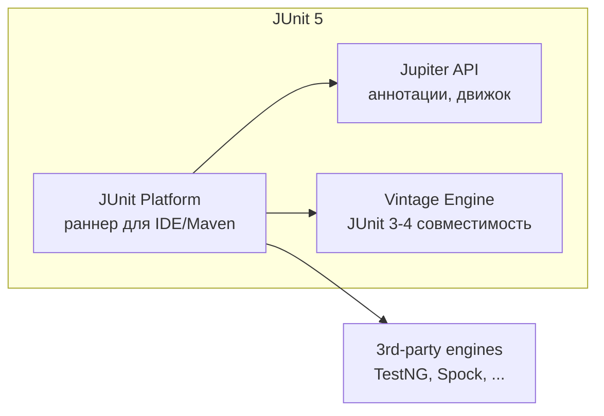
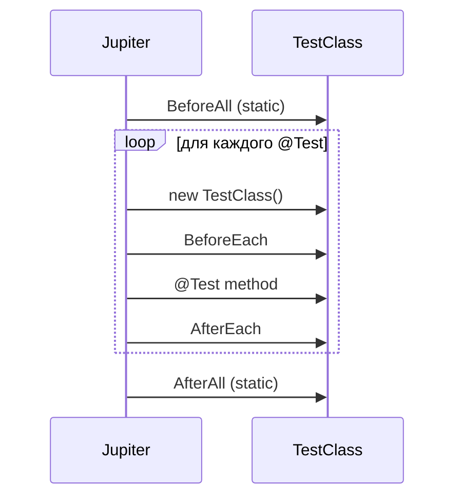

# 03. JUnit 5 (Jupiter)

> **Цель главы:** дать рабочее знание JUnit 5 для автотестов — аннотации, lifecycle, параметризация,
> расширения, ordering, dynamic tests и параллелизация. JUnit 4 умышленно игнорируется
> (он в legacy). Все примеры — на актуальной API.

---

## Содержание

1. [Часть 1. Архитектура и базовые аннотации](#часть-1-архитектура-и-базовые-аннотации)
2. [Часть 2. Lifecycle и порядок выполнения](#часть-2-lifecycle-и-порядок-выполнения)
3. [Часть 3. Assertions и assumptions](#часть-3-assertions-и-assumptions)
4. [Часть 4. Параметризованные тесты](#часть-4-параметризованные-тесты)
5. [Часть 5. Dynamic tests и Nested](#часть-5-dynamic-tests-и-nested)
6. [Часть 6. Extensions](#часть-6-extensions)
7. [Часть 7. Параллелизация](#часть-7-параллелизация)
8. [Часть 8. Интеграция с Maven и фильтрация](#часть-8-интеграция-с-maven-и-фильтрация)
9. [Чек-лист самопроверки](#чек-лист-самопроверки)
10. [Видеоматериалы](#видеоматериалы)

---

## Часть 1. Архитектура и базовые аннотации

### Q1. Из чего состоит JUnit 5



| Модуль                 | Назначение                                            |
| ---------------------- | ----------------------------------------------------- |
| `junit-platform-*`     | Запуск тестов на IDE / Maven / Gradle                 |
| `junit-jupiter-api`    | Аннотации `@Test`, `@BeforeEach`, `Assertions`        |
| `junit-jupiter-engine` | Реализация движка для платформы                       |
| `junit-jupiter-params` | `@ParameterizedTest`                                  |
| `junit-vintage-engine` | Запуск старых JUnit 3/4 тестов на новой платформе     |

**Минимум зависимостей в `pom.xml`:**
```xml
<dependency>
    <groupId>org.junit.jupiter</groupId>
    <artifactId>junit-jupiter</artifactId>
    <version>5.10.2</version>
    <scope>test</scope>
</dependency>
```
`junit-jupiter` агрегирует api + engine + params.

---

### Q2. Базовые аннотации

```java
import org.junit.jupiter.api.*;
import static org.junit.jupiter.api.Assertions.*;

class CalculatorTest {

    @BeforeAll
    static void setUpAll() { /* один раз перед всеми тестами класса */ }

    @BeforeEach
    void setUp() { /* перед каждым тестом */ }

    @Test
    @DisplayName("складывает два положительных числа")
    void addsTwoPositives() {
        assertEquals(5, 2 + 3);
    }

    @Test
    @Disabled("баг JIRA-1234, чинят на той неделе")
    void temporarilyOff() { }

    @Test
    @Tag("smoke")
    void smokeCheck() { }

    @AfterEach
    void tearDown() { /* после каждого теста */ }

    @AfterAll
    static void tearDownAll() { /* один раз после всех */ }
}
```

**Главные изменения по сравнению с JUnit 4:**
- `@Test` — без аргументов (`expected` и `timeout` теперь через `assertThrows` и `assertTimeout`)
- `@BeforeClass` → `@BeforeAll`, `@AfterClass` → `@AfterAll` (всегда `static`, кроме `@TestInstance(PER_CLASS)`)
- `@Before` → `@BeforeEach`, `@After` → `@AfterEach`
- `@Ignore` → `@Disabled`
- `@RunWith` → `@ExtendWith`
- Импорт `org.junit.jupiter.api.*` вместо `org.junit.*`

---

### Q3. @DisplayName и нейминг тестов

```java
@DisplayName("Калькулятор")
class CalculatorTest {

    @Test
    @DisplayName("✅ возвращает сумму при двух положительных числах")
    void addsTwoPositives() { }

    @Test
    @DisplayName("❌ кидает ArithmeticException при делении на 0")
    void divisionByZero() { }
}
```

В отчётах (Allure, IDE) видно человеческое название.

**Альтернатива — `DisplayNameGenerator`:**
```java
@DisplayNameGeneration(DisplayNameGenerator.ReplaceUnderscores.class)
class CalculatorTest {
    @Test
    void adds_two_positives_correctly() { }
    // отображается: "adds two positives correctly"
}
```

---

## Часть 2. Lifecycle и порядок выполнения

### Q4. По умолчанию: новый экземпляр на каждый тест



**Правила:**
- Дефолт — `@TestInstance(Lifecycle.PER_METHOD)` — новый объект на каждый тест
- `@BeforeAll`/`@AfterAll` — **обязаны быть `static`**
- Поля экземпляра не передаются между тестами

---

### Q5. @TestInstance(Lifecycle.PER_CLASS)

```java
@TestInstance(TestInstance.Lifecycle.PER_CLASS)
class StatefulTest {

    @BeforeAll                     // НЕ static
    void setUp() { /* ... */ }

    @Test void test1() { }
    @Test void test2() { }
}
```

**Что меняется:**
- Один экземпляр класса на все тесты
- `@BeforeAll`/`@AfterAll` могут быть НЕ static
- Можно использовать поля экземпляра в `@BeforeAll`

**Когда нужно:**
- Тяжёлые поля, которые нельзя сделать static (например, инжект через DI в нестатический контекст)
- Тесты на одном базовом state, без перезаливки

---

### Q6. Порядок тестов — @TestMethodOrder

По умолчанию порядок недетерминирован (точнее, основан на хэшах).

```java
@TestMethodOrder(MethodOrderer.OrderAnnotation.class)
class OrderedTest {

    @Test @Order(1) void registerUser() { }
    @Test @Order(2) void login() { }
    @Test @Order(3) void purchase() { }
}
```

**Доступные orderer'ы:**

| Класс                              | Порядок                                          |
| ---------------------------------- | ------------------------------------------------ |
| `MethodOrderer.OrderAnnotation`    | По `@Order`                                      |
| `MethodOrderer.MethodName`         | По имени метода                                  |
| `MethodOrderer.DisplayName`        | По `@DisplayName`                                |
| `MethodOrderer.Random`             | Случайный (с фиксированным seed)                 |

> **На собесе:** *«Тесты не должны зависеть от порядка. Если зависят — это анти-паттерн (chained test). Хорошие тесты независимы и идемпотентны».*

В fintech/банке — иногда e2e flow требует порядка, но это исключение, а не правило.

---

### Q7. @TestClassOrder — порядок классов

```java
@TestClassOrder(ClassOrderer.OrderAnnotation.class)
class TopLevelTest {

    @Nested @Order(1) class FirstNested { /* ... */ }
    @Nested @Order(2) class SecondNested { /* ... */ }
}
```

---

## Часть 3. Assertions и assumptions

### Q8. Базовые assertions

```java
import static org.junit.jupiter.api.Assertions.*;

assertEquals(expected, actual);
assertEquals(expected, actual, "сообщение при провале");
assertEquals(expected, actual, () -> "lazy сообщение"); // вычисляется только при провале

assertNotEquals(unexpected, actual);
assertSame(expected, actual);             // ==
assertNotSame(unexpected, actual);
assertTrue(condition);
assertFalse(condition);
assertNull(value);
assertNotNull(value);
assertArrayEquals(expectedArr, actualArr);
assertIterableEquals(expectedIterable, actualIterable);
assertLinesMatch(List.of("line1", ".*regex.*"), actualLines);
```

> **Совет:** в современном QA вместо JUnit Assertions всё чаще используют **AssertJ** — более выразительный fluent API. См. Q11.

---

### Q9. assertThrows и assertDoesNotThrow

```java
@Test
void divisionByZeroThrows() {
    ArithmeticException ex = assertThrows(ArithmeticException.class,
        () -> calculator.divide(10, 0));

    assertEquals("/ by zero", ex.getMessage());
}

@Test
void noExceptionOnValidArgs() {
    assertDoesNotThrow(() -> calculator.divide(10, 2));
}
```

---

### Q10. assertAll — несколько проверок без short-circuit

```java
@Test
void userIsValid() {
    User u = repo.findById(1).get();

    assertAll("user fields",
        () -> assertEquals(1, u.id()),
        () -> assertEquals("Иван", u.name()),
        () -> assertTrue(u.email().endsWith("@bank.ru")),
        () -> assertNotNull(u.address())
    );
}
```

**Зачем:** при провале первого assert выполнятся остальные → видишь все ошибки в отчёте сразу.

---

### Q11. AssertJ — современная альтернатива

```xml
<dependency>
    <groupId>org.assertj</groupId>
    <artifactId>assertj-core</artifactId>
    <version>3.25.3</version>
    <scope>test</scope>
</dependency>
```

```java
import static org.assertj.core.api.Assertions.*;

assertThat(user.email())
    .isNotNull()
    .endsWith("@bank.ru")
    .hasSizeBetween(5, 50);

assertThat(orders)
    .hasSize(3)
    .extracting(Order::status)
    .containsOnly("PAID", "NEW");

assertThat(orders).filteredOn(o -> o.amount() > 100).hasSize(2);

assertThatThrownBy(() -> client.find(-1))
    .isInstanceOf(IllegalArgumentException.class)
    .hasMessageContaining("must be positive");

// Сравнение POJO без equals
assertThat(actual)
    .usingRecursiveComparison()
    .ignoringFields("createdAt")
    .isEqualTo(expected);
```

> Большинство QA-фреймворков в РФ используют **AssertJ** для fluent-проверок и JUnit Assertions для базы.

---

### Q12. assertTimeout

```java
// Выполняется в текущем потоке, ждёт окончания
@Test
void completesIn1Sec() {
    assertTimeout(Duration.ofSeconds(1), () -> Thread.sleep(500));
}

// Прерывает по таймауту (отдельный поток)
@Test
void preemptiveTimeout() {
    assertTimeoutPreemptively(Duration.ofSeconds(1), () -> {
        Thread.sleep(2000); // прервётся
    });
}
```

**Подводный камень:** `assertTimeoutPreemptively` запускает в новом потоке → `ThreadLocal` и Spring-транзакции теряются.

---

### Q13. Assumptions — пропуск теста по условию

```java
@Test
void onlyOnCi() {
    assumeTrue("ci".equals(System.getenv("ENV")), "Skipping: not CI");
    // тест выполнится только в CI
}

@Test
void onLinux() {
    assumingThat("linux".equals(System.getProperty("os.name").toLowerCase()),
        () -> {
            // выполнится только на Linux
        });
}
```

**Разница с `@Disabled`:** `@Disabled` всегда отключает, `assumption` — динамически.

---

### Q14. @EnabledOn... / @DisabledOn... — условные аннотации

```java
@Test
@EnabledOnOs(OS.LINUX)
void onlyLinux() { }

@Test
@DisabledOnJre(JRE.JAVA_8)
void notOnJava8() { }

@Test
@EnabledIfEnvironmentVariable(named = "ENV", matches = "ci")
void onlyOnCi() { }

@Test
@EnabledIfSystemProperty(named = "run.flaky", matches = "true")
void flakyOnDemand() { }
```

---

## Часть 4. Параметризованные тесты

### Q15. @ParameterizedTest — базовое

```xml
<dependency>
    <groupId>org.junit.jupiter</groupId>
    <artifactId>junit-jupiter-params</artifactId>
    <version>5.10.2</version>
    <scope>test</scope>
</dependency>
```

```java
@ParameterizedTest
@ValueSource(ints = {1, 2, 3, 4, 5})
void positiveNumbersAreNotZero(int n) {
    assertNotEquals(0, n);
}
```

---

### Q16. Источники параметров

**`@ValueSource`** — простые типы:
```java
@ParameterizedTest
@ValueSource(strings = {"admin@bank.ru", "user@bank.ru"})
void emailsEndWithBankRu(String email) {
    assertTrue(email.endsWith("@bank.ru"));
}
```

**`@EnumSource`** — enum:
```java
enum OrderStatus { NEW, PAID, CANCELLED }

@ParameterizedTest
@EnumSource(OrderStatus.class)
void allStatusesAreUpper(OrderStatus status) {
    assertEquals(status.name().toUpperCase(), status.name());
}

@ParameterizedTest
@EnumSource(value = OrderStatus.class, mode = EXCLUDE, names = {"CANCELLED"})
void notCancelled(OrderStatus s) { }
```

**`@CsvSource`** — несколько параметров:
```java
@ParameterizedTest
@CsvSource({
    "1, 2, 3",
    "5, 7, 12",
    "10, -5, 5"
})
void addition(int a, int b, int expected) {
    assertEquals(expected, a + b);
}
```

**`@CsvFileSource`** — из файла:
```java
@ParameterizedTest
@CsvFileSource(resources = "/data/users.csv", numLinesToSkip = 1)
void loadsUserFromCsv(long id, String email, int age) { }
```

`/data/users.csv`:
```csv
id,email,age
1,a@bank.ru,30
2,b@bank.ru,25
```

**`@MethodSource`** — самый гибкий:
```java
@ParameterizedTest
@MethodSource("invalidEmails")
void invalidEmailFails(String email) {
    assertThrows(ValidationException.class, () -> validator.validate(email));
}

static Stream<String> invalidEmails() {
    return Stream.of("", "no-at", "@bank.ru", "user@", null);
}

// С несколькими параметрами:
@ParameterizedTest
@MethodSource("provideUsers")
void userIsValid(long id, String email, int expectedAge) { }

static Stream<Arguments> provideUsers() {
    return Stream.of(
        Arguments.of(1, "a@bank.ru", 30),
        Arguments.of(2, "b@bank.ru", 25)
    );
}
```

**`@ArgumentsSource`** — кастомный provider:
```java
@ParameterizedTest
@ArgumentsSource(MyArgsProvider.class)
void custom(String s) { }

static class MyArgsProvider implements ArgumentsProvider {
    @Override public Stream<Arguments> provideArguments(ExtensionContext ctx) {
        return Stream.of(Arguments.of("a"), Arguments.of("b"));
    }
}
```

---

### Q17. Кастомизация имени параметризованного теста

```java
@ParameterizedTest(name = "[{index}] {0} + {1} = {2}")
@CsvSource({"1, 2, 3", "5, 7, 12"})
void addition(int a, int b, int expected) { }

// В отчёте:
// [1] 1 + 2 = 3
// [2] 5 + 7 = 12
```

**Плейсхолдеры:**
- `{index}` — номер итерации
- `{0}, {1}, ...` — параметры
- `{arguments}` — все параметры через запятую
- `{displayName}` — имя метода

---

### Q18. ArgumentsConverter и ArgumentsAggregator

**Converter — преобразовать строку в объект:**
```java
@ParameterizedTest
@CsvSource({"2026-04-28", "2026-05-01"})
void parseDate(@JavaTimeConversionPattern("yyyy-MM-dd") LocalDate date) { }
```

**Aggregator — собрать несколько в объект:**
```java
@ParameterizedTest
@CsvSource({"1, Иван, 30", "2, Олег, 25"})
void aggregate(@AggregateWith(UserAggregator.class) User user) { }

static class UserAggregator implements ArgumentsAggregator {
    @Override public Object aggregateArguments(ArgumentsAccessor a, ParameterContext c) {
        return new User(a.getLong(0), a.getString(1), a.getInteger(2));
    }
}
```

---

## Часть 5. Dynamic tests и Nested

### Q19. @TestFactory — динамические тесты

В отличие от `@ParameterizedTest`, `@TestFactory` строит тесты в runtime — например, по списку из БД или внешнего файла.

```java
@TestFactory
Stream<DynamicTest> generatedTests() {
    return Stream.of("admin", "user", "guest")
        .map(role -> dynamicTest(
            "роль " + role + " имеет валидное имя",
            () -> assertTrue(role.matches("[a-z]+"))
        ));
}

// С группировкой
@TestFactory
DynamicContainer groupedTests() {
    return dynamicContainer("API smoke",
        Stream.of(
            dynamicTest("GET /health", () -> assertHealthOk()),
            dynamicTest("GET /metrics", () -> assertMetricsAvailable())
        )
    );
}
```

---

### Q20. @Nested — иерархические тесты

```java
@DisplayName("OrderService")
class OrderServiceTest {

    @Nested
    @DisplayName("при создании заказа")
    class WhenCreatingOrder {

        @Test @DisplayName("выставляет статус NEW")
        void setsStatus() { }

        @Test @DisplayName("генерирует id")
        void generatesId() { }
    }

    @Nested
    @DisplayName("при оплате")
    class WhenPaying {

        @Test @DisplayName("меняет статус на PAID")
        void changesStatus() { }
    }
}
```

В отчётах видна иерархия:
```
OrderService
├── при создании заказа
│   ├── выставляет статус NEW
│   └── генерирует id
└── при оплате
    └── меняет статус на PAID
```

---

## Часть 6. Extensions

### Q21. Что такое Extension

**Extension** — главный механизм расширения JUnit 5. Заменяет JUnit 4 `@RunWith` + `@Rule`.

**Главные интерфейсы:**

| Интерфейс                       | Хук                                              |
| ------------------------------- | ------------------------------------------------ |
| `BeforeAllCallback`             | Перед `@BeforeAll`                               |
| `AfterAllCallback`              | После `@AfterAll`                                |
| `BeforeEachCallback`            | Перед `@BeforeEach`                              |
| `AfterEachCallback`             | После `@AfterEach`                               |
| `BeforeTestExecutionCallback`   | Прямо перед `@Test`                              |
| `AfterTestExecutionCallback`    | Сразу после `@Test`                              |
| `TestWatcher`                   | По результату: success/failed/disabled/aborted   |
| `ParameterResolver`             | Инжект параметров в `@Test`-методы               |
| `TestExecutionExceptionHandler` | Обработка исключений теста                       |
| `InvocationInterceptor`         | Перехват вызова теста (для retry, etc.)          |

---

### Q22. Простой Extension — TestWatcher для скриншотов

```java
public class ScreenshotOnFailureExtension implements TestWatcher {

    @Override
    public void testFailed(ExtensionContext ctx, Throwable cause) {
        Page page = (Page) ctx.getStore(Namespace.GLOBAL).get("page");
        if (page != null) {
            byte[] png = page.screenshot();
            Allure.addAttachment("screenshot", "image/png", new ByteArrayInputStream(png), "png");
        }
    }
}

// Применение:
@ExtendWith(ScreenshotOnFailureExtension.class)
class LoginTest { /* ... */ }
```

---

### Q23. ParameterResolver — инжект в тесты

```java
public class UserResolver implements ParameterResolver {

    @Override
    public boolean supportsParameter(ParameterContext pc, ExtensionContext ec) {
        return pc.getParameter().getType() == User.class;
    }

    @Override
    public Object resolveParameter(ParameterContext pc, ExtensionContext ec) {
        return new User(1, "test@bank.ru");
    }
}

@ExtendWith(UserResolver.class)
class MyTest {
    @Test
    void something(User user) {
        // user инжектится автоматически
    }
}
```

**JUnit 5 уже умеет инжектить** `TestInfo`, `TestReporter`, `RepetitionInfo`:
```java
@Test
void test(TestInfo info, TestReporter reporter) {
    reporter.publishEntry("running", info.getDisplayName());
}
```

---

### Q24. ExtensionContext.Store — передача данных между хуками

```java
public class TraceIdExtension implements BeforeEachCallback, AfterEachCallback {

    private static final Namespace NS = Namespace.create(TraceIdExtension.class);

    @Override
    public void beforeEach(ExtensionContext ctx) {
        ctx.getStore(NS).put("traceId", UUID.randomUUID().toString());
    }

    @Override
    public void afterEach(ExtensionContext ctx) {
        String traceId = ctx.getStore(NS).get("traceId", String.class);
        log.info("test done, traceId={}", traceId);
    }
}
```

---

### Q25. Регистрация extensions: @ExtendWith vs @RegisterExtension vs ServiceLoader

**1. `@ExtendWith` (на классе или методе):**
```java
@ExtendWith({SpringExtension.class, MyExtension.class})
class MyTest { }
```

**2. `@RegisterExtension` (на поле, для extensions с состоянием/параметрами):**
```java
class MyTest {
    @RegisterExtension
    static MyExtension ext = new MyExtension("config");
}
```

**3. ServiceLoader** (`META-INF/services/org.junit.jupiter.api.extension.Extension`) — авто-применение ко всем тестам. Включается через:
```properties
junit.jupiter.extensions.autodetection.enabled=true
```

---

## Часть 7. Параллелизация

### Q26. Включить параллельный запуск

`src/test/resources/junit-platform.properties`:
```properties
junit.jupiter.execution.parallel.enabled=true

# Все методы и классы параллельно
junit.jupiter.execution.parallel.mode.default=concurrent
junit.jupiter.execution.parallel.mode.classes.default=concurrent

# Стратегия параллелизма
junit.jupiter.execution.parallel.config.strategy=fixed
junit.jupiter.execution.parallel.config.fixed.parallelism=4
```

**Стратегии:**
- `dynamic` — `Runtime.availableProcessors()`
- `fixed` — задаётся `parallelism`
- `custom` — свой `ParallelExecutionConfigurationStrategy`

---

### Q27. Точечный контроль параллельности

```java
// Класс выполняется параллельно с другими
@Execution(ExecutionMode.CONCURRENT)
class FastTest { }

// Класс выполняется в своём потоке (изоляция)
@Execution(ExecutionMode.SAME_THREAD)
class StatefulTest { }

// Метод не параллелится с другими методами своего класса
@Test
@Execution(ExecutionMode.SAME_THREAD)
void serialTest() { }
```

---

### Q28. @ResourceLock — синхронизация по ресурсу

```java
@Test
@ResourceLock(value = "DATABASE", mode = READ_WRITE)
void writesToDb() { }

@Test
@ResourceLock(value = "DATABASE", mode = READ)
void readsFromDb() { }
```

Несколько `READ` могут идти параллельно, `READ_WRITE` — эксклюзивно. Полезно когда ресурс нельзя дёргать одновременно (Singleton-кэш, system property).

---

### Q29. @RepeatedTest

```java
@RepeatedTest(10)
void runs10Times() { }

@RepeatedTest(value = 100, name = "{displayName} #{currentRepetition}/{totalRepetitions}")
void flakyHunting(RepetitionInfo info) {
    // info.getCurrentRepetition() / getTotalRepetitions()
}
```

Используется для **поиска flaky-тестов** или нагрузочного прогона.

---

## Часть 8. Интеграция с Maven и фильтрация

### Q30. Maven Surefire / Failsafe для JUnit 5

```xml
<plugin>
    <groupId>org.apache.maven.plugins</groupId>
    <artifactId>maven-surefire-plugin</artifactId>
    <version>3.2.5</version>
    <configuration>
        <includes>
            <include>**/*Test.java</include>
        </includes>
        <excludes>
            <exclude>**/*IT.java</exclude>
        </excludes>
        <properties>
            <configurationParameters>
                junit.jupiter.execution.parallel.enabled = true
                junit.jupiter.execution.parallel.mode.default = concurrent
            </configurationParameters>
        </properties>
    </configuration>
</plugin>

<!-- Failsafe — для интеграционных (IT.java) -->
<plugin>
    <artifactId>maven-failsafe-plugin</artifactId>
    <version>3.2.5</version>
    <executions>
        <execution>
            <goals>
                <goal>integration-test</goal>
                <goal>verify</goal>
            </goals>
        </execution>
    </executions>
</plugin>
```

> **Дефолтные include-маски Surefire:** `*Test.java`, `Test*.java`, `*Tests.java`, `*TestCase.java`. Failsafe — `*IT.java`, `IT*.java`, `*ITCase.java`.

---

### Q31. Фильтрация по тегам (@Tag)

```java
@Test @Tag("smoke") void smokeTest() { }
@Test @Tag("regression") void regressionTest() { }
@Test @Tag("slow") @Tag("flaky") void brokenSlowTest() { }
```

**Запуск только smoke:**
```bash
mvn test -Dgroups=smoke
mvn test -DexcludedGroups=slow,flaky
```

**Boolean-выражения:**
```bash
mvn test -Dgroups="smoke & !slow"
mvn test -Dgroups="any(smoke, regression)"
```

---

### Q32. Запуск конкретного теста / класса

```bash
mvn test -Dtest=LoginTest
mvn test -Dtest=LoginTest#successfulLogin
mvn test -Dtest='LoginTest, OrderTest#createOrder*'
```

В IDE — кнопкой Run/Debug на методе или классе.

---

## Чек-лист самопроверки

- [ ] Знаю состав JUnit 5: Platform / Jupiter / Vintage
- [ ] Различаю `@BeforeAll` (static, дефолт) и `Lifecycle.PER_CLASS`
- [ ] Расскажу, почему тесты должны быть независимы и идемпотентны
- [ ] Использую `@DisplayName` или `DisplayNameGenerator`
- [ ] Применяю `assertAll`, `assertThrows`, `assertTimeout`
- [ ] Знаю AssertJ, использую `usingRecursiveComparison`, `extracting`
- [ ] Пишу `@ParameterizedTest` с `@ValueSource`/`@CsvSource`/`@MethodSource`/`@CsvFileSource`
- [ ] Применяю `@TestFactory` и `dynamicTest` для генерируемых сценариев
- [ ] Использую `@Nested` для логической группировки
- [ ] Пишу свой Extension для скриншотов на падении
- [ ] Использую `ParameterResolver` для инжекта Page/ApiClient
- [ ] Знаю про `ExtensionContext.Store` и Namespace
- [ ] Включаю параллельные тесты в `junit-platform.properties`
- [ ] Применяю `@Execution(SAME_THREAD)` и `@ResourceLock` для несовместимых тестов
- [ ] Конфигурирую Surefire/Failsafe и фильтрую по `@Tag`

---

## Видеоматериалы

### Русскоязычные

- **Heisenbug — JUnit 5 доклады** — https://www.youtube.com/@HeisenbugConf/search?query=junit
- **«Что нового в JUnit 5», JUG.ru** — на канале JUGRU.

### Англоязычные

- **JUnit 5 User Guide** — https://junit.org/junit5/docs/current/user-guide/ — официальный, must-read.
- **«JUnit 5 Tutorial», Marco Codes** — https://www.youtube.com/@MarcoCodes
- **Test Automation University — JUnit 5** — https://testautomationu.applitools.com/junit5-tutorial/

### Документация

- **JUnit 5 User Guide** — https://junit.org/junit5/docs/current/user-guide/
- **JUnit 5 API Javadoc** — https://junit.org/junit5/docs/current/api/
- **AssertJ Core** — https://assertj.github.io/doc/

---

[← Назад: 02. Java Core](./02-java-core.md) · [К оглавлению](./README.md) · [Следующая: 04. Maven →](./04-maven.md)
