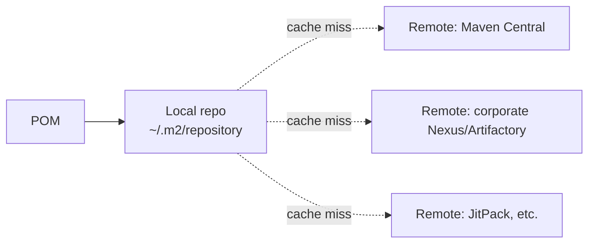
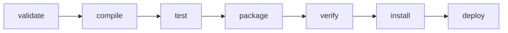

# 04. Maven

> **Цель главы:** дать рабочее знание Maven для QA Auto — структура, lifecycle, плагины
> Surefire/Failsafe, профили, dependency management. Без избыточной теории — только то,
> что нужно для понимания и поддержки тест-фреймворка.

---

## Содержание

1. [Часть 1. Что такое Maven и pom.xml](#часть-1-что-такое-maven-и-pomxml)
2. [Часть 2. Структура проекта и координаты](#часть-2-структура-проекта-и-координаты)
3. [Часть 3. Lifecycle, phases, goals](#часть-3-lifecycle-phases-goals)
4. [Часть 4. Зависимости и dependency management](#часть-4-зависимости-и-dependency-management)
5. [Часть 5. Surefire и Failsafe для тестов](#часть-5-surefire-и-failsafe-для-тестов)
6. [Часть 6. Профили и параметризация](#часть-6-профили-и-параметризация)
7. [Часть 7. Полезные плагины](#часть-7-полезные-плагины)
8. [Чек-лист самопроверки](#чек-лист-самопроверки)
9. [Видеоматериалы](#видеоматериалы)

---

## Часть 1. Что такое Maven и pom.xml

### Q1. В чём разница между Maven и Gradle?

| Критерий            | Maven                          | Gradle                                 |
| ------------------- | ------------------------------ | -------------------------------------- |
| Конфиг              | XML (`pom.xml`)                | Groovy / Kotlin DSL (`build.gradle`)   |
| Кривая обучения     | Низкая                         | Выше                                   |
| Скорость билда      | Медленнее                      | Быстрее (incremental, daemon)          |
| Гибкость            | Через плагины                  | Произвольный код                       |
| Чтение/поддержка    | Декларативный, предсказуемый   | Императивный, проще ошибиться          |

**В РФ-продуктовых QA-фреймворках чаще Maven** — он стандарт, проще для не-разработчиков, хорошая интеграция с IDE.

---

### Q2. Что такое pom.xml?

**POM (Project Object Model)** — описание проекта: координаты, зависимости, плагины, свойства, профили.

```xml
<?xml version="1.0" encoding="UTF-8"?>
<project xmlns="http://maven.apache.org/POM/4.0.0">
    <modelVersion>4.0.0</modelVersion>

    <!-- Координаты проекта -->
    <groupId>com.bank.qa</groupId>
    <artifactId>api-tests</artifactId>
    <version>1.0.0-SNAPSHOT</version>
    <packaging>jar</packaging>

    <!-- Свойства -->
    <properties>
        <maven.compiler.source>17</maven.compiler.source>
        <maven.compiler.target>17</maven.compiler.target>
        <project.build.sourceEncoding>UTF-8</project.build.sourceEncoding>
        <junit.version>5.10.2</junit.version>
        <playwright.version>1.45.0</playwright.version>
    </properties>

    <!-- Зависимости -->
    <dependencies>
        <dependency>
            <groupId>org.junit.jupiter</groupId>
            <artifactId>junit-jupiter</artifactId>
            <version>${junit.version}</version>
            <scope>test</scope>
        </dependency>
    </dependencies>

    <!-- Плагины сборки -->
    <build>
        <plugins>
            <plugin>
                <artifactId>maven-surefire-plugin</artifactId>
                <version>3.2.5</version>
            </plugin>
        </plugins>
    </build>
</project>
```

---

## Часть 2. Структура проекта и координаты

### Q3. Что такое стандартная структура Maven-проекта?

```
my-project/
├── pom.xml
├── src/
│   ├── main/
│   │   ├── java/                    # production-код
│   │   ├── resources/               # production-ресурсы
│   │   └── webapp/                  # для war
│   └── test/
│       ├── java/                    # тестовый код
│       └── resources/               # тестовые ресурсы (application.yml, csv, schemas)
└── target/                          # генерируется при билде
    ├── classes/                     # скомпилированный main
    ├── test-classes/                # скомпилированный test
    ├── surefire-reports/            # отчёты тестов
    └── *.jar                        # артефакт
```

> **Convention over configuration:** Maven сам знает где искать код, ресурсы и куда класть результат.

---

### Q4. Что такое GAV?

**G**roup **A**rtifact **V**ersion — уникальный идентификатор в репозитории.

```xml
<groupId>org.junit.jupiter</groupId>      <!-- организация / namespace -->
<artifactId>junit-jupiter</artifactId>    <!-- название библиотеки -->
<version>5.10.2</version>                 <!-- версия -->
```

Полная форма иногда включает `classifier` и `packaging`:
```
groupId:artifactId:version[:classifier][:packaging]
```

---

### Q5. В чём разница между SNAPSHOT и Release versions?

| Тип        | Пример              | Поведение                               |
| ---------- | ------------------- | --------------------------------------- |
| SNAPSHOT   | `1.0.0-SNAPSHOT`    | «in-progress», Maven подтягивает свежую с `-U` |
| Release    | `1.0.0`             | Иммутабельная, никогда не меняется      |

**Правило для прода:** релизные версии не должны зависеть от SNAPSHOT.

---

### Q6. Что такое локальный и удалённый репозитории?



- **Local repo** — `~/.m2/repository`. Maven сначала ищет здесь.
- **Maven Central** — главный публичный репозиторий — https://search.maven.org
- **Корпоративный Nexus / Artifactory** — для внутренних артефактов.

`settings.xml` в `~/.m2/` позволяет настроить:
- Proxy-сервера
- Mirrors (направить Maven Central через свой Nexus)
- Аутентификацию для приватных репозиториев

```xml
<settings>
    <mirrors>
        <mirror>
            <id>company-nexus</id>
            <mirrorOf>central</mirrorOf>
            <url>https://nexus.company.ru/repository/maven-public/</url>
        </mirror>
    </mirrors>
    <servers>
        <server>
            <id>company-nexus</id>
            <username>${env.NEXUS_USER}</username>
            <password>${env.NEXUS_PASSWORD}</password>
        </server>
    </servers>
</settings>
```

---

## Часть 3. Lifecycle, phases, goals

### Q7. Что такое Three lifecycles и зачем это нужно?

Maven имеет 3 встроенных жизненных цикла:

| Lifecycle | Назначение                           |
| --------- | ------------------------------------ |
| `clean`   | Удалить артефакты сборки             |
| `default` | Сборка проекта                       |
| `site`    | Генерация документации               |

---

### Q8. Что такое Phases default lifecycle и зачем это нужно?



| Phase                    | Что делает                                                |
| ------------------------ | --------------------------------------------------------- |
| `validate`               | Проверка валидности проекта                               |
| `compile`                | Компиляция `src/main/java` → `target/classes`             |
| `test-compile`           | Компиляция `src/test/java` → `target/test-classes`        |
| `test`                   | Запуск unit-тестов через **Surefire**                     |
| `package`                | Создание JAR/WAR в `target/`                              |
| `verify`                 | Запуск интеграционных тестов через **Failsafe**           |
| `install`                | Установка артефакта в локальный репо `~/.m2/`             |
| `deploy`                 | Загрузка в удалённый репо                                 |

**Ключевая особенность:** запуская одну фазу, Maven **выполняет все предыдущие**.

```bash
mvn package    # выполнит validate → compile → test → package
mvn test       # выполнит validate → compile → test
mvn verify     # выполнит всё до verify (включая test и package)
```

---

### Q9. Что такое Goals?

Каждый плагин предоставляет **goals**. Goals привязаны к phases.

```bash
mvn clean                        # goal: clean из maven-clean-plugin
mvn compile                      # goal: compile из maven-compiler-plugin
mvn surefire:test                # goal явно
mvn dependency:tree              # goal не привязан к phase
mvn versions:display-dependency-updates
```

---

### Q10. Что такое Связь phase ↔ goal?

Какой goal привязан к phase зависит от `<packaging>`. Для `jar`:

| Phase               | Default goal                    |
| ------------------- | ------------------------------- |
| `process-resources` | `resources:resources`           |
| `compile`           | `compiler:compile`              |
| `test`              | `surefire:test`                 |
| `package`           | `jar:jar`                       |
| `install`           | `install:install`               |
| `deploy`            | `deploy:deploy`                 |

---

### Q11. Что такое полезные команды Maven?

```bash
mvn clean                       # удалить target/
mvn compile                     # скомпилировать main
mvn test                        # прогнать unit-тесты
mvn test -Dtest=LoginTest       # один тест-класс
mvn test -Dtest=LoginTest#successfulLogin
mvn verify                      # тесты + интеграционные
mvn package                     # собрать jar
mvn install                     # положить в локальный репо

# Без перезапуска тестов
mvn install -DskipTests

# Игнорировать падения тестов и продолжить
mvn install -fae

# Подробный вывод
mvn test -X                     # debug
mvn test -e                     # с stacktrace при ошибке
mvn -q                          # quiet
mvn -o                          # offline (только локальный репо)
mvn -U                          # принудительно обновить SNAPSHOT

# Дерево зависимостей
mvn dependency:tree
mvn dependency:tree -Dverbose

# Какие версии устарели
mvn versions:display-dependency-updates
mvn versions:display-plugin-updates
```

---

## Часть 4. Зависимости и dependency management

### Q12. Что такое Dependency scopes и зачем это нужно?

```xml
<dependency>
    <groupId>...</groupId>
    <artifactId>...</artifactId>
    <version>...</version>
    <scope>compile</scope>  <!-- дефолт -->
</dependency>
```

| Scope        | Где доступно                        | В JAR-у           |
| ------------ | ----------------------------------- | ----------------- |
| `compile`    | везде (main + test, runtime)        | да                |
| `provided`   | compile + test, не runtime          | нет (контейнер даст) |
| `runtime`    | runtime + test (не compile main)    | да                |
| `test`       | только тесты                        | нет               |
| `system`     | как provided, но из локального пути | устаревший, не использовать |
| `import`     | только в `<dependencyManagement>` для BOM | n/a       |

**Для QA-проектов почти всё — `test`:**
```xml
<dependency>
    <groupId>org.junit.jupiter</groupId>
    <artifactId>junit-jupiter</artifactId>
    <version>5.10.2</version>
    <scope>test</scope>
</dependency>
```

---

### Q13. Что такое транзитивные зависимости и conflict resolution?

Если ваша библиотека зависит от `lib-x:1.0`, а другая от `lib-x:2.0` — Maven выбирает по правилам:

1. **Nearest definition wins** — кто ближе в дереве зависимостей.
2. При равной глубине — кто **раньше** в `pom.xml`.

```bash
mvn dependency:tree -Dverbose
# +- com.bank:api-client:jar:1.0:compile
# |  +- (com.fasterxml.jackson.core:jackson-databind:jar:2.13.0:compile - omitted for conflict with 2.15.0)
# +- io.rest-assured:rest-assured:jar:5.4.0:test
# |  +- com.fasterxml.jackson.core:jackson-databind:jar:2.15.0:test
```

---

### Q14. Что такое Exclusions?

```xml
<dependency>
    <groupId>org.springframework.boot</groupId>
    <artifactId>spring-boot-starter-test</artifactId>
    <version>3.2.0</version>
    <scope>test</scope>
    <exclusions>
        <exclusion>
            <groupId>org.junit.vintage</groupId>
            <artifactId>junit-vintage-engine</artifactId>
        </exclusion>
    </exclusions>
</dependency>
```

---

### Q15. Что такое dependencyManagement?

В **родительском POM** или в текущем — задать версии один раз для всех модулей / зависимостей:

```xml
<dependencyManagement>
    <dependencies>
        <dependency>
            <groupId>com.fasterxml.jackson</groupId>
            <artifactId>jackson-bom</artifactId>
            <version>2.16.0</version>
            <type>pom</type>
            <scope>import</scope>            <!-- BOM import -->
        </dependency>
        <dependency>
            <groupId>org.junit.jupiter</groupId>
            <artifactId>junit-jupiter</artifactId>
            <version>5.10.2</version>
        </dependency>
    </dependencies>
</dependencyManagement>

<dependencies>
    <!-- здесь без version — берётся из management -->
    <dependency>
        <groupId>org.junit.jupiter</groupId>
        <artifactId>junit-jupiter</artifactId>
        <scope>test</scope>
    </dependency>
</dependencies>
```

**BOM (Bill Of Materials)** — артефакт типа `pom`, который содержит только `dependencyManagement`. Подключаешь BOM — получаешь согласованные версии большой библиотеки (Spring Boot, Jackson).

---

### Q16. Что такое multi-module проекты?

```
parent/
├── pom.xml                  <!-- packaging=pom, modules: api, ui, common -->
├── api-tests/
│   └── pom.xml              <!-- наследует от parent -->
├── ui-tests/
│   └── pom.xml
└── common/
    └── pom.xml
```

**Parent pom.xml:**
```xml
<groupId>com.bank.qa</groupId>
<artifactId>qa-tests-parent</artifactId>
<version>1.0.0-SNAPSHOT</version>
<packaging>pom</packaging>

<modules>
    <module>common</module>
    <module>api-tests</module>
    <module>ui-tests</module>
</modules>
```

Из корня — одна команда `mvn test` запустит тесты всех модулей.

---

## Часть 5. Surefire и Failsafe для тестов

### Q17. В чём разница между Surefire и Failsafe?

| Plugin       | Phase             | Дефолтные include-маски                    | Поведение при падении       |
| ------------ | ----------------- | ------------------------------------------ | --------------------------- |
| **Surefire** | `test`            | `*Test.java`, `Test*.java`, `*Tests.java`, `*TestCase.java` | Сразу падает билд          |
| **Failsafe** | `integration-test` + `verify` | `*IT.java`, `IT*.java`, `*ITCase.java`     | Запоминает падение, билд падает в `verify` (после `post-integration-test`) |

> **Зачем Failsafe?** Чтобы успеть **остановить контейнеры / стенды** в `post-integration-test` даже если тесты упали. Surefire падает сразу — `tearDown` инфраструктуры не запустится.

---

### Q18. Что такое Surefire?

```xml
<plugin>
    <groupId>org.apache.maven.plugins</groupId>
    <artifactId>maven-surefire-plugin</artifactId>
    <version>3.2.5</version>
    <configuration>
        <!-- Какие классы запускать -->
        <includes>
            <include>**/*Test.java</include>
        </includes>
        <excludes>
            <exclude>**/*IT.java</exclude>
            <exclude>**/Slow*Test.java</exclude>
        </excludes>

        <!-- Параллелизация (см. главу 03) -->
        <properties>
            <configurationParameters>
                junit.jupiter.execution.parallel.enabled = true
                junit.jupiter.execution.parallel.mode.default = concurrent
                junit.jupiter.execution.parallel.config.strategy = fixed
                junit.jupiter.execution.parallel.config.fixed.parallelism = 4
            </configurationParameters>
        </properties>

        <!-- Системные свойства для тестов -->
        <systemPropertyVariables>
            <env>${env}</env>
            <api.token>${env.API_TOKEN}</api.token>
        </systemPropertyVariables>

        <!-- Forked JVM для тестов -->
        <forkCount>1</forkCount>
        <reuseForks>true</reuseForks>

        <!-- JVM args -->
        <argLine>-Xmx2g -XX:+EnableDynamicAgentLoading</argLine>

        <!-- Поведение при провалах -->
        <testFailureIgnore>false</testFailureIgnore>
        <skipAfterFailureCount>0</skipAfterFailureCount>     <!-- продолжать после первого fail -->
    </configuration>
</plugin>
```

---

### Q19. Что такое Failsafe?

```xml
<plugin>
    <artifactId>maven-failsafe-plugin</artifactId>
    <version>3.2.5</version>
    <executions>
        <execution>
            <id>integration-tests</id>
            <goals>
                <goal>integration-test</goal>
                <goal>verify</goal>
            </goals>
            <configuration>
                <includes>
                    <include>**/*IT.java</include>
                </includes>
            </configuration>
        </execution>
    </executions>
</plugin>
```

```bash
mvn verify     # запустит unit (Surefire) + IT (Failsafe)
```

**Phases вокруг Failsafe:**
1. `pre-integration-test` — поднять Testcontainers / окружение
2. `integration-test` — запустить тесты (failures сохраняются)
3. `post-integration-test` — остановить окружение
4. `verify` — проверить failures, упасть если были

---

### Q20. Что такое параллельные тесты в Surefire?

**Уровни параллелизма:**

```xml
<configuration>
    <!-- Через JUnit 5 параметры (см. Q18) -->
    <properties>
        <configurationParameters>
            junit.jupiter.execution.parallel.enabled = true
        </configurationParameters>
    </properties>

    <!-- Или через Surefire forking (несколько JVM) -->
    <forkCount>4</forkCount>             <!-- 4 параллельных JVM -->
    <reuseForks>true</reuseForks>        <!-- переиспользовать процессы -->
</configuration>
```

**Когда что:**
- **JUnit 5 parallel** — внутри одной JVM, дешевле
- **Surefire fork** — изоляция (несколько JVM), для тестов с глобальным state (system properties)

> Подробнее в главе [03. JUnit 5](./03-junit5.md), Q26-Q28.

---

## Часть 6. Профили и параметризация

### Q21. Что такое maven профили?

**Profile** — набор настроек, активируемый условно. Используется для разных сред / разных режимов запуска.

```xml
<profiles>
    <profile>
        <id>dev</id>
        <activation>
            <activeByDefault>true</activeByDefault>
        </activation>
        <properties>
            <env>dev</env>
            <api.url>https://api.dev.bank.ru</api.url>
        </properties>
    </profile>

    <profile>
        <id>stage</id>
        <properties>
            <env>stage</env>
            <api.url>https://api.stage.bank.ru</api.url>
        </properties>
    </profile>

    <profile>
        <id>smoke</id>
        <build>
            <plugins>
                <plugin>
                    <artifactId>maven-surefire-plugin</artifactId>
                    <configuration>
                        <groups>smoke</groups>
                    </configuration>
                </plugin>
            </plugins>
        </build>
    </profile>
</profiles>
```

**Активация:**
```bash
mvn test -Pstage
mvn test -P!dev,stage      # отключить dev, активировать stage
mvn test -Pstage,smoke     # несколько
```

**Способы активации:**
- `-P profileId` — командой
- `<activeByDefault>true</activeByDefault>` — всегда (если ничего не указано)
- `<activation>` — по env var, system property, OS, JDK

---

### Q22. Что такое system properties и -D?

Передать значение в тесты через JVM property:

```bash
mvn test -Dapi.url=https://api.stage.bank.ru -Denv=stage
```

В коде:
```java
String url = System.getProperty("api.url", "https://default");
```

**Через Surefire** (более правильно):
```xml
<systemPropertyVariables>
    <api.url>${api.url}</api.url>
</systemPropertyVariables>
```

---

### Q23. Что такое Environment variables и зачем это нужно?

```bash
export API_TOKEN="xyz"
mvn test
```

В коде:
```java
String token = System.getenv("API_TOKEN");
```

**В POM:**
```xml
<systemPropertyVariables>
    <api.token>${env.API_TOKEN}</api.token>
</systemPropertyVariables>
```

---

## Часть 7. Полезные плагины

### Q24. Что такое maven-compiler-plugin и зачем это нужно?

```xml
<plugin>
    <groupId>org.apache.maven.plugins</groupId>
    <artifactId>maven-compiler-plugin</artifactId>
    <version>3.13.0</version>
    <configuration>
        <release>17</release>             <!-- современный способ -->
        <!-- старый способ: source + target -->
    </configuration>
</plugin>
```

`<release>` — Java 9+, заменяет `<source>` и `<target>`, гарантирует API совместимость.

---

### Q25. Что такое allure-maven-plugin и зачем это нужно?

```xml
<plugin>
    <groupId>io.qameta.allure</groupId>
    <artifactId>allure-maven</artifactId>
    <version>2.12.0</version>
    <configuration>
        <reportVersion>2.27.0</reportVersion>
        <resultsDirectory>${project.build.directory}/allure-results</resultsDirectory>
    </configuration>
</plugin>
```

```bash
mvn test
mvn allure:report             # сгенерировать в target/site/allure-maven-plugin/
mvn allure:serve              # сгенерировать + запустить веб-сервер
```

См. главу [08. Allure](./08-allure.md).

---

### Q26. В чём разница между exec-maven-plugin — Playwright codegen и install?

```bash
# Установить браузеры
mvn exec:java -e -D exec.mainClass=com.microsoft.playwright.CLI \
    -D exec.args="install --with-deps"

# Codegen
mvn exec:java -e -D exec.mainClass=com.microsoft.playwright.CLI \
    -D exec.args="codegen --target=java https://example.com"
```

Без отдельного объявления плагина — `exec` идёт из дефолтных goals.

---

### Q27. Что такое versions-maven-plugin?

```bash
# Какие версии устарели
mvn versions:display-dependency-updates

# То же для плагинов
mvn versions:display-plugin-updates

# Обновить версии в pom.xml до latest
mvn versions:use-latest-versions
```

---

### Q28. Что такое maven-enforcer-plugin?

```xml
<plugin>
    <artifactId>maven-enforcer-plugin</artifactId>
    <version>3.4.1</version>
    <executions>
        <execution>
            <goals><goal>enforce</goal></goals>
            <configuration>
                <rules>
                    <requireJavaVersion>
                        <version>[17,)</version>
                    </requireJavaVersion>
                    <requireMavenVersion>
                        <version>[3.8.0,)</version>
                    </requireMavenVersion>
                    <dependencyConvergence/>     <!-- одна версия каждой зависимости -->
                </rules>
            </configuration>
        </execution>
    </executions>
</plugin>
```

Полезно: гарантирует что у всех в команде одна и та же сборка.

---

### Q29. Что такое maven-shade-plugin?

Создаёт «толстый» JAR со всеми зависимостями внутри. Используется редко в QA, но полезно для публикации Java-инструментов.

```bash
java -jar target/qa-tools-1.0.0.jar
```

---

## Чек-лист самопроверки

- [ ] Знаю структуру `pom.xml` и зачем нужен `modelVersion`
- [ ] Понимаю GAV-координаты и SNAPSHOT/release
- [ ] Знаю стандартную структуру каталогов `src/main/java`, `src/test/java`
- [ ] Различаю Maven Central, локальный репо, корпоративный Nexus
- [ ] Знаю 3 lifecycle и phases default-цикла (validate → compile → test → package → verify → install → deploy)
- [ ] Различаю phase и goal
- [ ] Знаю основные команды: `clean`, `test`, `package`, `install`, `verify`, `dependency:tree`
- [ ] Различаю scope зависимостей (compile/test/provided/runtime)
- [ ] Использую `dependencyManagement` для централизации версий
- [ ] Подключаю BOM (например, Spring Boot)
- [ ] Использую exclusions для решения конфликтов зависимостей
- [ ] Различаю Surefire (unit) и Failsafe (IT)
- [ ] Конфигурирую Surefire для параллельного запуска JUnit 5
- [ ] Создаю профили для разных сред (`dev`, `stage`, `prod`)
- [ ] Передаю параметры через `-D` и env vars
- [ ] Знаю allure-maven, exec-maven, versions-maven, enforcer-plugin

---

## Видеоматериалы

### Русскоязычные

- **«Maven для тестировщиков», JUG.ru** — поиск по каналу.
- **«Maven с нуля», Devmark** — базовый курс.
- **Технострим — Maven** — лекции МГТУ.

### Англоязычные

- **«Maven Tutorial», Java Brains** — https://www.youtube.com/@Java.Brains
- **Test Automation University — Maven** — https://testautomationu.applitools.com
- **Apache Maven Project (official)** — https://maven.apache.org/guides/

### Документация

- **Apache Maven Guide** — https://maven.apache.org/guides/
- **Maven Plugin Index** — https://maven.apache.org/plugins/
- **Maven Surefire Plugin** — https://maven.apache.org/surefire/maven-surefire-plugin/
- **Maven Failsafe Plugin** — https://maven.apache.org/surefire/maven-failsafe-plugin/

---

[← Назад: 03. JUnit 5](./03-junit5.md) · [К оглавлению](./README.md) · [Следующая: 05. Playwright Java →](./05-playwright-java.md)
