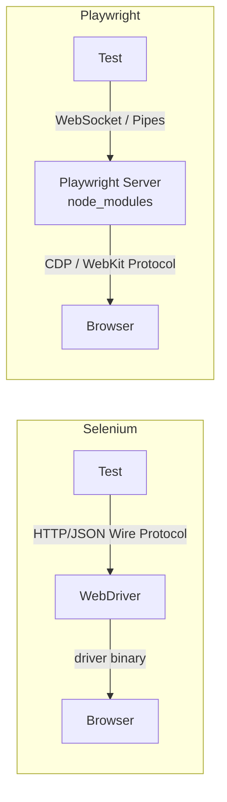
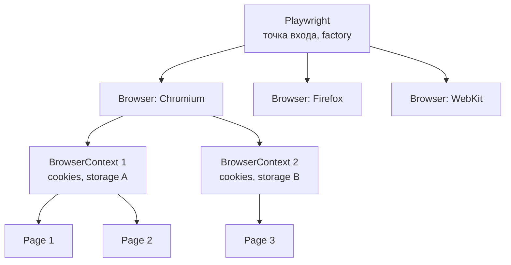
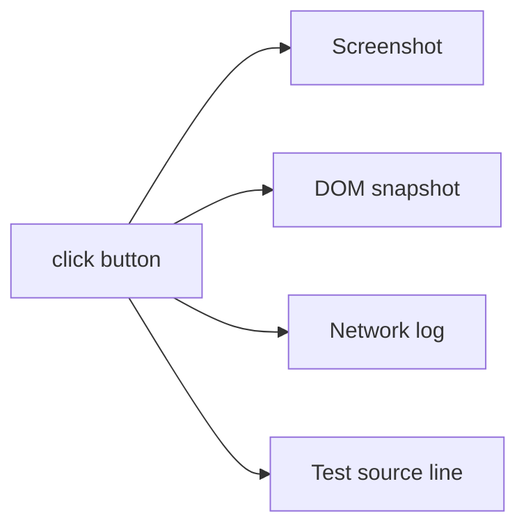

# 05. Playwright Java

> **Цель главы:** дать целостное понимание Playwright под Java — от установки до сложных сценариев
> с моками, трейсингом и параллельным запуском. Фокус — на отличиях от Selenium и
> идиомах, которые ждут на интервью.

---

## Содержание

1. [Часть 1. Введение и архитектура](#часть-1-введение-и-архитектура)
2. [Часть 2. Установка и базовая конфигурация](#часть-2-установка-и-базовая-конфигурация)
3. [Часть 3. Локаторы и взаимодействие](#часть-3-локаторы-и-взаимодействие)
4. [Часть 4. Auto-waiting и assertions](#часть-4-auto-waiting-и-assertions)
5. [Часть 5. Network: мокинг, перехват, авторизация](#часть-5-network-мокинг-перехват-авторизация)
6. [Часть 6. Trace, video, screenshots, debug](#часть-6-trace-video-screenshots-debug)
7. [Часть 7. Параллелизация и интеграция с JUnit 5](#часть-7-параллелизация-и-интеграция-с-junit-5)
8. [Часть 8. Page Object и архитектура](#часть-8-page-object-и-архитектура)
9. [Чек-лист самопроверки](#чек-лист-самопроверки)
10. [Видеоматериалы](#видеоматериалы)

---

## Часть 1. Введение и архитектура

### Q1. Что такое Playwright и чем он отличается от Selenium?

**Playwright** — фреймворк для автоматизации браузеров от Microsoft. Поддерживает Chromium, Firefox, WebKit (один API). Доступен на Java, Python, JS/TS, .NET.

**Архитектурное отличие от Selenium:**



| Критерий                           | Selenium 4                            | Playwright                                  |
| ---------------------------------- | ------------------------------------- | ------------------------------------------- |
| Протокол                           | W3C WebDriver (HTTP)                  | CDP / WebKit Inspector (WebSocket)          |
| Auto-waiting                       | Нет (нужны `WebDriverWait`)           | **Встроено** во все действия                |
| Network interception               | Через CDP, неполный                   | First-class API: `route()`, `request()`     |
| Параллелизация                     | Один driver = один поток              | `BrowserContext` — изолированные сессии в одном браузере |
| Trace viewer                       | Нет                                   | **Встроенный** trace.zip с тайм-травеллингом |
| Codegen                            | IDE-плагины                           | `mvn exec:java -Dexec.args="codegen ..."`   |
| Поддерживаемые браузеры            | Все (через драйверы)                  | Chromium, Firefox, **WebKit (Safari engine)** |
| Headless по умолчанию              | Нет                                   | Да                                          |
| Установка браузеров                | Driver manager / WebDriverManager     | `mvn exec ... install` ставит свои сборки   |
| Скорость прогона                   | средне                                | **быстрее** (нет HTTP roundtrip на каждое действие) |

> **Запомни для интервью:** *«Playwright говорит с браузером по WebSocket через CDP, у него встроенный auto-wait, изолированные BrowserContext и отличный trace viewer. Это даёт скорость и стабильность, недоступные в Selenium.»*

---

### Q2. Какова архитектура Playwright: Playwright → Browser → BrowserContext → Page?



**Что делать на каком уровне:**

| Уровень          | Аналог                       | Что хранит                                                   |
| ---------------- | ---------------------------- | ------------------------------------------------------------ |
| `Playwright`     | весь движок                  | Драйвер-процесс. Один на JVM.                                |
| `Browser`        | запущенный chromium-процесс  | Тяжёлый ресурс. Один на тестовый прогон.                     |
| `BrowserContext` | **incognito-окно**           | Свои cookies, localStorage, права, viewport. **Изолирован.** |
| `Page`           | вкладка                      | Лёгкая. Можно несколько в одном context.                     |

**Ключевая идея:** `BrowserContext` — основа изоляции тестов. **Один Browser, много Context'ов** = быстрый параллельный прогон без перезапуска браузера.

---

### Q3. Что такое CDP и при чём тут Playwright?

**Chrome DevTools Protocol (CDP)** — JSON-RPC протокол, через который DevTools говорят с браузером. Playwright для Chromium использует именно его. Это даёт:

- Прямой доступ к низкоуровневым событиям сети, консоли, JS
- Эмуляцию device, geolocation, timezone, permissions
- Network interception без проксей
- Скриншоты, PDF, evaluation JS — всё одной командой

Для WebKit и Firefox у Playwright собственные форки/патчи браузеров с похожими протоколами — но публично API единое.

---

### Q4. В чём разница между Sync и async API в Playwright Java?

В Java Playwright предоставляет **синхронный API** (под капотом — асинхронный, обёрнутый в блокирующие вызовы). Для QA это удобнее: код читается линейно, не нужны Future/CompletableFuture.

```java
// Синхронно — возвращает результат сразу
String title = page.title();
page.click("button#submit");
page.waitForURL("**/dashboard");
```

Для асинхронных событий используется паттерн `waitFor*`:
```java
page.waitForResponse("**/api/orders", () -> page.click("button.submit"));
```

---

## Часть 2. Установка и базовая конфигурация

### Q5. Как добавить Playwright в Maven-проект?

**`pom.xml`:**
```xml
<properties>
    <playwright.version>1.45.0</playwright.version>
    <junit.version>5.10.2</junit.version>
</properties>

<dependencies>
    <dependency>
        <groupId>com.microsoft.playwright</groupId>
        <artifactId>playwright</artifactId>
        <version>${playwright.version}</version>
    </dependency>
    <dependency>
        <groupId>org.junit.jupiter</groupId>
        <artifactId>junit-jupiter</artifactId>
        <version>${junit.version}</version>
        <scope>test</scope>
    </dependency>
</dependencies>
```

**Установка браузеров (нужна один раз на машине / в CI-образе):**
```bash
mvn exec:java -e -D exec.mainClass=com.microsoft.playwright.CLI -D exec.args="install --with-deps"
```

`--with-deps` доустанавливает системные библиотеки (важно для Linux CI).

---

### Q6. Что такое минимальный тест на Playwright + JUnit 5?

```java
import com.microsoft.playwright.*;
import org.junit.jupiter.api.*;

import static com.microsoft.playwright.assertions.PlaywrightAssertions.assertThat;

class SmokeTest {

    static Playwright playwright;
    static Browser browser;
    BrowserContext context;
    Page page;

    @BeforeAll
    static void launchBrowser() {
        playwright = Playwright.create();
        browser = playwright.chromium().launch(
            new BrowserType.LaunchOptions().setHeadless(true));
    }

    @BeforeEach
    void newContext() {
        context = browser.newContext();
        page = context.newPage();
    }

    @AfterEach
    void closeContext() { context.close(); }

    @AfterAll
    static void closeBrowser() {
        browser.close();
        playwright.close();
    }

    @Test
    void googleHasInputField() {
        page.navigate("https://www.google.com");
        assertThat(page.locator("textarea[name=q]")).isVisible();
    }
}
```

> **Важно:** `Playwright`, `Browser`, `BrowserContext`, `Page` — все имплементируют `AutoCloseable`. Не закрывать = утечка процессов.

---

### Q7. В чём разница между Headless, headed, slowMo и channel?

```java
BrowserType.LaunchOptions opts = new BrowserType.LaunchOptions()
    .setHeadless(false)           // показать окно
    .setSlowMo(500)               // замедлить каждое действие на 500ms (отладка)
    .setChannel("chrome")         // использовать установленный Google Chrome (а не bundled chromium)
    .setArgs(List.of("--start-maximized"))
    .setDevtools(true);           // открыть devtools

Browser browser = playwright.chromium().launch(opts);
```

**Channel'ы:**
- `chromium` (default) — bundled
- `chrome`, `chrome-beta`, `chrome-canary` — установленный Google Chrome
- `msedge`, `msedge-beta`, `msedge-canary` — Edge

---

### Q8. BrowserContext — что туда передавать?

**`Browser.NewContextOptions`** — десятки опций. Самые нужные:

```java
BrowserContext ctx = browser.newContext(new Browser.NewContextOptions()
    .setBaseURL("https://app.bank.ru")
    .setViewportSize(1920, 1080)
    .setLocale("ru-RU")
    .setTimezoneId("Europe/Moscow")
    .setGeolocation(55.75, 37.62)
    .setPermissions(List.of("geolocation"))
    .setUserAgent("MyTestBot/1.0")
    .setExtraHTTPHeaders(Map.of("X-Test-Run-Id", "abc123"))
    .setHttpCredentials("user", "pass")          // basic auth
    .setIgnoreHTTPSErrors(true)
    .setRecordVideoDir(Paths.get("target/videos"))
    .setStorageStatePath(Paths.get("auth.json")) // загрузить cookies/localStorage
);
```

`baseURL` крайне удобен:
```java
page.navigate("/login");  // = https://app.bank.ru/login
```

---

## Часть 3. Локаторы и взаимодействие

### Q9. Что такое Locator и чем он отличается от ElementHandle?

**`ElementHandle`** — снапшот DOM-узла в момент получения. Если DOM перестроился — handle **устаревает** (как в Selenium при `StaleElementReferenceException`).

**`Locator`** — **ленивый запрос**, который **переразрешается на каждое действие**. Не устаревает.

```java
// плохо (устаревший подход):
ElementHandle btn = page.querySelector("button.submit");
btn.click(); // если кнопка перерендерилась — упадёт

// хорошо:
Locator btn = page.locator("button.submit");
btn.click();   // resolve + click
btn.click();   // resolve + click заново — DOM мог измениться
```

> **На интервью часто:** *«Locator — это рецепт поиска, а не сам элемент. Поэтому он стабилен к ре-рендерам.»*

---

### Q10. Какие виды локаторов рекомендует Playwright? (Locator API)?

Playwright продвигает **user-facing locators** — поиск как ищет пользователь, а не по `xpath`/`css`.

```java
// Roles (приоритет)
page.getByRole(AriaRole.BUTTON, new Page.GetByRoleOptions().setName("Submit"));

// Текст
page.getByText("Welcome, John");

// Label
page.getByLabel("Email");

// Placeholder
page.getByPlaceholder("Enter your email");

// AltText (для img)
page.getByAltText("Profile picture");

// Title
page.getByTitle("Close dialog");

// TestId — атрибут data-testid
page.getByTestId("submit-button");
```

**Иерархия по надёжности (рекомендация Playwright Team):**
```
1. getByRole       (доступность, не зависит от вёрстки)
2. getByLabel      (формы)
3. getByPlaceholder
4. getByText / getByAltText / getByTitle
5. getByTestId     (если фронт добавил data-testid — самый стабильный)
6. CSS / XPath     (последний выбор)
```

CSS и XPath тоже работают:
```java
page.locator("button.submit");           // CSS
page.locator("//button[@type='submit']"); // XPath (Playwright распознаёт по //)
page.locator("text=Submit");              // text-engine
page.locator("css=button >> nth=2");      // chained engines
```

---

### Q11. Как работать с вложенными локаторами и фильтрацией?

```java
// Внутри карточки заказа найти кнопку "Pay"
Locator order = page.locator(".order-card", new Page.LocatorOptions().setHasText("ORD-123"));
order.getByRole(AriaRole.BUTTON, new Locator.GetByRoleOptions().setName("Pay")).click();
```

**`.filter()`** — фильтрация коллекции:
```java
Locator activeOrders = page.locator(".order-card")
    .filter(new Locator.FilterOptions().setHasText("Active"));

int count = activeOrders.count();
```

**`.nth(i)`, `.first()`, `.last()`:**
```java
page.locator(".item").nth(2).click();
page.locator(".item").first().click();
```

**`>>` (chaining)** — устаревает, лучше `.locator(child)`:
```java
// устаревший
page.locator(".form >> input[name=email]");
// современный
page.locator(".form").locator("input[name=email]");
```

---

### Q12. Какие базовые действия (click, fill, type, press, hover) нужно знать?

```java
page.click("button.submit");
page.fill("input#email", "test@bank.ru");      // очищает и вводит
page.locator("input#email").pressSequentially("test"); // посимвольно с реальными key events
page.press("input#email", "Enter");
page.hover("nav.menu");
page.dblclick("li.item");
page.check("input#agree");                      // checkbox
page.uncheck("input#promo");
page.selectOption("select#country", "RU");      // выбор в <select>
```

**Опции (force, timeout, noWaitAfter, modifiers):**
```java
page.click("button.submit", new Page.ClickOptions()
    .setTimeout(5_000)
    .setForce(true)              // не ждать видимости/доступности
    .setModifiers(List.of(KeyboardModifier.SHIFT))
    .setButton(MouseButton.RIGHT));
```

---

### Q13. Что такое работа с iframe?

```java
FrameLocator frame = page.frameLocator("iframe#payment");
frame.locator("input#cardNumber").fill("4111111111111111");
frame.getByRole(AriaRole.BUTTON, new FrameLocator.GetByRoleOptions().setName("Pay")).click();
```

Старый API через `page.frame(...)` тоже работает, но `frameLocator` — современный и lazy.

---

### Q14. Что такое загрузка и скачивание файлов?

**Upload:**
```java
page.setInputFiles("input[type=file]", Paths.get("data/passport.pdf"));

// Несколько файлов:
page.setInputFiles("input[type=file]", new Path[]{
    Paths.get("a.png"), Paths.get("b.png")
});
```

**Download (паттерн `waitForDownload`):**
```java
Download download = page.waitForDownload(() -> {
    page.click("a#export");
});
Path saved = download.path(); // путь во временной директории
download.saveAs(Paths.get("target/exports/" + download.suggestedFilename()));
```

---

### Q15. Что такое работа с диалогами (alert, confirm, prompt)?

```java
page.onceDialog(dialog -> {
    System.out.println(dialog.message());
    dialog.accept("my answer");  // или dialog.dismiss();
});
page.click("button#showAlert");
```

`onceDialog` — обработать **один** ближайший диалог, дальше слушатель снимается. `onDialog` — постоянный.

---

## Часть 4. Auto-waiting и assertions

### Q16. Что такое auto-waiting и какие условия Playwright проверяет перед действием?

Перед каждым действием Playwright **сам ждёт**, пока элемент будет готов:

| Действие         | Проверки до выполнения                                                       |
| ---------------- | ---------------------------------------------------------------------------- |
| `click`          | Attached → Visible → Stable → Receives events → Enabled                      |
| `fill`           | Attached → Visible → Stable → Enabled → Editable                             |
| `check/uncheck`  | + соответствие желаемому состоянию                                           |
| `dispatchEvent`  | Только Attached                                                              |
| `hover`          | Attached → Visible → Stable → Receives events                                |

**Stable** = элемент 2 анимационных кадра подряд имеет одинаковую bounding box.
**Receives events** = ничто не перекрывает (hit-test точки клика).

> **Поэтому в Playwright почти не нужны явные `wait`** — в отличие от Selenium, где это обязательно.

---

### Q17. Что такое PlaywrightAssertions?

```java
import static com.microsoft.playwright.assertions.PlaywrightAssertions.assertThat;

assertThat(page).hasURL("**/dashboard");
assertThat(page).hasTitle("Dashboard");

assertThat(page.locator("h1")).hasText("Welcome, John");
assertThat(page.locator(".error")).isHidden();
assertThat(page.locator("button.submit")).isEnabled();
assertThat(page.locator(".item")).hasCount(5);
assertThat(page.locator("input")).hasValue("test@bank.ru");
assertThat(page.locator(".badge")).hasAttribute("data-state", "active");
assertThat(page.locator("li")).containsText("Active");
```

**Эти assertions — ретрайные**: повторяют проверку до `expect.timeout` (по умолчанию 5 сек).

> ❌ `Assertions.assertEquals(page.locator("h1").textContent(), "Welcome")` — НЕ ждёт.
> ✅ `assertThat(page.locator("h1")).hasText("Welcome")` — ждёт.

---

### Q18. Что такое Ручные ожидания?

Иногда auto-wait недостаточен:

```java
// Ждать пока локатор не станет видимым (state: VISIBLE/HIDDEN/ATTACHED/DETACHED)
page.locator(".spinner").waitFor(new Locator.WaitForOptions()
    .setState(WaitForSelectorState.HIDDEN));

// Ждать загрузки страницы
page.waitForLoadState(LoadState.NETWORKIDLE);
// LOAD: load event
// DOMCONTENTLOADED
// NETWORKIDLE: 500ms без сетевых запросов

// Ждать редиректа на URL
page.waitForURL("**/orders/*/confirmation");

// Ждать сетевой ответ
Response resp = page.waitForResponse("**/api/orders",
    () -> page.click("button.submit"));
assertThat(resp.status() == 200);

// Ждать запрос
Request req = page.waitForRequest("**/api/orders", () -> page.click("button"));

// Ждать popup / новой страницы
Page popup = page.waitForPopup(() -> page.click("a[target=_blank]"));

// Ждать функцию (custom condition)
page.waitForFunction("() => window.dataLayer && window.dataLayer.length > 0");
```

---

### Q19. Что такое управление таймаутами?

```java
// Глобально: для page actions
page.setDefaultTimeout(10_000);                  // все действия и waitFor
page.setDefaultNavigationTimeout(30_000);        // navigate / waitForURL

// Для assertions (статически на JVM):
PlaywrightAssertions.setDefaultAssertionTimeout(10_000);

// Точечно:
page.click("button", new Page.ClickOptions().setTimeout(15_000));
assertThat(page.locator(".result")).hasText("Done",
    new LocatorAssertions.HasTextOptions().setTimeout(20_000));
```

---

## Часть 5. Network: мокинг, перехват, авторизация

### Q20. Что такое route()?

```java
// Стабнуть API
page.route("**/api/orders", route -> {
    route.fulfill(new Route.FulfillOptions()
        .setStatus(200)
        .setContentType("application/json")
        .setBody("[{\"id\":1,\"amount\":100}]"));
});

// Заблокировать ресурсы (картинки, аналитика)
context.route("**/*.{png,jpg,jpeg,gif}", route -> route.abort());
context.route("**/google-analytics.com/**",  route -> route.abort());

// Модифицировать запрос
page.route("**/api/users", route -> {
    Request r = route.request();
    Map<String, String> headers = new HashMap<>(r.headers());
    headers.put("X-Test", "true");
    route.resume(new Route.ResumeOptions().setHeaders(headers));
});

// Подставить ответ из файла
page.route("**/api/products", route -> {
    route.fulfill(new Route.FulfillOptions()
        .setPath(Paths.get("mocks/products.json")));
});
```

**`route()` на context vs page:**
- `context.route(...)` — действует на все страницы контекста
- `page.route(...)` — только на эту страницу

**Снять перехват:** `page.unroute(...)`.

---

### Q21. Что такое APIRequestContext?

Playwright умеет делать **прямые HTTP-запросы** в обход UI — удобно для пред-условий теста (создать пользователя через API, потом тестировать UI).

```java
APIRequestContext api = playwright.request().newContext(
    new APIRequest.NewContextOptions()
        .setBaseURL("https://api.bank.ru")
        .setExtraHTTPHeaders(Map.of("Authorization", "Bearer " + token)));

APIResponse resp = api.post("/orders", RequestOptions.create()
    .setData(Map.of("amount", 100, "currency", "RUB")));

assertThat(resp.status() == 201);
JsonElement body = new com.google.gson.JsonParser().parse(resp.text());
long id = body.getAsJsonObject().get("id").getAsLong();
```

> Для серьёзной API-автоматизации лучше RestAssured (см. главу 06). `APIRequestContext` хорош для **подготовки данных к UI-тесту**.

---

### Q22. Что такое Storage state?

**Идея:** один раз залогинились, сохранили cookies + localStorage в файл, дальше переиспользуем.

```java
// Один раз — login.json
@BeforeAll
static void setUpAuth() {
    BrowserContext authCtx = browser.newContext();
    Page p = authCtx.newPage();
    p.navigate("https://app.bank.ru/login");
    p.fill("#username", "qa-user");
    p.fill("#password", System.getenv("QA_PASSWORD"));
    p.click("button[type=submit]");
    p.waitForURL("**/dashboard");

    authCtx.storageState(new BrowserContext.StorageStateOptions()
        .setPath(Paths.get("auth/state.json")));
    authCtx.close();
}

// В тестах
@BeforeEach
void newCtx() {
    context = browser.newContext(new Browser.NewContextOptions()
        .setStorageStatePath(Paths.get("auth/state.json")));
    page = context.newPage();
}
```

**Вариации:**
- разные `state.json` для разных ролей (admin, user, manager)
- регенерация state перед каждым прогоном (чтобы не протухал)

---

### Q23. Что такое webSocket-тестирование?

```java
page.onWebSocket(ws -> {
    System.out.println("WS opened: " + ws.url());
    ws.onFrameSent(frame -> System.out.println("→ " + frame.text()));
    ws.onFrameReceived(frame -> System.out.println("← " + frame.text()));
});
```

---

## Часть 6. Trace, video, screenshots, debug

### Q24. Что такое Trace Viewer?

**Trace** — zip-архив с DOM-снапшотами, скриншотами, логами действий, network-запросами по каждому шагу.

```java
// Запись
context.tracing().start(new Tracing.StartOptions()
    .setScreenshots(true)
    .setSnapshots(true)      // DOM snapshots — ползунок времени в viewer
    .setSources(true));      // подсветка строк теста, который выполнялся

// ...тест...

context.tracing().stop(new Tracing.StopOptions()
    .setPath(Paths.get("target/traces/" + testName + ".zip")));
```

**Просмотр:**
```bash
mvn exec:java -e -D exec.mainClass=com.microsoft.playwright.CLI \
  -D exec.args="show-trace target/traces/myTest.zip"
```

Откроется веб-приложение с тайм-травеллингом: ползунок времени, на каждом шаге — DOM, скриншот, network, console.



> **Запомни:** trace viewer закрывает 90% дебаг-задач. Ставь его на падающие тесты — никаких `System.out.println` не нужно.

---

### Q25. Что такое записать trace только при падении (паттерн)?

```java
@BeforeEach
void startTracing() {
    context.tracing().start(new Tracing.StartOptions()
        .setScreenshots(true).setSnapshots(true).setSources(true));
}

@AfterEach
void stopTracing(TestInfo info, TestReporter reporter) {
    boolean failed = /* как определить — см. ниже */;
    Path path = failed
        ? Paths.get("target/traces/" + info.getDisplayName() + ".zip")
        : null;
    if (failed) {
        context.tracing().stop(new Tracing.StopOptions().setPath(path));
    } else {
        context.tracing().stop();   // отбросить
    }
}
```

Для определения падения проще всего использовать `TestWatcher`-extension JUnit 5:

```java
public class TraceOnFailureExtension implements TestWatcher {
    @Override
    public void testFailed(ExtensionContext ctx, Throwable cause) {
        // достать context из Store и сохранить trace
    }
}
```

---

### Q26. Что такое видеозапись тестов?

```java
context = browser.newContext(new Browser.NewContextOptions()
    .setRecordVideoDir(Paths.get("target/videos"))
    .setRecordVideoSize(1280, 720));
// ...
context.close(); // запись сохраняется только при close

// Привязать видео к Page
Path videoPath = page.video().path();
```

Для падающих тестов — переименуй / прикрепи к Allure (см. главу 08).

---

### Q27. Что такое скриншоты?

```java
// Полный скриншот
page.screenshot(new Page.ScreenshotOptions()
    .setPath(Paths.get("target/screenshots/full.png"))
    .setFullPage(true));

// Только элемент
page.locator(".invoice").screenshot(new Locator.ScreenshotOptions()
    .setPath(Paths.get("target/screenshots/invoice.png")));

// В память (для Allure attachments)
byte[] bytes = page.screenshot();
```

---

### Q28. Что такое Codegen?

Запустить рекордер:
```bash
mvn exec:java -e -D exec.mainClass=com.microsoft.playwright.CLI \
  -D exec.args="codegen --target=java https://app.bank.ru"
```

Откроется браузер + окно с генерируемым кодом. Каждое твоё действие конвертируется в Java. Полезно для:
- Быстрого старта
- Разведки локаторов на новой странице (Playwright предлагает приоритетные `getByRole/getByText`)

> Codegen — **черновик**, не финальный код. Промышленный код пишут руками с PageObject.

---

### Q29. Что такое pWDEBUG и Inspector?

```bash
PWDEBUG=1 mvn test -Dtest=LoginTest
```

Откроется Playwright Inspector: пошаговое выполнение, кнопки step over, подсветка локатора в DOM, prompt для проверки локаторов.

---

## Часть 7. Параллелизация и интеграция с JUnit 5

### Q30. Как запускать тесты параллельно?

**В Playwright нет своего раннера** для Java — он работает поверх JUnit 5 / TestNG. Параллелизм настраивается на их уровне.

**JUnit 5 — `junit-platform.properties` в `src/test/resources`:**
```properties
junit.jupiter.execution.parallel.enabled = true
junit.jupiter.execution.parallel.mode.default = concurrent
junit.jupiter.execution.parallel.mode.classes.default = concurrent
junit.jupiter.execution.parallel.config.strategy = fixed
junit.jupiter.execution.parallel.config.fixed.parallelism = 4
```

**Либо через Maven Surefire:**
```xml
<plugin>
    <artifactId>maven-surefire-plugin</artifactId>
    <configuration>
        <parallel>classes</parallel>
        <threadCount>4</threadCount>
        <forkCount>1</forkCount>
    </configuration>
</plugin>
```

---

### Q31. Что такое Thread-safety: Playwright и Browser?

**Правило:** один `Playwright` и один `Browser` могут жить в нескольких потоках, **но `Page` и `BrowserContext` — нет**. На поток должен быть **свой Page**.

**Паттерн ThreadLocal:**

```java
public class PlaywrightHolder {
    private static final ThreadLocal<Playwright> PW = ThreadLocal.withInitial(Playwright::create);
    private static final ThreadLocal<Browser> BROWSER = ThreadLocal.withInitial(() ->
        PW.get().chromium().launch(new BrowserType.LaunchOptions().setHeadless(true)));
    private static final ThreadLocal<BrowserContext> CTX = new ThreadLocal<>();
    private static final ThreadLocal<Page> PAGE = new ThreadLocal<>();

    public static Page page() {
        if (PAGE.get() == null) {
            CTX.set(BROWSER.get().newContext());
            PAGE.set(CTX.get().newPage());
        }
        return PAGE.get();
    }

    public static void closeContext() {
        if (CTX.get() != null) {
            CTX.get().close();
            CTX.remove();
            PAGE.remove();
        }
    }
}
```

**Альтернатива — JUnit 5 Extension** (см. Q33).

---

### Q32. Что такое полный набор JUnit 5 + Playwright (рекомендуемый паттерн с Extension)?

```java
public class PlaywrightExtension implements
        BeforeAllCallback, AfterAllCallback,
        BeforeEachCallback, AfterEachCallback {

    private static final ExtensionContext.Namespace NS =
            ExtensionContext.Namespace.create(PlaywrightExtension.class);

    @Override public void beforeAll(ExtensionContext ctx) {
        var store = ctx.getRoot().getStore(NS);
        store.getOrComputeIfAbsent("playwright", k -> Playwright.create());
        store.getOrComputeIfAbsent("browser", k -> {
            Playwright pw = (Playwright) store.get("playwright");
            return pw.chromium().launch(
                new BrowserType.LaunchOptions().setHeadless(true));
        });
    }

    @Override public void beforeEach(ExtensionContext ctx) {
        Browser browser = (Browser) ctx.getRoot().getStore(NS).get("browser");
        BrowserContext bctx = browser.newContext();
        bctx.tracing().start(new Tracing.StartOptions()
            .setScreenshots(true).setSnapshots(true).setSources(true));
        Page page = bctx.newPage();
        ctx.getStore(NS).put("context", bctx);
        ctx.getStore(NS).put("page", page);
    }

    @Override public void afterEach(ExtensionContext ctx) {
        BrowserContext bctx = (BrowserContext) ctx.getStore(NS).get("context");
        boolean failed = ctx.getExecutionException().isPresent();
        if (failed) {
            Path trace = Paths.get("target/traces/" + ctx.getDisplayName() + ".zip");
            bctx.tracing().stop(new Tracing.StopOptions().setPath(trace));
        } else {
            bctx.tracing().stop();
        }
        bctx.close();
    }

    @Override public void afterAll(ExtensionContext ctx) {
        var store = ctx.getRoot().getStore(NS);
        ((Browser) store.get("browser")).close();
        ((Playwright) store.get("playwright")).close();
    }

    public static Page page(ExtensionContext ctx) {
        return (Page) ctx.getStore(NS).get("page");
    }
}
```

```java
@ExtendWith(PlaywrightExtension.class)
class LoginTest {
    @Test
    void successfulLogin(ExtensionContext ctx) {
        Page page = PlaywrightExtension.page(ctx);
        page.navigate("/login");
        // ...
    }
}
```

---

### Q33. Что такое запуск в Docker / CI?

**Официальный образ:**
```dockerfile
FROM mcr.microsoft.com/playwright/java:v1.45.0-jammy

WORKDIR /app
COPY . .
RUN mvn -q -DskipTests package
CMD ["mvn", "test"]
```

В образе **уже установлены браузеры и зависимости**. Это самый надёжный способ для CI.

**GitLab CI пример:**
```yaml
ui-tests:
  image: mcr.microsoft.com/playwright/java:v1.45.0-jammy
  script:
    - mvn test -Dspring.profiles.active=stage
  artifacts:
    when: always
    paths:
      - target/traces/
      - target/videos/
      - target/site/allure-maven-plugin/
```

---

## Часть 8. Page Object и архитектура

### Q34. Что такое Page Object на Playwright Java и чем он лучше альтернатив?

Playwright Java НЕ требует `@FindBy` (как в Selenium PageFactory). Локаторы — обычные поля.

```java
public class LoginPage {
    private final Page page;

    private final Locator username;
    private final Locator password;
    private final Locator submit;
    private final Locator error;

    public LoginPage(Page page) {
        this.page = page;
        this.username = page.getByLabel("Username");
        this.password = page.getByLabel("Password");
        this.submit   = page.getByRole(AriaRole.BUTTON,
                            new Page.GetByRoleOptions().setName("Sign in"));
        this.error    = page.locator(".error");
    }

    public LoginPage open() {
        page.navigate("/login");
        return this;
    }

    public DashboardPage loginAs(String user, String pass) {
        username.fill(user);
        password.fill(pass);
        submit.click();
        return new DashboardPage(page);
    }

    public LoginPage assertError(String text) {
        assertThat(error).hasText(text);
        return this;
    }
}
```

**Почему именно так:**
- Локаторы инициализируются один раз в конструкторе → не перетаскиваются по методам
- `Locator` ленивый, поэтому DOM можно ещё не открыть в момент создания PageObject
- Методы возвращают следующую страницу (fluent) — улучшает читаемость теста
- Assertions внутри PageObject — самодостаточный API

---

### Q35. Что такое Stick to "actions and assertions"?

**Антипаттерн:** PageObject выставляет наружу `Locator` или `WebElement`-подобные сущности.

```java
// ❌
loginPage.getUsernameField().fill("user");

// ✅
loginPage.fillUsername("user");
loginPage.assertErrorMessage("Invalid credentials");
```

PageObject — это **скрипт пользовательского сценария** на конкретной странице, а не обёртка над DOM.

---

## Чек-лист самопроверки

- [ ] Объясню разницу между Playwright и Selenium на уровне протокола
- [ ] Знаю что такое Browser / BrowserContext / Page и зачем у каждого свой уровень
- [ ] Поднимаю минимальный JUnit 5 + Playwright тест с lifecycle
- [ ] Использую `getByRole`/`getByLabel`/`getByTestId` вместо CSS/XPath
- [ ] Понимаю auto-waiting, что такое actionability checks (visible/stable/enabled/...)
- [ ] Применяю `assertThat(locator).hasText/...` вместо `Assertions.assertEquals`
- [ ] Знаю когда нужны `waitForResponse`, `waitForURL`, `waitForLoadState`
- [ ] Мокаю API через `route()` и блокирую ненужные ресурсы
- [ ] Использую `APIRequestContext` для подготовки данных к UI-тестам
- [ ] Сохраняю и переиспользую авторизацию через `storageState`
- [ ] Включаю tracing с screenshots/snapshots и сохраняю при падении
- [ ] Запускаю тесты параллельно через JUnit 5 + Surefire с пониманием thread-safety
- [ ] Пишу JUnit 5 Extension для управления Playwright-lifecycle
- [ ] Пишу Page Object с конструктор-инициализированными `Locator`
- [ ] Запускаю тесты в официальном Docker-образе для CI

---

## Видеоматериалы

### Русскоязычные

- **Heisenbug — доклады по Playwright** — https://www.youtube.com/@HeisenbugConf/search?query=playwright
- **Playwright vs Selenium на Heisenbug 2023** — поиск на канале.
- **«Playwright для Java», SOWA QA** — https://www.youtube.com/@SOWAQA — есть стримы с практикой Playwright Java.
- **QA Guild — митапы по Playwright** — https://www.youtube.com/@QAGuild

### Англоязычные

- **Playwright YouTube (official)** — https://www.youtube.com/@Playwrightdev — еженедельные релизы и tips.
- **Playwright Conf** — все доклады с ежегодной конференции.
- **Test Automation University — Playwright with Java** — https://testautomationu.applitools.com/playwright-tutorial-java/
- **«Playwright with Java» — Pavan Kumar** — https://www.youtube.com/@pavankumarYouTube
- **«Playwright Tutorial» — Joan Esquivel** — https://www.youtube.com/@JoanMedia

### Документация

- **Playwright Java** — https://playwright.dev/java/
- **Best Practices** — https://playwright.dev/java/docs/best-practices — must-read.
- **API Reference** — https://playwright.dev/java/docs/api/class-playwright
- **Trace Viewer guide** — https://playwright.dev/java/docs/trace-viewer

---

[← Назад: 04. Maven](./04-maven.md) · [К оглавлению](./README.md) · [Следующая: 06. RestAssured →](./06-rest-assured.md)
