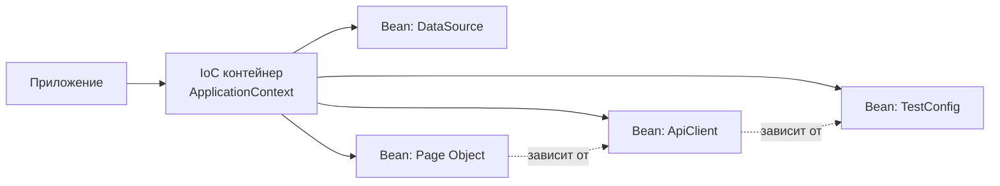
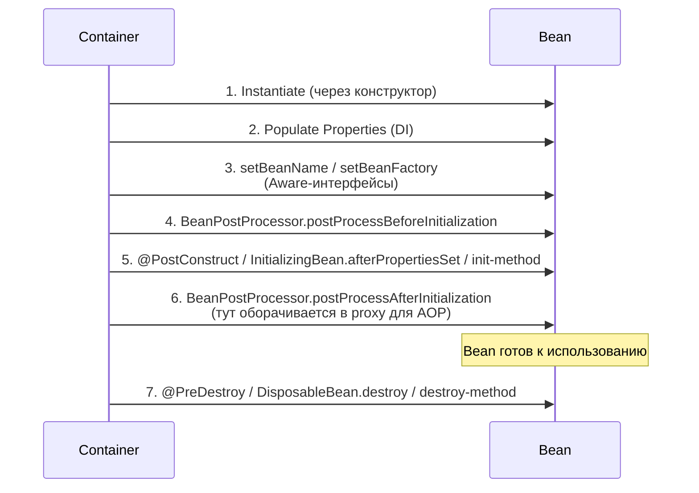
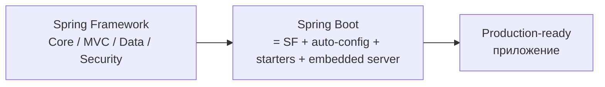
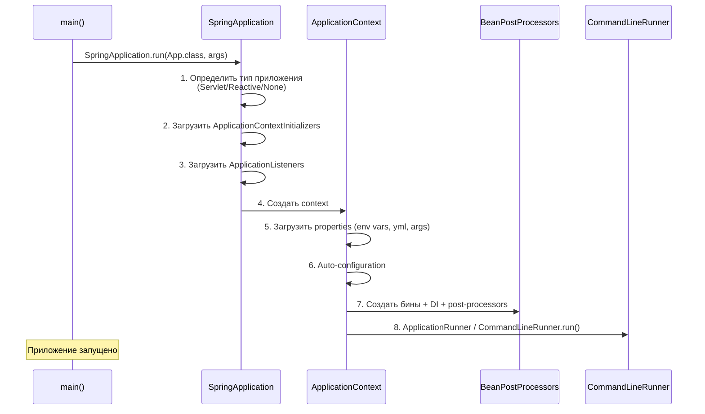

# 07. Spring для QA Automation

> **Цель главы:** дать целостное понимание Spring Framework и Spring Boot с прицелом на автотесты.
> Фокус — не заучивать аннотации, а понимать, *зачем* Spring нужен в автотест-фреймворке и
> как он решает проблемы конфигурации, переиспользования компонентов и интеграции.

---

## Содержание

1. [Часть 1. Spring Core: IoC, DI, Bean](#часть-1-spring-core-ioc-di-bean)
2. [Часть 2. Spring Boot: auto-configuration, properties, profiles](#часть-2-spring-boot)
3. [Часть 3. Spring Test: контексты, slices, моки](#часть-3-spring-test)
4. [Часть 4. Spring в автотест-фреймворке (практика)](#часть-4-spring-в-автотест-фреймворке-практика)
5. [Чек-лист самопроверки](#чек-лист-самопроверки)
6. [Видеоматериалы](#видеоматериалы)

---

## Часть 1. Spring Core: IoC, DI, Bean

### Q1. Что такое Spring Framework и какие проблемы он решает?

**Spring** — модульный Java-фреймворк, ядром которого является **IoC-контейнер** (Inversion of Control). Он управляет жизненным циклом объектов, их зависимостями и конфигурацией приложения.

**Проблемы, которые решает:**

| Проблема без Spring                                  | Как решает Spring                                                |
| ---------------------------------------------------- | ---------------------------------------------------------------- |
| Тесная связанность (`new` повсюду)                   | Контейнер сам создаёт объекты и инжектит зависимости             |
| Дублирование кода настройки (БД, HTTP-клиенты)       | Конфиг описывается один раз и переиспользуется через DI          |
| Сложно подменять реализации в тестах                 | Заменяешь bean на mock через `@MockBean` или другой `@Profile`   |
| Boilerplate (транзакции, безопасность, сериализация) | AOP + декларативные аннотации (`@Transactional`, `@Cacheable`)   |
| Конфигурация для разных сред                         | Profiles + externalized configuration (`application-{env}.yml`)  |



---

### Q2. Что такое IoC и Dependency Injection? В чём разница?

**IoC (Inversion of Control)** — общий принцип: управление потоком/жизненным циклом передаётся внешней системе (контейнеру). Это **парадигма**.

**DI (Dependency Injection)** — конкретный **способ реализации IoC**: зависимости *вкладываются* в объект извне, а не создаются им самим.

**Без DI:**
```java
public class OrderService {
    private final PaymentClient client = new PaymentClient("https://api.bank.ru");
    // OrderService жёстко привязан к PaymentClient → не подменишь в тестах
}
```

**С DI:**
```java
@Service
public class OrderService {
    private final PaymentClient client;
    public OrderService(PaymentClient client) { // зависимость инжектится
        this.client = client;
    }
}
```

> **Ключевая фраза для интервью:** *«IoC — это принцип, DI — техника. Spring реализует IoC через DI.»*

---

### Q3. Что такое Spring-контейнер? BeanFactory vs ApplicationContext

**Контейнер** — это объект, отвечающий за создание, конфигурацию и хранение бинов.

| Тип                  | Что это                                                                  | Когда использовать                  |
| -------------------- | ------------------------------------------------------------------------ | ----------------------------------- |
| `BeanFactory`        | Базовый интерфейс. Lazy-инициализация, минимум функций.                  | Очень редко (memory-constrained).   |
| `ApplicationContext` | Расширяет `BeanFactory`. Eager-init синглтонов, события, i18n, AOP.      | **Дефолт** для любого приложения.   |

**Имплементации `ApplicationContext`:**
- `AnnotationConfigApplicationContext` — для Java-конфигов
- `ClassPathXmlApplicationContext` — для XML
- `AnnotationConfigServletWebServerApplicationContext` — Spring Boot web
- `GenericWebApplicationContext` — REST API

```java
// Программное создание контекста (например, для автотестов)
ApplicationContext ctx = new AnnotationConfigApplicationContext(TestConfig.class);
ApiClient client = ctx.getBean(ApiClient.class);
```

---

### Q4. Что такое Bean и каков его жизненный цикл?

**Bean** — объект, созданный, сконфигурированный и управляемый Spring-контейнером.

**Жизненный цикл:**



**Минимальный пример хука инициализации:**
```java
@Component
public class DbCleaner {
    @PostConstruct
    void init() {
        // выполнится после DI всех зависимостей
        cleanTestData();
    }

    @PreDestroy
    void shutdown() {
        // выполнится при закрытии контекста
        closeConnections();
    }
}
```

---

### Q5. Какие способы DI существуют? Что выбрать и почему?

**1. Constructor injection (рекомендуемый):**
```java
@Service
public class OrderService {
    private final PaymentClient client;
    private final UserRepo repo;

    // С Lombok @RequiredArgsConstructor — автоматически
    public OrderService(PaymentClient client, UserRepo repo) {
        this.client = client;
        this.repo = repo;
    }
}
```

**2. Setter injection:**
```java
@Service
public class OrderService {
    private PaymentClient client;

    @Autowired
    public void setClient(PaymentClient client) { this.client = client; }
}
```

**3. Field injection (антипаттерн):**
```java
@Service
public class OrderService {
    @Autowired
    private PaymentClient client; // плохо: нельзя сделать final, тяжелее тестировать
}
```

**Сравнение:**

| Критерий                          | Constructor | Setter | Field |
| --------------------------------- | ----------- | ------ | ----- |
| `final` поля                      | ✅           | ❌      | ❌     |
| Обязательность зависимости        | ✅ (явно)    | ❌      | ❌     |
| Циклические зависимости           | ловятся     | ок     | ок    |
| Тестируемость без Spring          | ✅           | ✅      | ❌     |
| Дефолт в современных Spring/Boot  | ✅           |        |       |

> **Для интервью:** *«Constructor injection — стандарт. Иммутабельные зависимости, явные контракты, легко мокать в unit-тестах без поднятия контекста.»*

---

### Q6. @Component, @Service, @Repository, @Controller — есть ли разница?

Все четыре — **stereotype-аннотации**, фактически синонимы `@Component` для контейнера. Но семантически и функционально:

| Аннотация       | Назначение                                  | Доп. поведение                                                                        |
| --------------- | ------------------------------------------- | ------------------------------------------------------------------------------------- |
| `@Component`    | Любой компонент                             | —                                                                                     |
| `@Service`      | Сервисный слой / бизнес-логика              | Только семантика                                                                      |
| `@Repository`   | Доступ к данным (DAO)                       | **Translates exceptions:** низкоуровневые `SQLException` в `DataAccessException`      |
| `@Controller`   | Web-контроллер (Spring MVC)                 | Маршрутизация запросов, поддержка `@RequestMapping`                                   |
| `@RestController` | REST-контроллер                           | `@Controller` + `@ResponseBody` (всё возвращается как JSON)                           |

```java
@Service                  // бизнес-логика
public class OrderService { /* ... */ }

@Repository               // DAO
public class OrderRepo { /* ... */ }
```

---

### Q7. Что делает @Autowired? Чем отличается от @Resource и @Inject?

| Аннотация    | Источник              | Поиск по                       | Особенности                                                |
| ------------ | --------------------- | ------------------------------ | ---------------------------------------------------------- |
| `@Autowired` | Spring                | **типу** → потом по имени      | Можно `required = false`. Подружить с `@Qualifier`.        |
| `@Resource`  | JSR-250 (Java EE)     | **имени** → потом по типу      | Часть стандарта Java, не зависит от Spring                 |
| `@Inject`    | JSR-330 (CDI)         | **типу**                       | Стандарт. Аналог `@Autowired`, но без `required`.          |

**На практике в Spring Boot:** `@Autowired` чаще всего не пишется — для конструктора с одним параметром Spring инжектит автоматически (с версии 4.3+).

---

### Q8. @Qualifier и @Primary — когда что использовать?

**Проблема:** есть два бина одного типа.

```java
public interface Notifier { void send(String msg); }

@Component class EmailNotifier implements Notifier { /*...*/ }
@Component class SmsNotifier   implements Notifier { /*...*/ }

@Service
class OrderService {
    public OrderService(Notifier notifier) { } // ❌ NoUniqueBeanDefinitionException
}
```

**Решение 1: `@Primary`** — указать «дефолтную» реализацию.
```java
@Component @Primary
class EmailNotifier implements Notifier { }
```

**Решение 2: `@Qualifier`** — выбрать конкретную в точке инжекции.
```java
@Service
class OrderService {
    public OrderService(@Qualifier("smsNotifier") Notifier notifier) { }
}
```

**Когда что:**
- `@Primary` — если для 90% случаев нужна одна реализация. *(Например, по умолчанию используем `EmailNotifier`.)*
- `@Qualifier` — точечный выбор в конкретной зависимости. Чаще для тестов и edge cases.

---

### Q9. Bean Scope — какие бывают и зачем?

| Scope         | Описание                                                            |
| ------------- | ------------------------------------------------------------------- |
| `singleton`   | **Дефолт.** Один экземпляр на контейнер.                             |
| `prototype`   | Новый экземпляр при каждом `getBean()` / DI                         |
| `request`     | Один на HTTP-запрос (только web)                                    |
| `session`     | Один на HTTP-сессию (только web)                                    |
| `application` | Один на ServletContext (web)                                        |
| `websocket`   | Один на websocket-сессию                                            |

**Пример: в автотестах нужен новый клиент на каждый тест**
```java
@Component
@Scope(ConfigurableBeanFactory.SCOPE_PROTOTYPE)
public class TestApiClient {
    private final String requestId = UUID.randomUUID().toString();
    // каждый тест получает свой клиент
}
```

**Подводный камень:** инжект `prototype` в `singleton` даёт *один и тот же* prototype-bean. Решение — `ObjectProvider<T>`, `Provider<T>` или `@Lookup`.

---

### Q10. Что такое @Configuration и @Bean?

`@Configuration` — Java-класс с описанием бинов программно. `@Bean` — метод, возвращающий бин.

```java
@Configuration
public class TestApiConfig {

    @Bean
    public RequestSpecification baseSpec(@Value("${api.base-url}") String baseUrl) {
        return new RequestSpecBuilder()
            .setBaseUri(baseUrl)
            .setContentType(ContentType.JSON)
            .build();
    }

    @Bean
    public OrderApiClient orderClient(RequestSpecification spec) {
        return new OrderApiClient(spec);
    }
}
```

**Когда `@Configuration` лучше `@Component` со статическими бинами:**
- сложная конфигурация (нужны параметры, логика)
- интеграция со сторонними классами без аннотаций (Apache HttpClient, OkHttp, Playwright Browser)
- условная регистрация (`@ConditionalOnProperty`)

**Тонкость:** `@Configuration` создаёт CGLIB-прокси над классом, чтобы вызовы `bean1()` внутри `bean2()` возвращали один и тот же синглтон. Если поставить `@Configuration(proxyBeanMethods = false)` — не оборачивается, но теряется этот трюк.

---

## Часть 2. Spring Boot

### Q11. Что такое Spring Boot? Чем отличается от Spring Framework?

**Spring Framework** — набор модулей: Core, MVC, Data, Security, etc. Требует много ручной конфигурации.

**Spring Boot** — надстройка, которая:
1. Делает **auto-configuration** на основе classpath
2. Поставляет **starters** (метазависимости) — `spring-boot-starter-web`, `-test`, `-data-jpa`
3. Включает **embedded server** (Tomcat/Jetty/Netty) — приложение запускается как `java -jar`
4. Даёт **Actuator** — health-checks, metrics
5. Даёт **externalized config** — `application.yml`, profiles, env



> **Запомни фразу:** *«Spring Boot — это convention over configuration: разумные дефолты, можно переопределить.»*

---

### Q12. Как работает auto-configuration?

Механика:

1. На классе с `@SpringBootApplication` (он включает `@EnableAutoConfiguration`) Spring Boot ищет файлы `META-INF/spring/org.springframework.boot.autoconfigure.AutoConfiguration.imports` (раньше — `spring.factories`) во всех jar в classpath.
2. Из найденных списков загружает классы `*AutoConfiguration`.
3. Каждый из них помечен `@Conditional*`-аннотациями: применяется только если в classpath есть нужные классы / отсутствует определённый property / нет уже зарегистрированного бина.

**Пример:**
```java
@AutoConfiguration
@ConditionalOnClass(DataSource.class)
@ConditionalOnMissingBean(DataSource.class)
@EnableConfigurationProperties(DataSourceProperties.class)
public class DataSourceAutoConfiguration {
    @Bean DataSource dataSource(DataSourceProperties props) { /* ... */ }
}
```

**Как посмотреть, что включилось:**
```bash
# Запустить с --debug — Boot напечатает positive/negative matches
java -jar app.jar --debug
```

или в `application.yml`:
```yaml
debug: true
```

---

### Q13. application.properties / application.yml — чем @Value отличается от @ConfigurationProperties?

**`@Value`** — точечный инжект одного значения.

```yaml
api:
  base-url: https://api.dev.bank.ru
  timeout: 30s
```

```java
@Component
public class ApiClient {
    @Value("${api.base-url}")
    private String baseUrl;

    @Value("${api.timeout:10s}") // дефолт, если не задано
    private Duration timeout;
}
```

**`@ConfigurationProperties`** — биндит целую группу в POJO.

```java
@ConfigurationProperties(prefix = "api")
public record ApiProperties(String baseUrl, Duration timeout, Map<String, String> headers) {}

@Configuration
@EnableConfigurationProperties(ApiProperties.class)
public class ApiConfig { }
```

```java
@Component
@RequiredArgsConstructor
public class ApiClient {
    private final ApiProperties props; // type-safe
}
```

**Когда что:**

| Критерий                   | `@Value`               | `@ConfigurationProperties` |
| -------------------------- | ---------------------- | -------------------------- |
| 1–2 значения               | ✅                      | избыточно                  |
| Группа > 3 значений        | пишется много раз      | ✅                          |
| Валидация (`@NotBlank`)    | ❌                      | ✅                          |
| Список / Map               | сложно                 | ✅                          |
| Auto-completion в IDE      | ✅ (с конфиг-метой)     | ✅                          |

---

### Q14. Spring Profiles — что это и как использовать в тестах?

**Profile** — именованная группа бинов и properties, которая активируется условно.

**Структура файлов:**
```
src/main/resources/
├── application.yml          # общие настройки
├── application-dev.yml      # dev среда
├── application-stage.yml    # stage
└── application-prod.yml     # prod

src/test/resources/
└── application-test.yml     # для автотестов
```

**Активация:**
```yaml
# application.yml
spring:
  profiles:
    active: dev    # либо через env: SPRING_PROFILES_ACTIVE=dev
```

**Условный bean:**
```java
@Configuration
public class ApiClientConfig {

    @Bean @Profile("dev")
    ApiClient devClient() { return new ApiClient("https://api.dev"); }

    @Bean @Profile({"stage", "prod"})
    ApiClient prodClient() { return new ApiClient("https://api.bank.ru"); }
}
```

**В тестах:**
```java
@SpringBootTest
@ActiveProfiles("test")    // только для этого теста
class OrderApiTest { /* ... */ }
```

**Передача профиля при запуске тестов:**
```bash
mvn test -Dspring.profiles.active=stage
```

---

### Q15. Что такое starter? Какие starter'ы используют для тестов?

**Starter** — это «метазависимость» (POM-only артефакт), которая транзитивно подтягивает связанный набор библиотек.

**Самые нужные для QA:**

| Starter                                   | Что приносит                                              |
| ----------------------------------------- | --------------------------------------------------------- |
| `spring-boot-starter-test`                | JUnit 5, Mockito, AssertJ, Spring Test, JsonAssert        |
| `spring-boot-starter-web`                 | Spring MVC + Tomcat (если тестируем web-приложение)       |
| `spring-boot-starter-webflux`             | WebFlux + WebTestClient                                   |
| `spring-boot-starter-data-jpa`            | Hibernate, JPA, для интеграционных тестов с БД            |
| `spring-boot-testcontainers`              | Авто-интеграция с Testcontainers (с Boot 3.1+)            |

**Пример pom.xml:**
```xml
<dependency>
    <groupId>org.springframework.boot</groupId>
    <artifactId>spring-boot-starter-test</artifactId>
    <scope>test</scope>
    <exclusions>
        <!-- если используешь свой Mockito или AssertJ -->
        <exclusion>
            <groupId>org.mockito</groupId>
            <artifactId>mockito-core</artifactId>
        </exclusion>
    </exclusions>
</dependency>
```

---

### Q16. Жизненный цикл Spring Boot приложения



---

### Q17. Actuator — нужен ли для тестов?

**Actuator** — endpoints для health/metrics/info: `/actuator/health`, `/actuator/metrics`, `/actuator/env`.

**Для QA полезен потому что:**
- В smoke-тестах можно ждать `/actuator/health = UP` перед началом сценариев
- Проверять конфиг приложения через `/actuator/env` (если включён)
- Тесты для самих endpoint'ов

**В автотестах сами по себе не нужны** — но их часто используют как «pre-flight check»:

```java
@Test
void apiIsHealthy() {
    given().baseUri(env.baseUrl())
        .when().get("/actuator/health")
        .then().statusCode(200).body("status", equalTo("UP"));
}
```

---

### Q18. SpringApplication.run vs @SpringBootTest

| Способ                          | Когда                                          | Что делает                                       |
| ------------------------------- | ---------------------------------------------- | ------------------------------------------------ |
| `SpringApplication.run(...)`    | В `main()` приложения                          | Поднимает контекст + embedded server             |
| `@SpringBootTest`               | На тестовом классе                             | Поднимает контекст для теста, **с web или без**  |
| `@SpringBootTest(webEnvironment = RANDOM_PORT)` | API-тесты                          | Стартует embedded server на случайном порту      |
| `@SpringBootTest(webEnvironment = MOCK)` | Web-тесты с MockMvc                | Не стартует сервер, web — через моки             |

---

## Часть 3. Spring Test

### Q19. Что такое Spring Test Context Framework?

Это часть `spring-test`, отвечающая за **управление ApplicationContext в тестах**:

- Загрузка контекста (через `@ContextConfiguration` или `@SpringBootTest`)
- **Кэширование** контекста между тестами с одинаковой конфигурацией
- Инжект бинов в тестовый класс
- Управление транзакциями (`@Transactional`)
- Профили (`@ActiveProfiles`)
- Перекрытие properties (`@TestPropertySource`)

```mermaid
flowchart LR
    T1[TestClass1<br/>@SpringBootTest] -->|same config| CACHE[(Контекст-кэш)]
    T2[TestClass2<br/>@SpringBootTest] -->|same config| CACHE
    T3[TestClass3<br/>@MockBean DataSource] -->|new key| CTX2[Новый контекст]
    CACHE --> CTX1[Контекст 1]
```

---

### Q20. @SpringBootTest — что делает, какие webEnvironment бывают?

**Аннотация поднимает Spring Boot контекст** для интеграционного теста. Без неё — обычный JUnit-тест без DI.

**`webEnvironment`:**

| Значение           | Поведение                                                                |
| ------------------ | ------------------------------------------------------------------------ |
| `MOCK` (дефолт)    | Web-окружение есть, но реального сервера нет. Используй MockMvc.         |
| `RANDOM_PORT`      | Запускает embedded server на случайном свободном порту                   |
| `DEFINED_PORT`     | На порту из `server.port`                                                |
| `NONE`             | Без web вообще                                                           |

**Пример: интеграционный API-тест с RestAssured:**
```java
@SpringBootTest(webEnvironment = RANDOM_PORT)
class OrderApiIT {

    @LocalServerPort int port;

    @BeforeEach
    void setUp() { RestAssured.port = port; }

    @Test
    void createOrderReturns201() {
        given()
            .contentType(JSON)
            .body(Map.of("amount", 100, "currency", "RUB"))
        .when()
            .post("/orders")
        .then()
            .statusCode(201)
            .body("id", notNullValue());
    }
}
```

---

### Q21. Test slices — что это? @WebMvcTest, @DataJpaTest, @JsonTest

**Slice-тест** поднимает **только часть** контекста, нужную для одного слоя. Быстрее, чем `@SpringBootTest`.

| Аннотация              | Что включает                                       | Что использовать      |
| ---------------------- | -------------------------------------------------- | --------------------- |
| `@WebMvcTest`          | MVC: контроллеры, фильтры, ControllerAdvice        | `MockMvc`             |
| `@WebFluxTest`         | WebFlux                                            | `WebTestClient`       |
| `@DataJpaTest`         | JPA, Hibernate, in-memory БД                       | `TestEntityManager`   |
| `@DataMongoTest`       | MongoDB embedded                                   |                       |
| `@JsonTest`            | Jackson/GSON                                       | `JacksonTester`       |
| `@RestClientTest`      | RestTemplate / WebClient + MockRestServiceServer   |                       |

**Пример `@WebMvcTest`:**
```java
@WebMvcTest(OrderController.class)
class OrderControllerTest {

    @Autowired MockMvc mvc;
    @MockBean OrderService service;   // сервис мокаем — slice не подтягивает реализации

    @Test
    void getOrderReturnsJson() throws Exception {
        when(service.findById(1L)).thenReturn(new Order(1L, 100));

        mvc.perform(get("/orders/1"))
           .andExpect(status().isOk())
           .andExpect(jsonPath("$.amount").value(100));
    }
}
```

> **Для QA Auto важно:** slice-тесты — это **разработческие** unit/integration тесты. Автотесты на готовый сервис обычно используют `@SpringBootTest` с `RANDOM_PORT` или ходят по сети на стейдж.

---

### Q22. @MockBean vs @SpyBean

Обе из `spring-boot-test`. Заменяют **бин в контексте** на mock/spy Mockito.

| Аннотация    | Поведение                                                            |
| ------------ | -------------------------------------------------------------------- |
| `@MockBean`  | Полностью замокирован. Без `when().thenReturn()` методы возвращают null/0/false. |
| `@SpyBean`   | Реальный бин обёрнут в spy: вызовы реальные, можно подменять отдельные методы.  |

```java
@SpringBootTest
class PaymentServiceIT {

    @MockBean PaymentClient client;          // ходит в банк — мокаем
    @SpyBean  AuditLogger logger;            // реальная имплементация, но шпионим

    @Autowired PaymentService service;

    @Test
    void chargesUserAndLogs() {
        when(client.charge(any())).thenReturn(new ChargeResult("OK"));

        service.charge(new Payment(100));

        verify(logger).log(contains("charged"));
    }
}
```

> С Spring Boot 3.4+ предпочтительнее новые **`@MockitoBean` / `@MockitoSpyBean`** — они снимают ряд ограничений старых аннотаций.

---

### Q23. Кэширование контекста — как работает и почему важно для скорости тестов?

Spring **кэширует ApplicationContext по ключу** = (config classes + active profiles + property sources + test classes for slices + ...).

**Если у двух тестов одинаковый ключ — поднимается один контекст**, тесты разделяют его.

**Что ломает кэш:**
- разные `@ActiveProfiles`
- разные `@MockBean`
- разные `@TestPropertySource`
- `@DirtiesContext`
- разные конфиги в `@SpringBootTest(classes = ...)`

**Почему это важно:**

```mermaid
gantt
    title Скорость прогона тестов с кэшированием контекста
    dateFormat  s
    axisFormat  %S сек
    section Без кэша
    Test1: a1, 0, 10s
    Test2: a2, after a1, 10s
    Test3: a3, after a2, 10s
    section С кэшем
    Boot+Test1: b1, 0, 10s
    Test2: b2, after b1, 1s
    Test3: b3, after b2, 1s
```


**Правило для автотестов:** держи **минимум разных конфигураций**. Каждая комбинация `@MockBean` × `@ActiveProfiles` = новый контекст = +10–30 секунд на холодный старт.

---

### Q24. @DirtiesContext — когда применять?

**`@DirtiesContext`** говорит Spring: «сбрось кэш для этого контекста после теста / класса».

```java
@SpringBootTest
@DirtiesContext(classMode = BEFORE_CLASS) // пересоздать перед классом
class DangerousTest { }
```

**Когда нужно:**
- Тест **меняет состояние синглтонов** (вставляет данные в in-memory кэш, мутирует синглтонный bean)
- Тест **shutdown'ит ресурсы** (закрывает DataSource, останавливает Kafka consumer)
- Запускается **перед** другим тестом, который не должен видеть эти изменения

**Цена:** контекст пересоздаётся → следующий тест ждёт полный init.

> **Антипаттерн:** ставить `@DirtiesContext` «на всякий случай» — гарантия медленных тестов.

---

### Q25. @TestConfiguration vs @Configuration в тесте

**`@Configuration` в `src/test/java`** — обычный конфиг, **подхватывается auto-scan** так же, как из `main`. Может перебить production-bean неожиданно.

**`@TestConfiguration`** — конфиг **только для тестов**, не подхватывается auto-scan. Подключается явно через `@Import(MyTestConfig.class)` или вложенным классом.

```java
@SpringBootTest
class OrderApiIT {

    @Autowired ApiClient client;

    @TestConfiguration
    static class MockApiConfig {
        @Bean
        ApiClient stubApiClient() {
            return new ApiClient("https://stub.local");
        }
    }
}
```

---

### Q26. @ActiveProfiles в тестах

Активирует один или несколько профилей **только для теста**:

```java
@SpringBootTest
@ActiveProfiles({"test", "stub-payments"})
class OrderApiTest { }
```

Что делает:
1. Берёт `application-test.yml` и `application-stub-payments.yml` поверх `application.yml`
2. Активирует все `@Bean @Profile("test"|"stub-payments")`

**Анти-кейс:** не клади credentials в `application-test.yml` в репозиторий — используй env vars или Vault.

---

### Q27. Как переопределить properties в тесте

**Вариант 1: `@TestPropertySource`** — точечно, в одном тестовом классе.
```java
@SpringBootTest
@TestPropertySource(properties = {
    "api.base-url=http://localhost:8080",
    "api.timeout=2s"
})
class FastTimeoutTest { }
```

**Вариант 2: `properties` в `@SpringBootTest`** (то же самое, короче):
```java
@SpringBootTest(properties = "api.timeout=2s")
class FastTimeoutTest { }
```

**Вариант 3: отдельный `application-test.yml`** + `@ActiveProfiles("test")`.

**Вариант 4: `@DynamicPropertySource`** — если значения известны только в рантайме (например, контейнеры):
```java
@SpringBootTest
@Testcontainers
class DbIT {
    @Container static PostgreSQLContainer<?> pg = new PostgreSQLContainer<>("postgres:16");

    @DynamicPropertySource
    static void props(DynamicPropertyRegistry r) {
        r.add("spring.datasource.url",      pg::getJdbcUrl);
        r.add("spring.datasource.username", pg::getUsername);
        r.add("spring.datasource.password", pg::getPassword);
    }
}
```

---

### Q28. TestRestTemplate vs WebTestClient vs MockMvc

| Инструмент       | Что тестирует                       | Сетевой вызов | Когда использовать                            |
| ---------------- | ----------------------------------- | ------------- | --------------------------------------------- |
| `MockMvc`        | Spring MVC контроллеры              | ❌ (мок)       | Юнит-тесты контроллера в `@WebMvcTest`        |
| `TestRestTemplate` | Реальный HTTP к embedded server   | ✅             | Интеграция с `@SpringBootTest(RANDOM_PORT)`   |
| `WebTestClient`  | WebFlux или MVC                     | ✅ или ❌       | Реактивные тесты                              |
| **RestAssured**  | Любой REST API (свой/внешний)       | ✅             | **Дефолт для автотестов в QA**                |

**Пример MockMvc:**
```java
mvc.perform(get("/api/orders/1").accept(MediaType.APPLICATION_JSON))
   .andExpect(status().isOk())
   .andExpect(jsonPath("$.id").value(1));
```

**Пример WebTestClient:**
```java
webClient.get().uri("/api/orders/1")
    .exchange()
    .expectStatus().isOk()
    .expectBody().jsonPath("$.id").isEqualTo(1);
```

**Пример RestAssured (см. главу 06):**
```java
given().port(port).when().get("/api/orders/1").then().statusCode(200);
```

---

### Q29. @AutoConfigureMockMvc — что делает?

Подключает MockMvc к `@SpringBootTest` без перехода в slice:

```java
@SpringBootTest
@AutoConfigureMockMvc
class OrderControllerTest {
    @Autowired MockMvc mvc;
}
```

vs `@WebMvcTest` — когда нужен **полный контекст**, но без поднятия сервера.

---

### Q30. @Transactional в тестах — польза и подводные камни

**Польза:** каждый тест в своей транзакции, откатывается в конце → БД чистая.

```java
@SpringBootTest
@Transactional
class OrderRepoTest {

    @Autowired OrderRepo repo;

    @Test
    void savesOrder() {
        repo.save(new Order(100));
        assertThat(repo.count()).isEqualTo(1);
        // после теста — ROLLBACK, в БД ничего не остаётся
    }
}
```

**Подводные камни:**
1. **Не работает с `@SpringBootTest(RANDOM_PORT)`** — клиент и сервер в разных потоках, транзакция теста не виден серверу.
2. **HTTP-тесты через RestAssured** не откатываются — реальный код приложения коммитит свои транзакции.
3. **Lazy-loading** — за пределами транзакции выкидывает `LazyInitializationException`.
4. **`@Commit`** или `TestTransaction.flagForCommit()` — если нужно сохранить данные после теста.

> **Для интеграционных тестов:** часто проще чистить БД явно через `@Sql` / Flyway / Testcontainers, чем полагаться на `@Transactional`.

---

### Q31. ContextHierarchy и @ContextConfiguration

`@ContextConfiguration` — низкоуровневая аннотация (используется в Spring без Boot или для тонкой настройки).

`@ContextHierarchy` — иерархия контекстов: parent + child.

```java
@ContextHierarchy({
    @ContextConfiguration(classes = ParentConfig.class),
    @ContextConfiguration(classes = ChildConfig.class)
})
class HierarchicalTest { }
```

В **автотестах редко нужно** — обычно хватает плоской конфигурации `@SpringBootTest`.

---

### Q32. Почему Spring Boot tests медленнее unit?

**Holding cost:**
1. Bootstrap классов из 50–200 jar в classpath
2. Auto-configuration: scan + conditions
3. Создание всех singleton-бинов (eager-init)
4. Embedded server (если webEnvironment != NONE)
5. Подключение к БД, Kafka, Redis (если есть)

**Холодный старт `@SpringBootTest`** = 5–30 секунд. Unit-тест без Spring = миллисекунды.

**Что делать:**
- **Минимум разных конфигов** → кэш контекста работает
- **Slice-тесты** где это юнит-логика
- **Чистые unit-тесты** без Spring для бизнес-логики
- **`@SpringBootTest`** только для интеграционных проверок

```mermaid
flowchart TB
    PYR[Тестовая пирамида] --> U[Unit без Spring<br/>тысячи, миллисек.]
    PYR --> SL[Slice-тесты<br/>сотни, 1-3 сек.]
    PYR --> IT[@SpringBootTest IT<br/>десятки, 10+ сек.]
    PYR --> E2E[E2E через сеть<br/>единицы-десятки, 30+ сек.]
```

---

### Q33. Spring + Testcontainers

Testcontainers — библиотека, поднимающая Docker-контейнеры (БД, Kafka, Redis) на время тестов.

**С Spring Boot 3.1+** есть автоинтеграция:

```java
@SpringBootTest
@Testcontainers
class OrderRepoIT {

    @Container @ServiceConnection
    static PostgreSQLContainer<?> pg = new PostgreSQLContainer<>("postgres:16");

    @Autowired OrderRepo repo;

    @Test
    void persistsOrder() {
        repo.save(new Order(100));
        assertThat(repo.count()).isOne();
    }
}
```

`@ServiceConnection` сам подсовывает url/user/password в `spring.datasource.*` — не нужен `@DynamicPropertySource`.

**Подробнее — в главе 11.**

---

## Часть 4. Spring в автотест-фреймворке (практика)

### Q34. Зачем нужен Spring в автотестах? Реальные кейсы

| Кейс                                                  | Как помогает Spring                                                       |
| ----------------------------------------------------- | ------------------------------------------------------------------------- |
| Один URL/credentials для всех тестов                  | `@ConfigurationProperties` + DI в Page Object'ы и API-клиенты             |
| Подмена endpoint'а в зависимости от среды             | Profiles + `application-{env}.yml`                                         |
| Переиспользование API-клиентов между тестами          | `@Bean` синглтонов `ApiClient` инжектятся куда нужно                      |
| Логирование/Allure-фильтры на каждом запросе          | Регистрируешь bean `RequestSpecBuilder` с фильтрами один раз               |
| Подмена бэкенда на стаб для негативных тестов         | `@MockBean` / отдельный профиль                                           |
| Запуск базы / Kafka / Redis в Testcontainers          | `@DynamicPropertySource` + `@ServiceConnection`                           |
| Чистка тестовых данных                                | `@PostConstruct` / hooks через DI репозиториев                            |

> **Когда Spring избыточен:** маленький фреймворк с 30 тестами и одним endpoint — хватит обычной статики.

---

### Q35. Spring Boot Test для API-тестов: пример с RestAssured

**Структура:**
```
src/test/java/.../
├── config/
│   ├── ApiTestConfig.java
│   └── RestAssuredConfig.java
├── client/
│   ├── OrderApiClient.java
│   └── UserApiClient.java
├── tests/
│   └── OrderApiTest.java
└── resources/
    ├── application.yml
    ├── application-dev.yml
    └── application-stage.yml
```

**`application.yml`:**
```yaml
api:
  base-url: ${API_BASE_URL:https://api.dev.bank.ru}
  auth:
    token: ${API_TOKEN:}
  timeout: 30s
```

**`ApiProperties.java`:**
```java
@ConfigurationProperties(prefix = "api")
public record ApiProperties(String baseUrl, AuthProps auth, Duration timeout) {
    public record AuthProps(String token) {}
}
```

**`RestAssuredConfig.java`:**
```java
@Configuration
@EnableConfigurationProperties(ApiProperties.class)
public class RestAssuredConfig {

    @Bean
    public RequestSpecification baseSpec(ApiProperties props) {
        return new RequestSpecBuilder()
            .setBaseUri(props.baseUrl())
            .setContentType(ContentType.JSON)
            .addHeader("Authorization", "Bearer " + props.auth().token())
            .addFilter(new AllureRestAssured())
            .addFilter(new RequestLoggingFilter(LogDetail.URI))
            .addFilter(new ResponseLoggingFilter(LogDetail.STATUS))
            .build();
    }
}
```

**`OrderApiClient.java`:**
```java
@Component
@RequiredArgsConstructor
public class OrderApiClient {
    private final RequestSpecification spec;

    public Response createOrder(CreateOrderRequest body) {
        return given(spec)
            .body(body)
            .when().post("/orders");
    }

    public OrderDto getOrder(long id) {
        return given(spec)
            .when().get("/orders/{id}", id)
            .then().statusCode(200)
            .extract().as(OrderDto.class);
    }
}
```

**`OrderApiTest.java`:**
```java
@SpringBootTest(classes = ApiTestConfig.class)
@ActiveProfiles("dev")
class OrderApiTest {

    @Autowired OrderApiClient orderApi;

    @Test
    void createsOrder() {
        var resp = orderApi.createOrder(new CreateOrderRequest(100, "RUB"));

        assertThat(resp.statusCode()).isEqualTo(201);
        assertThat(resp.jsonPath().getLong("id")).isPositive();
    }
}
```

`ApiTestConfig.java`:
```java
@Configuration
@ComponentScan(basePackages = {"com.bank.qa.client", "com.bank.qa.config"})
public class ApiTestConfig { }
```

---

### Q36. Как передать конфигурацию в Page Object Playwright через Spring?

```java
@Configuration
@EnableConfigurationProperties(UiProperties.class)
public class PlaywrightConfig {

    @Bean(destroyMethod = "close")
    public Playwright playwright() {
        return Playwright.create();
    }

    @Bean(destroyMethod = "close")
    public Browser browser(Playwright pw, UiProperties props) {
        return pw.chromium().launch(new BrowserType.LaunchOptions()
            .setHeadless(props.headless())
            .setSlowMo(props.slowMo()));
    }

    @Bean
    @Scope(ConfigurableBeanFactory.SCOPE_PROTOTYPE) // новый context на каждый тест
    public BrowserContext browserContext(Browser browser, UiProperties props) {
        return browser.newContext(new Browser.NewContextOptions()
            .setBaseURL(props.baseUrl())
            .setViewportSize(1920, 1080));
    }

    @Bean
    @Scope(ConfigurableBeanFactory.SCOPE_PROTOTYPE)
    public Page page(BrowserContext ctx) { return ctx.newPage(); }
}
```

```java
@Component
@Scope(ConfigurableBeanFactory.SCOPE_PROTOTYPE)
@RequiredArgsConstructor
public class LoginPage {
    private final Page page;
    private final UiProperties props;

    public void open() { page.navigate(props.baseUrl() + "/login"); }
    public void login(String user, String pass) {
        page.fill("#username", user);
        page.fill("#password", pass);
        page.click("button[type=submit]");
    }
}
```

```java
@SpringBootTest(classes = UiTestConfig.class)
@ActiveProfiles("ui-dev")
class LoginTest {
    @Autowired LoginPage loginPage;

    @Test
    void successfulLogin() {
        loginPage.open();
        loginPage.login("user", "pass");
        // assertions...
    }
}
```

> **Подводный камень:** prototype-bean в singleton не пересоздаётся. Чтобы каждый тест получал новый Page — либо `prototype` + `ObjectProvider<Page>`, либо отдельный TestExecutionListener, либо `@DirtiesContext`. На практике многие используют `ThreadLocal<Page>` для параллельного запуска.

---

### Q37. Spring profile для разных сред (dev, stage, prod) в автотестах

**Структура `src/test/resources`:**
```
application.yml             # общее
application-dev.yml         # https://api.dev.bank.ru
application-stage.yml       # https://api.stage.bank.ru
application-prod.yml        # https://api.bank.ru (smoke only!)
application-local.yml       # http://localhost:8080
```

**Запуск:**
```bash
# дефолт (профиль dev задан в application.yml)
mvn test

# на stage
mvn test -Dspring.profiles.active=stage

# несколько профилей
mvn test -Dspring.profiles.active=stage,smoke-only
```

**В CI (GitLab):**
```yaml
test:stage:
  script: mvn test -Dspring.profiles.active=stage
  variables:
    API_TOKEN: $STAGE_TOKEN
```

---

### Q38. Inject properties в тесты

**Вариант 1 — `@Value`:**
```java
@Value("${api.base-url}")
private String baseUrl;
```

**Вариант 2 — `@ConfigurationProperties` (предпочтительно):**
```java
@Autowired ApiProperties props;
```

**Вариант 3 — environment напрямую:**
```java
@Autowired Environment env;
String url = env.getProperty("api.base-url");
```

**Override в одном тесте:**
```java
@SpringBootTest(properties = "api.base-url=http://stub.local")
class StubBackendTest { }
```

---

### Q39. Создание API-клиентов как @Bean

**Преимущество:** один клиент = один `@Bean` со всей нужной обвязкой (filters, baseURI, auth). Тестам не нужно знать ничего о конфигурации.

```java
@Configuration
public class ClientsConfig {

    @Bean RequestSpecification authedSpec(ApiProperties p) { /* как в Q35 */ }

    @Bean OrderApiClient orderClient(RequestSpecification s)   { return new OrderApiClient(s); }
    @Bean UserApiClient  userClient(RequestSpecification s)    { return new UserApiClient(s); }
    @Bean PaymentApiClient payClient(RequestSpecification s)   { return new PaymentApiClient(s); }
}
```

**Если используешь сгенерированного клиента из swagger-codegen:**
```java
@Bean
OrdersApi ordersApi(ApiProperties p) {
    var apiClient = new io.swagger.client.ApiClient();
    apiClient.setBasePath(p.baseUrl());
    apiClient.setAccessToken(p.auth().token());
    return new OrdersApi(apiClient);
}
```

---

### Q40. Конкурентные тесты + Spring (thread-safety)

JUnit 5 умеет запускать тесты параллельно (см. главу 03). При этом Spring-контекст один на все потоки → **синглтонные бины должны быть thread-safe**.

**Чек-лист:**
- `RequestSpecification` от RestAssured — **thread-safe** (с оговорками — лучше билдить новый на запрос).
- API-клиенты без состояния — ок.
- Page Object с полем `Page page` — **НЕ ok**. Нужен либо `prototype`, либо `ThreadLocal<Page>`.
- `RestTemplate` / `WebClient` — thread-safe.
- Bean со счётчиками, кэшами, мутирующим state — нужен `Atomic*` или `@Scope(prototype)`.

```java
@Component
public class TestContext {
    private static final ThreadLocal<UUID> traceId = ThreadLocal.withInitial(UUID::randomUUID);

    public UUID currentTrace() { return traceId.get(); }
    public void clear()        { traceId.remove(); }
}
```

---

### Q41. Типичные ошибки и антипаттерны при использовании Spring в автотестах

| Антипаттерн                                                 | Почему плохо                              | Как правильно                                        |
| ----------------------------------------------------------- | ----------------------------------------- | ---------------------------------------------------- |
| `@Autowired` field injection                                | Усложняет unit-тесты, делает поля mutable | Constructor injection                                |
| `@DirtiesContext` на каждом тесте                           | Контекст пересоздаётся, прогон 30+ мин    | Минимум разных конфигов, ThreadLocal для shared state |
| Куча разных `@MockBean` по тестам                           | Каждая комбинация = новый контекст        | Один-два набора моков на профиль                     |
| Креды в `application-test.yml` в git                        | Утечка                                    | `${API_TOKEN}` + env vars / Vault                    |
| `@SpringBootTest` для каждого юнита                         | Медленно                                  | `@ExtendWith(MockitoExtension.class)` для логики     |
| Разные `@SpringBootTest(classes = ...)` в каждом тесте      | Каждый класс = свой контекст              | Общий root config, один на все тесты                 |
| Использовать `prototype` + `singleton` injection            | Получаешь один и тот же экземпляр         | `ObjectProvider<T>`                                  |
| Полагаться на `@Transactional` в `RANDOM_PORT`              | Не откатывается                           | Чистка через `@Sql` или Testcontainers               |
| Spring там, где хватит обычного класса                      | Боль для понимания                        | Spring оправдан с 50+ тестами и 2+ средами           |

---

## Чек-лист самопроверки

- [ ] Объясню, что такое IoC и DI, в чём разница
- [ ] Знаю 3 способа DI и почему constructor предпочтительнее
- [ ] Понимаю жизненный цикл бина и `@PostConstruct/@PreDestroy`
- [ ] Различаю `@Component`, `@Service`, `@Repository`, `@Controller`
- [ ] Расскажу, что такое `@Configuration` и зачем `proxyBeanMethods`
- [ ] Знаю разницу `@Value` vs `@ConfigurationProperties`
- [ ] Использую профили для dev/stage/prod в автотестах
- [ ] Понимаю, что делает auto-configuration и как её отлаживать
- [ ] Различаю `@SpringBootTest` и slice-тесты, знаю их `webEnvironment`
- [ ] Использую `@MockBean` (или `@MockitoBean`) и понимаю, как это бьёт по кэшу контекста
- [ ] Знаю, почему `@DirtiesContext` — крайнее средство
- [ ] Различаю TestRestTemplate / WebTestClient / MockMvc / RestAssured
- [ ] Подключаю Testcontainers с `@ServiceConnection` или `@DynamicPropertySource`
- [ ] Знаю как сделать Page Object thread-safe в параллельных тестах
- [ ] Могу за 5 минут на доске накидать структуру Spring-based фреймворка автотестов

---

## Видеоматериалы

### Базовый Spring (RU)

- **JUG.ru — «Spring без магии», Евгений Борисов** — https://www.youtube.com/watch?v=BmBr5diz8WA — классика, 4 часа разбора внутренностей.
- **Spring Framework для начинающих, Алишев** — https://www.youtube.com/playlist?list=PLAma_mKffTOR5o0WNHnY0wRWGZLKlhZ-V — простой старт с нуля.
- **Spring Boot, Технострим** — https://www.youtube.com/playlist?list=PLrCZzMib1e9p2sNCPdvRagaitDOO4zGNP — лекции МГТУ.

### Spring Test и автотесты (RU)

- **Heisenbug — доклады с тегом Spring** — https://www.youtube.com/@HeisenbugConf/search?query=spring
- **«Тестирование Spring Boot приложений», Артём Ерошенко** (autor Allure) — на YouTube искать по фразе.

### Англоязычные

- **Test Automation University — Spring Boot Test** — https://testautomationu.applitools.com/spring-test/
- **Spring Developer (official channel)** — https://www.youtube.com/@SpringSourceDev
- **Spring Boot 3 Crash Course, Amigoscode** — https://www.youtube.com/@amigoscode (поиск «Spring Boot»).
- **Reflectoring.io — статьи по Spring Boot Testing** — https://reflectoring.io/spring-boot-testing/

### Документация (читать обязательно)

- **Spring Framework Reference** — https://docs.spring.io/spring-framework/reference/
- **Spring Boot Reference** — https://docs.spring.io/spring-boot/reference/
- **Spring Boot Testing** — https://docs.spring.io/spring-boot/reference/testing/index.html
- **Baeldung — Spring** — https://www.baeldung.com/spring-tutorial (один из лучших ресурсов)

---

[← К оглавлению](./README.md) · [Следующая глава: 05. Playwright Java →](./05-playwright-java.md)
