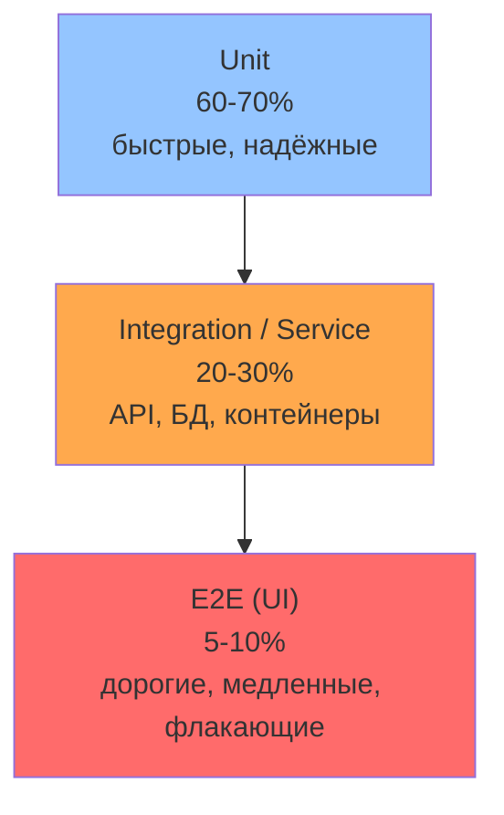
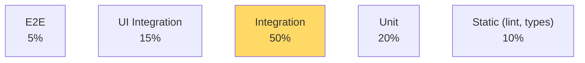
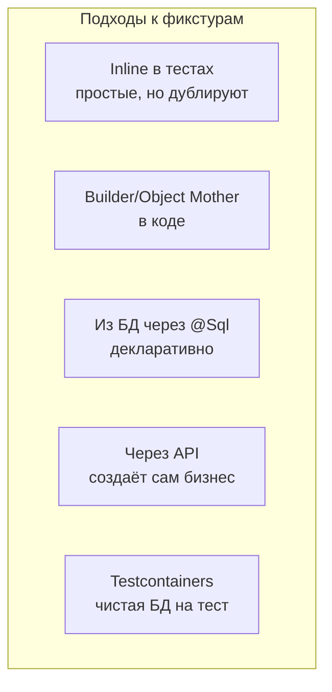
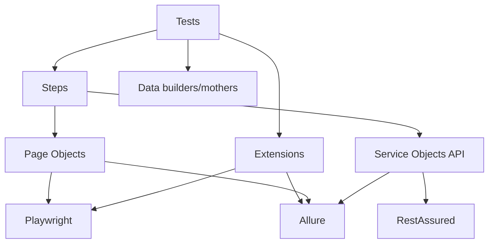
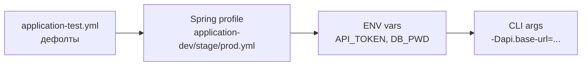

# 09. Архитектура автотестов и паттерны

> **Цель главы:** разобрать паттерны построения тест-фреймворка — Page Object, Steps,
> Screenplay, SOLID для тестов, фабрики тестовых данных, фикстуры. На senior-уровне
> ждут не просто знания PO, но умения **спроектировать** фреймворк под задачу.

---

## Содержание

1. [Часть 1. Тестовая пирамида и виды тестов](#часть-1-тестовая-пирамида-и-виды-тестов)
2. [Часть 2. Page Object Model (POM)](#часть-2-page-object-model-pom)
3. [Часть 3. Steps / Service layer](#часть-3-steps--service-layer)
4. [Часть 4. Screenplay (Serenity)](#часть-4-screenplay-serenity)
5. [Часть 5. SOLID для автотестов](#часть-5-solid-для-автотестов)
6. [Часть 6. Тестовые данные: Builder, Object Mother, Fixtures](#часть-6-тестовые-данные)
7. [Часть 7. Структура проекта и слои фреймворка](#часть-7-структура-проекта-и-слои-фреймворка)
8. [Часть 8. Антипаттерны](#часть-8-антипаттерны)
9. [Чек-лист самопроверки](#чек-лист-самопроверки)
10. [Видеоматериалы](#видеоматериалы)

---

## Часть 1. Тестовая пирамида и виды тестов

### Q1. Тестовая пирамида (Mike Cohn)



**Принципы:**
- Чем выше — тем дороже поддерживать и выполнять
- Тестировать на минимально достаточном уровне
- E2E — для критичных пользовательских сценариев, не для всего подряд

---

### Q2. «Trophy» Кента Доддса — современная альтернатива



**Идея:** интеграционные тесты дают лучший ROI — реальная связка модулей без хрупкости UI.

---

### Q3. Виды тестов по уровню и цели

| Уровень            | Цель                                 | Стек                                | Пример                                          |
| ------------------ | ------------------------------------ | ----------------------------------- | ----------------------------------------------- |
| Unit               | один класс/метод                     | JUnit 5, Mockito                    | `OrderService.calculateTotal(...)`              |
| Component          | модуль с реальными зависимостями     | JUnit 5, Spring Boot Test slice     | `@WebMvcTest OrderController`                   |
| Integration        | несколько модулей вместе             | Spring Boot Test, Testcontainers    | OrderService + БД                                |
| API / Service      | контракт REST/SOAP                   | RestAssured                         | `POST /orders` отдаёт 201                        |
| Contract           | контракт между сервисами             | Pact, Spring Cloud Contract         | producer/consumer тесты                         |
| E2E (UI)           | сценарий пользователя через UI       | Playwright, Selenium                | login → buy → confirmation                       |
| Smoke              | критичный минимум после деплоя       | API/UI                              | `/health`, login form                           |
| Regression         | покрытие после релиза                | API/UI                              | весь набор автотестов                           |
| Performance        | нагрузка / latency                   | JMeter, Gatling, k6                 | 1000 RPS на `/orders`                            |
| Security           | OWASP / penetration                  | OWASP ZAP, Burp                     | XSS / SQL injection                             |

---

### Q4. Black-box vs white-box vs grey-box

- **Black-box** — тестируем по спецификации, не зная внутренностей. Большинство QA-тестов.
- **White-box** — знаем код, проверяем ветви, покрытие, инварианты. Обычно разработчики (unit).
- **Grey-box** — комбинация. QA знает архитектуру, но не код целиком. Например, проверяем логи + БД после API-вызова.

В **fintech** часто **grey-box**: знаем что после `POST /payment` появляется запись в `payments` и event в Kafka — проверяем оба факта.

---

## Часть 2. Page Object Model (POM)

### Q5. Что такое Page Object и зачем он нужен

**Page Object** — класс, инкапсулирующий взаимодействие с конкретной страницей UI. Фактически API страницы для тестов.

**Зачем:**
- **Локаторы в одном месте.** Изменился UI — правишь один класс, не 50 тестов.
- **Тест читается как сценарий**, а не набор `click()`/`fill()`.
- **Переиспользование** между тестами.

**Без POM:**
```java
@Test
void login() {
    page.fill("#username", "user");
    page.fill("#password", "pass");
    page.click("button[type=submit]");
    assertThat(page.locator(".welcome")).hasText("Welcome");
}
```

**С POM:**
```java
@Test
void login() {
    new LoginPage(page).open()
        .loginAs("user", "pass")
        .assertWelcomeMessage("Welcome");
}
```

---

### Q6. Современный Page Object на Playwright Java

```java
public class LoginPage {
    private final Page page;
    private final Locator username, password, submit, error;

    public LoginPage(Page page) {
        this.page = page;
        this.username = page.getByLabel("Username");
        this.password = page.getByLabel("Password");
        this.submit   = page.getByRole(BUTTON, new Page.GetByRoleOptions().setName("Sign in"));
        this.error    = page.locator(".error");
    }

    public LoginPage open() {
        page.navigate("/login");
        return this;
    }

    public DashboardPage loginAs(String user, String pass) {
        username.fill(user);
        password.fill(pass);
        submit.click();
        return new DashboardPage(page);
    }

    public LoginPage assertError(String text) {
        assertThat(error).hasText(text);
        return this;
    }
}
```

**Принципы:**
- Локаторы — **поля класса**, инициализируются в конструкторе
- Методы возвращают **следующий PageObject** или `this` (fluent)
- Assertion-методы (`assertError`) — допустимы внутри PO
- **Не возвращай `Locator` или `WebElement` наружу** — это утечка деталей

---

### Q7. Композиция: Page Object из компонентов

UI часто состоит из переиспользуемых блоков (header, footer, modal). Не дублируй их в каждом PO — выноси в **Component**.

```java
public class HeaderComponent {
    private final Locator userMenu, logout;

    public HeaderComponent(Page page) {
        this.userMenu = page.getByTestId("user-menu");
        this.logout   = page.getByText("Sign out");
    }

    public LoginPage logout() {
        userMenu.click();
        logout.click();
        return new LoginPage(userMenu.page());
    }
}

public class DashboardPage {
    public final HeaderComponent header;
    private final Page page;

    public DashboardPage(Page page) {
        this.page = page;
        this.header = new HeaderComponent(page);
    }
}

// Тест:
new DashboardPage(page).header.logout();
```

---

### Q8. Page Object и assertions — разделение ответственности

**Спорный момент:** должны ли assertions быть в PO?

**Подход 1: PO без assertions, всё в тестах:**
```java
DashboardPage dash = new LoginPage(page).loginAs("u", "p");
assertThat(dash.welcomeText()).isEqualTo("Welcome, John");
```

**Подход 2: assertions в PO как часть API:**
```java
new LoginPage(page).loginAs("u", "p").assertWelcomeText("Welcome, John");
```

**Подход 3: гибрид (рекомендуется для UI):**
- Простые геттеры в PO (`welcomeText()`)
- Сложные доменные проверки в PO (`assertOrderIsPaid(id)`) — тесты не пишут логику чтения
- Assertion на одно значение — чаще в тесте

---

### Q9. Page Factory (Selenium) — устарел

`@FindBy(...)` + `PageFactory.initElements()` — старый Selenium-паттерн. **В современном QA не используется**:

- Не работает с Playwright
- В Selenium 4 заменяется на конструкторную инициализацию `WebElement` или относительные локаторы
- Лениво находит элемент → плохо отлаживается

> На собесе про Page Factory достаточно сказать «знаю, но не использую — устарел, в Playwright не нужен».

---

## Часть 3. Steps / Service layer

### Q10. Что такое Steps?

**Steps** — слой между тестом и Page Object'ами / API-клиентами. Представляет **бизнес-операции пользователя**.

**Зачем:**
- Page Object отвечает за **«как кликать на странице»**, Step — за **«что делает пользователь в системе»**.
- Один Step может затрагивать несколько Page Object'ов / API.
- В Allure отображается красивым деревом.

```java
public class OrderSteps {
    private final NewOrderPage newOrderPage;
    private final OrdersPage ordersPage;
    private final HeaderComponent header;

    @Step("Создать заказ {orderType} на сумму {amount}")
    public Order createOrder(OrderType orderType, BigDecimal amount) {
        header.openOrders();
        ordersPage.clickNewOrder();
        return newOrderPage.fillForm(orderType, amount).submit();
    }

    @Step("Оплатить заказ {orderId}")
    public void pay(String orderId) {
        ordersPage.openOrder(orderId).clickPay().confirm();
    }
}
```

**Тест становится почти human-readable:**
```java
@Test
void userCanPayOrder() {
    Order o = orderSteps.createOrder(OrderType.STANDARD, BigDecimal.valueOf(100));
    orderSteps.pay(o.id());
    orderSteps.assertOrderStatus(o.id(), Status.PAID);
}
```

---

### Q11. Steps vs Page Object — где грань

| Слой        | Что инкапсулирует                              | Размер метода   |
| ----------- | ---------------------------------------------- | --------------- |
| Page Object | DOM-взаимодействие на одной странице           | мелкие операции |
| Steps       | Бизнес-сценарий, может пересекать страницы и API | агрегирующие   |

**Правило:** если в Page Object ты пишешь метод, который **знает про другую страницу или API** — это Step.

---

### Q12. Service Object для API

**API-аналог Page Object** — класс, оборачивающий API-вызовы по одному ресурсу.

```java
@Component
@RequiredArgsConstructor
public class OrdersApi {
    private final RequestSpecification spec;

    @Step("API: создать заказ")
    public Order create(CreateOrderRequest body) {
        return given(spec).body(body)
            .when().post("/orders")
            .then().statusCode(201)
            .extract().as(Order.class);
    }

    @Step("API: получить заказ {id}")
    public Order get(String id) {
        return given(spec).pathParam("id", id)
            .when().get("/orders/{id}")
            .then().statusCode(200)
            .extract().as(Order.class);
    }
}
```

> **Важно:** Service Object должен быть либо строгим (валидация status в `then()`) для happy-path, либо возвращать `Response` для негативных тестов.

---

## Часть 4. Screenplay (Serenity)

### Q13. Что такое Screenplay и когда использовать

**Screenplay** — паттерн от Serenity-команды, развитие POM. Тесты пишутся в виде «актёров, выполняющих задания».

```java
actor.attemptsTo(
    Open.url("https://app.bank.ru"),
    Login.with("user", "pass"),
    CreateOrder.standard(amount(100))
);

actor.should(
    seeThat("статус заказа", LastOrder.status(), is("PAID"))
);
```

**Сильные стороны:**
- Тесты ультра-читаемы (как user story)
- Композиция мелких **Tasks** в большие сценарии
- Из коробки — Serenity отчёт с шагами

**Слабые стороны:**
- Высокий порог входа
- Много шаблонного кода (Tasks, Questions, Abilities)
- В РФ-практике редко встречается; обычно достаточно POM + Steps

> **На собесе достаточно знать концепцию.** Использование — только если явно работали с Serenity.

---

## Часть 5. SOLID для автотестов

### Q14. SRP — Single Responsibility

Каждый класс имеет одну причину меняться.

```java
// ❌ Page Object с логикой и assertions и data loading:
public class LoginPage {
    public void open() {}
    public void login() {}
    public boolean isLoggedIn() {}
    public List<User> loadTestUsersFromCsv() {}  // не его дело
    public void writeReport() {}                  // тоже не его
}

// ✅ Разделили:
public class LoginPage { /* UI */ }
public class TestUsersDataset { /* загрузка */ }
public class AllureReporter { /* отчёт */ }
```

---

### Q15. OCP — Open / Closed

Расширяй, не меняя существующий код.

```java
// ❌ Жёстко: добавление нового типа отчёта меняет код
class TestRunner {
    void runWithReport(String type) {
        if ("allure".equals(type)) { /* allure */ }
        else if ("extent".equals(type)) { /* extent */ }
        // когда добавим reportPortal — лезем сюда
    }
}

// ✅ OCP: интерфейс + полиморфизм
interface Reporter { void report(TestResult r); }
class AllureReporter implements Reporter { /* ... */ }
class ExtentReporter implements Reporter { /* ... */ }

class TestRunner {
    private final Reporter reporter;
    void runWithReport() { reporter.report(...); }
}
```

---

### Q16. LSP — Liskov Substitution

Наследник должен быть полноценной заменой родителя.

```java
// ❌ нарушение LSP
class Bird { void fly() { /* ... */ } }
class Penguin extends Bird {
    @Override void fly() { throw new UnsupportedOperationException(); }
}
// Теперь любой код, ожидающий Bird, упадёт на Penguin

// ✅ исправление иерархии
interface Bird { /* общие свойства */ }
interface Flyable { void fly(); }
class Sparrow implements Bird, Flyable { }
class Penguin implements Bird { }
```

---

### Q17. ISP — Interface Segregation

Лучше много мелких интерфейсов, чем один жирный.

```java
// ❌
interface Page {
    void open();
    void close();
    void submit();
    void uploadFile();
    void scrollTo();
    void takeScreenshot();
}

// ✅ Разделили
interface Openable { void open(); }
interface Submittable { void submit(); }
interface FileUpload { void uploadFile(File f); }
```

---

### Q18. DIP — Dependency Inversion

Завись от абстракций, не от реализаций.

```java
// ❌ конкретная зависимость
class OrderTest {
    private final HttpClient http = new ApacheHttpClient();
}

// ✅ абстракция
class OrderTest {
    private final ApiClient client; // интерфейс
    OrderTest(ApiClient client) { this.client = client; }
}
// можно подставить mock, fake, real в зависимости от теста
```

> **На собесе:** часто просят дать пример каждого SOLID на тестах — заранее заготовь.

---

## Часть 6. Тестовые данные

### Q19. Test Data Builder

Создание сложных POJO с дефолтами + точечные изменения.

```java
public class UserBuilder {
    private long id = 1;
    private String email = "user@bank.ru";
    private int age = 30;
    private List<String> roles = List.of("USER");

    public static UserBuilder aUser() { return new UserBuilder(); }

    public UserBuilder withId(long id) { this.id = id; return this; }
    public UserBuilder withEmail(String e) { this.email = e; return this; }
    public UserBuilder withAge(int a) { this.age = a; return this; }
    public UserBuilder asAdmin() { this.roles = List.of("ADMIN"); return this; }

    public User build() { return new User(id, email, age, roles); }
}

// В тестах:
User admin = aUser().asAdmin().withEmail("a@bank.ru").build();
User minor = aUser().withAge(15).build();
```

**Преимущества:**
- Только релевантные параметры в тесте — остальное дефолт
- Изменение модели = одно место (билдер), не 50 тестов
- Читаемость

---

### Q20. Object Mother

Альтернативный паттерн: фабрика **готовых сценарных» объектов**.

```java
public class Users {
    public static User adminUser()  { return aUser().asAdmin().build(); }
    public static User regularUser(){ return aUser().build(); }
    public static User minorUser()  { return aUser().withAge(15).build(); }
    public static User bannedUser() { return aUser().asBanned().build(); }
}

// Тест:
User admin = Users.adminUser();
```

**Когда что:**
- **Builder** — гибкость, точечные модификации
- **Object Mother** — типовые «персонажи» сценариев
- Часто используют **вместе**: Object Mother возвращает Builder

---

### Q21. Фабрика тестовых данных через генератор

Для негативных тестов и фуззинга — Faker / Datafaker:

```java
import net.datafaker.Faker;

Faker faker = new Faker(new Locale("ru"));

User user = aUser()
    .withEmail(faker.internet().emailAddress())
    .withName(faker.name().fullName())
    .withPhone(faker.phoneNumber().phoneNumber())
    .build();
```

**Принцип:** уникальные данные — каждый прогон не натыкается на конфликты `unique constraint`.

---

### Q22. Фикстуры — какие бывают подходы



**В fintech-практике обычно:**
- **API-create фикстуры** для пользователей, аккаунтов
- **`@Sql` / Flyway** для базовых справочников
- **Testcontainers** для интеграции с БД
- **Object Mother** для unit-тестов

---

### Q23. Где брать тестовые данные в DEV/STAGE

| Подход                              | Плюсы                                | Минусы                              |
| ----------------------------------- | ------------------------------------ | ----------------------------------- |
| Захардкожен в тестах                | Просто                               | Дубль, конфликты при параллели      |
| Faker/случайные                     | Уникальность                         | Сложно дебажить (нет повтора)       |
| Faker + seed                        | Уникальность + воспроизводимость     | Чуть сложнее                        |
| Создаются API при старте            | Идемпотентно                         | Зависит от API                      |
| Снимок prod (анонимизированный)     | Реальные кейсы                       | Безопасность, обновление            |
| Specific test accounts              | Стабильно                            | Конфликты в parallel                |

> **Правило:** **никогда** не используй prod-credentials и **никогда** не делай test data, который виден реальным клиентам (например, в общем поиске).

---

## Часть 7. Структура проекта и слои фреймворка

### Q24. Каноничная структура

```
qa-framework/
├── pom.xml
├── src/test/java/com/bank/qa/
│   ├── config/
│   │   ├── ApiConfig.java
│   │   ├── PlaywrightConfig.java
│   │   └── TestConfig.java
│   ├── api/
│   │   ├── client/
│   │   │   ├── OrdersApi.java
│   │   │   └── UsersApi.java
│   │   ├── model/
│   │   │   ├── Order.java
│   │   │   └── User.java
│   │   └── spec/
│   │       └── Specs.java
│   ├── ui/
│   │   ├── pages/
│   │   │   ├── LoginPage.java
│   │   │   └── DashboardPage.java
│   │   └── components/
│   │       └── HeaderComponent.java
│   ├── steps/
│   │   ├── OrderSteps.java
│   │   └── UserSteps.java
│   ├── data/
│   │   ├── builders/
│   │   │   └── UserBuilder.java
│   │   └── mothers/
│   │       └── Users.java
│   ├── ext/                              # JUnit 5 extensions
│   │   ├── PlaywrightExtension.java
│   │   └── ScreenshotOnFailureExtension.java
│   ├── utils/
│   │   ├── TestEnv.java
│   │   └── DateUtils.java
│   └── tests/
│       ├── api/
│       │   └── OrderApiTest.java
│       └── ui/
│           └── LoginUiTest.java
└── src/test/resources/
    ├── application.yml
    ├── application-dev.yml
    ├── application-stage.yml
    ├── junit-platform.properties
    ├── allure.properties
    ├── data/
    │   └── users.csv
    └── schema/
        └── order.json
```

---

### Q25. Слои и их зависимости



**Правила:**
- Тесты НЕ работают напрямую с `Page` или `RestAssured` — только через PO/SO/Steps
- Page Object не знает про API
- Steps могут знать и про PO, и про SO (для `grey-box` сценариев)
- Конфиг доступен через DI или Properties — не через хардкод

---

### Q26. Где хранить параметры окружения

**Иерархия:**



**Правила:**
- Секреты (токены, пароли) — **только** в env vars или Vault, **не в git**
- Среда — через профиль (`dev/stage/prod`)
- Локальные оверрайды — `application-local.yml` в `.gitignore`

---

## Часть 8. Антипаттерны

### Q27. Топ-15 антипаттернов

| Антипаттерн                                              | Почему плохо                                | Как правильно                          |
| -------------------------------------------------------- | ------------------------------------------- | -------------------------------------- |
| `Thread.sleep(...)` для синхронизации                    | Флаки, медленно                             | Auto-wait Playwright, `waitFor*`       |
| Зависимости между тестами (один создаёт, другой удаляет) | Сломаешь один — рассыплется всё             | Каждый тест self-contained             |
| Локаторы через `xpath = //div[3]/div[2]/...`             | Хрупко                                      | `getByRole`, `getByTestId`, `getByLabel` |
| Page Object возвращает WebElement/Locator наружу         | Тест зависит от DOM                         | Только методы и assertions             |
| Хардкод данных в тестах                                  | Не работает в parallel, конфликты           | Builder/Faker                          |
| One big test (login → buy → pay → cancel)                | При падении не понятно где                  | Разделить на отдельные тесты           |
| Условия в тестах (`if (env=='dev') ...`)                 | Тест не self-evident                        | Профили + `@EnabledIf*`                |
| `try { ... } catch { fail() }` вместо `assertThrows`     | Скрывает реальную ошибку                    | `assertThrows` / `assertThatThrownBy`  |
| Логирование `System.out.println`                         | Не попадает в Allure                        | SLF4J + Allure attachments             |
| Полная очистка БД между тестами                          | Медленно                                    | Изолированные данные / Testcontainers  |
| Dead code и закомментированные блоки                     | Шум                                         | Удаляй, git помнит                     |
| Нет проверки негативных сценариев                        | Покрытие фейковое                           | На каждый happy — 1-2 негативных        |
| Все тесты в одном классе                                 | Несколько тысяч строк                       | Логическое разбиение по фиче           |
| Page Object с десятком методов на каждую кнопку          | Жирный класс                                | Component + composition                |
| Скриншоты вручную в каждом тесте                         | Дубль                                       | Extension `ScreenshotOnFailure`        |

---

### Q28. Flaky tests — как бороться

**Признаки flakiness:**
- Тест проходит локально, падает в CI
- Падает раз в N запусков

**Причины и борьба:**

| Причина                              | Решение                                     |
| ------------------------------------ | ------------------------------------------- |
| Нет ожиданий                         | Auto-waiting Playwright или explicit waits  |
| Анимации / transitions               | `setReducedMotion`, `disable animations`    |
| Network latency                      | `waitForResponse`, retry на сетевых ошибках  |
| Состояние от других тестов           | Изолировать данные, чистка                  |
| Параллельность с shared state         | `@ResourceLock`, ThreadLocal                |
| Время / даты (TZ-зависимое)          | Заморозить время mock'ом                    |
| Зависимость от внешних сервисов      | Mock через `route()` Playwright или WireMock |
| Случайные данные без seed            | Использовать seed                           |

**Тактика:** не закрывать flaky тесты `@Disabled` навсегда — это технический долг. Триаж: повторный прогон → починка → если не починить за неделю → удаление.

---

## Чек-лист самопроверки

- [ ] Объясняю тестовую пирамиду и trophy-модель
- [ ] Различаю unit/integration/E2E/contract/smoke/regression
- [ ] Пишу Page Object с конструкторной инициализацией Locator
- [ ] Знаю когда использовать composition (Component) внутри PO
- [ ] Различаю Page Object и Steps по ответственности
- [ ] Пишу API Service Object с RestAssured
- [ ] Объясняю Screenplay (без обязательного использования)
- [ ] Привожу пример каждого SOLID-принципа на автотестах
- [ ] Использую Builder и Object Mother для тестовых данных
- [ ] Применяю Faker для уникальных данных
- [ ] Соблюдаю каноничную структуру проекта (api / ui / steps / data / ext / tests)
- [ ] Знаю где хранить секреты (env / Vault, не в git)
- [ ] Распознаю и фикшу 5+ антипаттернов
- [ ] Имею стратегию борьбы с flaky-тестами
- [ ] Могу за 30 мин нарисовать архитектуру фреймворка для нового сервиса (см. главу [14](./14-system-design-qa.md))

---

## Видеоматериалы

### Русскоязычные

- **Heisenbug — доклады по архитектуре фреймворков** — https://www.youtube.com/@HeisenbugConf/search?query=архитектура
- **«Как мы строили QA в банке», Тинькофф / Альфа** — поиск в YouTube.
- **Артём Ерошенко — паттерны автоматизации** — поиск в YouTube.

### Англоязычные

- **«Page Object Pattern», Test Automation University** — https://testautomationu.applitools.com/page-object-model/
- **«Test Architecture», Angie Jones** — на канале Test Automation University.
- **«Screenplay Pattern», John Ferguson Smart** — есть видео на канале Serenity.

### Книги

- **«Growing Object-Oriented Software, Guided by Tests», Steve Freeman & Nat Pryce** — must-read.
- **«xUnit Test Patterns», Gerard Meszaros** — каталог тест-паттернов.
- **«BDD in Action», John Ferguson Smart** — про Screenplay/Cucumber.

---

[← Назад: 08. Allure](./08-allure.md) · [К оглавлению](./README.md) · [Следующая: 10. SQL →](./10-sql.md)
