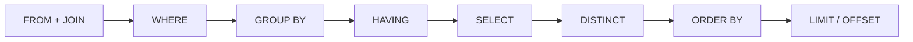
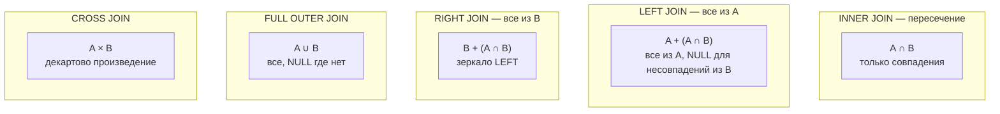
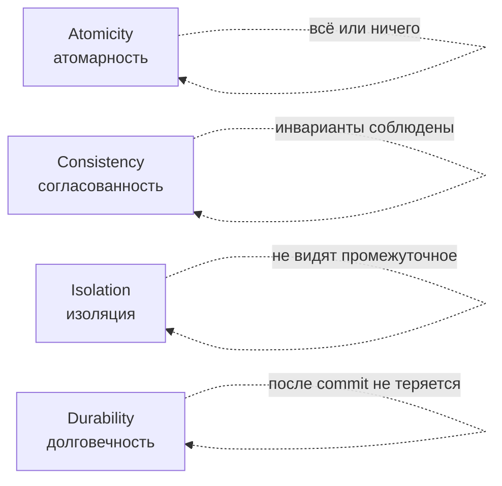
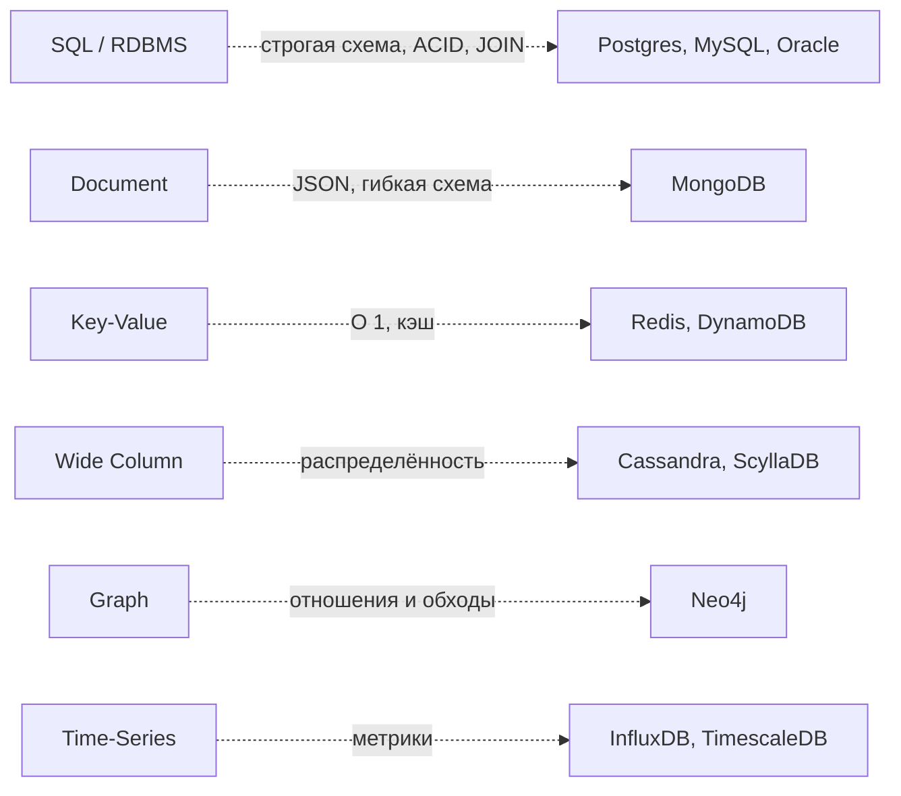
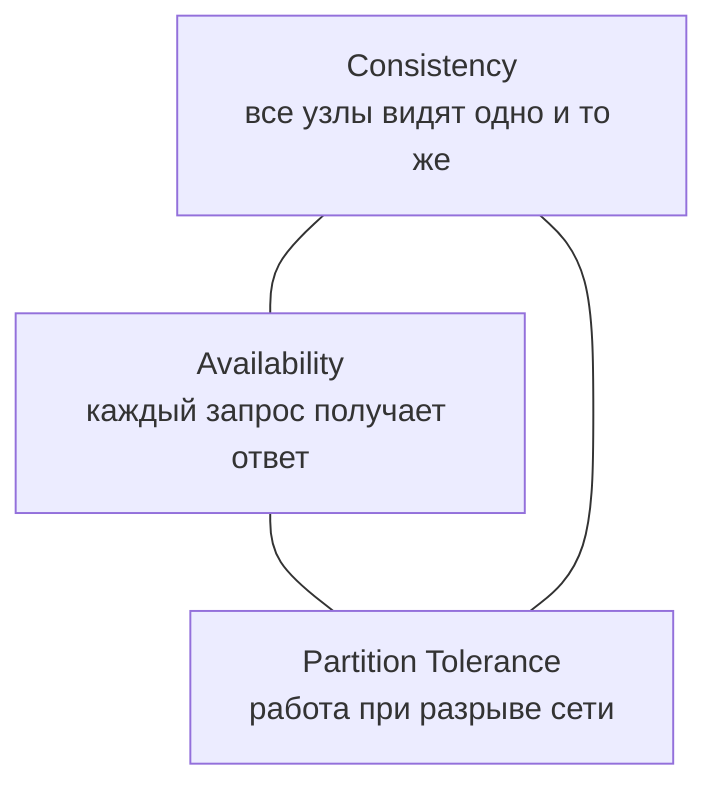

# 10. SQL и базы данных

> **Цель главы:** дать практичный SQL для QA Auto в fintech — JOIN'ы, агрегации, window functions,
> транзакции, ACID, isolation levels, индексы и оптимизация. Без лишней теории RDBMS — фокус на
> том, что спрашивают на собесе и используют в тестах.

---

## Содержание

1. [Часть 1. Основы SQL и нормализация](#часть-1-основы-sql-и-нормализация)
2. [Часть 2. JOIN'ы — все варианты](#часть-2-joinы--все-варианты)
3. [Часть 3. Агрегации, GROUP BY, HAVING](#часть-3-агрегации-group-by-having)
4. [Часть 4. Подзапросы, CTE, window functions](#часть-4-подзапросы-cte-window-functions)
5. [Часть 5. Транзакции и ACID](#часть-5-транзакции-и-acid)
6. [Часть 6. Isolation levels и аномалии](#часть-6-isolation-levels-и-аномалии)
7. [Часть 7. Индексы и оптимизация](#часть-7-индексы-и-оптимизация)
8. [Часть 8. SQL для QA: типовые задачи на собесе](#часть-8-sql-для-qa-типовые-задачи-на-собесе)
9. [Часть 9. NoSQL — базовое сравнение](#часть-9-nosql--базовое-сравнение)
10. [Чек-лист самопроверки](#чек-лист-самопроверки)
11. [Видеоматериалы](#видеоматериалы)

---

## Часть 1. Основы SQL и нормализация

### Q1. Что такое DDL / DML / DCL / TCL?

| Категория | Команды                                  | Назначение                       |
| --------- | ---------------------------------------- | -------------------------------- |
| **DDL**   | `CREATE`, `ALTER`, `DROP`, `TRUNCATE`    | Структура (схема)                |
| **DML**   | `SELECT`, `INSERT`, `UPDATE`, `DELETE`   | Данные                           |
| **DCL**   | `GRANT`, `REVOKE`                        | Права                            |
| **TCL**   | `BEGIN`, `COMMIT`, `ROLLBACK`, `SAVEPOINT` | Транзакции                     |

> Иногда `SELECT` называют `DQL` (Data Query Language).

---

### Q2. Что такое Базовый SELECT?

```sql
SELECT  o.id, u.email, SUM(o.amount) AS total
FROM    orders o
JOIN    users u ON u.id = o.user_id
WHERE   o.status = 'PAID'
  AND   o.created_at >= '2026-01-01'
GROUP BY o.id, u.email
HAVING  SUM(o.amount) > 1000
ORDER BY total DESC
LIMIT   10;
```

**Логический порядок выполнения (важно для собеса):**



> Поэтому **в `WHERE` нельзя использовать алиасы из `SELECT`** (FROM выполняется до SELECT). А в `ORDER BY` — можно.

---

### Q3. Что такое Нормализация?

| Форма  | Правило                                                                     |
| ------ | --------------------------------------------------------------------------- |
| **1НФ** | Атомарные значения, нет повторяющихся групп                                |
| **2НФ** | 1НФ + все неключевые поля зависят от **полного** ключа (нет частичной зависимости) |
| **3НФ** | 2НФ + неключевые поля зависят **только** от ключа (нет транзитивных зависимостей) |
| **BCNF** | Сильнее 3НФ: любая FD имеет ключ слева                                    |

**Денормализация** — намеренное нарушение нормализации ради скорости (read-heavy системы). В fintech часто комбинируют: транзакционная БД нормализована, аналитическая — денормализована.

---

### Q4. Какие типы данных — что важно существуют?

```sql
-- Числа
INTEGER, BIGINT, NUMERIC(10, 2)  -- для денег: NUMERIC/DECIMAL, не FLOAT!

-- Строки
VARCHAR(255), TEXT

-- Время
TIMESTAMP WITH TIME ZONE  -- предпочтительно для распределённых систем
TIMESTAMP, DATE, TIME, INTERVAL

-- Бинарные
BYTEA (Postgres), BLOB (MySQL/Oracle)

-- JSON
JSONB (Postgres) -- бинарный, индексируемый
JSON (MySQL)

-- UUID
UUID (Postgres)
CHAR(36) для совместимости

-- Boolean
BOOLEAN
```

> **Деньги — никогда `FLOAT/DOUBLE`!** Используй `NUMERIC(precision, scale)` или хранение в копейках в `BIGINT`.

---

## Часть 2. JOIN'ы — все варианты

### Q5. Какие типы JOIN — диаграмма Венна существуют?



---

### Q6. Что такое примеры JOIN?

Таблицы:
```
users:                orders:
id | email           id | user_id | amount
---+----------       ---+---------+--------
1  | a@x.ru          10 | 1       | 100
2  | b@x.ru          11 | 1       | 200
3  | c@x.ru          12 | 2       | 300
4  | d@x.ru          (нет для users 3, 4)
```

```sql
-- INNER JOIN — только пользователи с заказами
SELECT u.email, o.amount FROM users u
INNER JOIN orders o ON o.user_id = u.id;
-- a@x.ru | 100
-- a@x.ru | 200
-- b@x.ru | 300

-- LEFT JOIN — все пользователи, даже без заказов
SELECT u.email, o.amount FROM users u
LEFT JOIN orders o ON o.user_id = u.id;
-- a@x.ru | 100
-- a@x.ru | 200
-- b@x.ru | 300
-- c@x.ru | NULL
-- d@x.ru | NULL

-- RIGHT JOIN — все заказы, в т.ч. без user'а (если бы были)
SELECT u.email, o.amount FROM users u
RIGHT JOIN orders o ON o.user_id = u.id;

-- FULL OUTER JOIN — все строки обеих таблиц
SELECT u.email, o.amount FROM users u
FULL OUTER JOIN orders o ON o.user_id = u.id;

-- CROSS JOIN — декартово произведение
SELECT u.email, o.amount FROM users u CROSS JOIN orders o;
-- 4 × 3 = 12 строк
```

---

### Q7. Что такое SELF JOIN и зачем это нужно?

Соединение таблицы с самой собой. Классика — иерархия (manager → employee).

```sql
SELECT e.name AS employee, m.name AS manager
FROM   employees e
LEFT JOIN employees m ON m.id = e.manager_id;
```

---

### Q8. Что такое Типичная задача с JOIN на собесе?

```sql
-- Через LEFT JOIN
SELECT u.* FROM users u
LEFT JOIN orders o ON o.user_id = u.id
WHERE  o.id IS NULL;

-- Через NOT EXISTS — обычно быстрее
SELECT u.* FROM users u
WHERE NOT EXISTS (
    SELECT 1 FROM orders o WHERE o.user_id = u.id
);

-- Через NOT IN (опасно при NULL!)
SELECT u.* FROM users u
WHERE u.id NOT IN (SELECT user_id FROM orders WHERE user_id IS NOT NULL);
```

> **Ловушка `NOT IN`:** если в подзапросе встречается `NULL`, весь `NOT IN` возвращает unknown → пустой результат. Поэтому `NOT EXISTS` безопаснее.

---

## Часть 3. Агрегации, GROUP BY, HAVING

### Q9. Что такое агрегатные функции?

```sql
SELECT
    COUNT(*)              AS total_rows,
    COUNT(email)          AS non_null_emails,    -- NULL не считается
    COUNT(DISTINCT email) AS unique_emails,
    SUM(amount)           AS total_amount,
    AVG(amount)           AS avg_amount,
    MIN(amount), MAX(amount),
    STRING_AGG(email, ', ') AS all_emails           -- Postgres
    -- GROUP_CONCAT(email)                          -- MySQL
FROM users;
```

**Особенности:**
- `COUNT(*)` — все строки
- `COUNT(col)` — не-NULL значения столбца
- `COUNT(DISTINCT col)` — уникальные не-NULL

---

### Q10. Что такое gROUP BY и HAVING?

```sql
-- Сумма заказов по пользователю
SELECT u.email, SUM(o.amount) AS total
FROM   users u
JOIN   orders o ON o.user_id = u.id
GROUP BY u.email;

-- HAVING — фильтрация ПОСЛЕ агрегации (нельзя в WHERE)
SELECT u.email, SUM(o.amount) AS total
FROM   users u
JOIN   orders o ON o.user_id = u.id
GROUP BY u.email
HAVING SUM(o.amount) > 1000;
```

**Правило:**
- В `SELECT` при наличии `GROUP BY` могут быть только **поля из GROUP BY** или **агрегаты**.
- `WHERE` фильтрует **до** агрегации, `HAVING` — **после**.

---

### Q11. Что такое различные комбинации COUNT?

```sql
-- Сколько пользователей с минимум 1 заказом
SELECT COUNT(DISTINCT user_id) FROM orders;

-- Сколько у каждого пользователя заказов (включая 0)
SELECT u.email, COUNT(o.id) AS orders_count
FROM   users u
LEFT JOIN orders o ON o.user_id = u.id
GROUP BY u.email;
-- LEFT JOIN важен: иначе пользователи без заказов не попадут
```

---

## Часть 4. Подзапросы, CTE, window functions

### Q12. Что такое подзапросы?

**Скалярный подзапрос (одно значение):**
```sql
SELECT * FROM orders
WHERE  amount > (SELECT AVG(amount) FROM orders);
```

**В FROM (производная таблица):**
```sql
SELECT u.email, t.total
FROM   users u
JOIN  (SELECT user_id, SUM(amount) AS total FROM orders GROUP BY user_id) t
       ON t.user_id = u.id;
```

**Коррелированный подзапрос (зависит от внешнего):**
```sql
SELECT u.email,
       (SELECT COUNT(*) FROM orders o WHERE o.user_id = u.id) AS orders_count
FROM users u;
-- Часто медленно: подзапрос выполняется на каждую строку u
```

---

### Q13. Что такое CTE (Common Table Expression)?

CTE — именованный подзапрос. Делает запрос читаемее.

```sql
WITH paid_orders AS (
    SELECT * FROM orders WHERE status = 'PAID'
),
big_spenders AS (
    SELECT user_id, SUM(amount) AS total
    FROM   paid_orders
    GROUP BY user_id
    HAVING SUM(amount) > 10000
)
SELECT u.email, b.total
FROM   users u
JOIN   big_spenders b ON b.user_id = u.id;
```

**Recursive CTE** — для иерархий (дерево категорий, граф):
```sql
WITH RECURSIVE descendants AS (
    SELECT id, parent_id, name FROM categories WHERE id = 1
    UNION ALL
    SELECT c.id, c.parent_id, c.name
    FROM   categories c
    JOIN   descendants d ON c.parent_id = d.id
)
SELECT * FROM descendants;
```

---

### Q14. Что такое Window functions?

Окно — это группа строк, на которой считается агрегат **без коллапса** (в отличие от `GROUP BY`).

```sql
SELECT
    o.id,
    o.user_id,
    o.amount,
    -- Сумма заказов пользователя по всему набору
    SUM(o.amount) OVER (PARTITION BY o.user_id) AS user_total,
    -- Ранжирование заказов по сумме внутри пользователя
    ROW_NUMBER() OVER (PARTITION BY o.user_id ORDER BY o.amount DESC) AS rn,
    -- Средняя по всем
    AVG(o.amount) OVER () AS overall_avg
FROM orders o;
```

**Полезные window-функции:**

| Функция                    | Что делает                                         |
| -------------------------- | -------------------------------------------------- |
| `ROW_NUMBER()`             | Уникальный номер строки в окне                     |
| `RANK()`                   | Ранг с пропусками (1, 2, 2, 4)                     |
| `DENSE_RANK()`             | Ранг без пропусков (1, 2, 2, 3)                    |
| `LAG(col, n)`              | Значение из строки n шагов назад                   |
| `LEAD(col, n)`             | Значение из строки n шагов вперёд                  |
| `FIRST_VALUE/LAST_VALUE`   | Первое/последнее значение в окне                   |
| `NTILE(n)`                 | Разбить на n групп                                 |
| `SUM/AVG/COUNT() OVER (...)` | Накопительные / по партициям                    |

**Пример: топ-3 заказа каждого пользователя**
```sql
WITH ranked AS (
    SELECT o.*, ROW_NUMBER() OVER (PARTITION BY user_id ORDER BY amount DESC) AS rn
    FROM   orders o
)
SELECT * FROM ranked WHERE rn <= 3;
```

**Пример: разница с предыдущим заказом пользователя**
```sql
SELECT id, user_id, amount,
       amount - LAG(amount) OVER (PARTITION BY user_id ORDER BY created_at) AS diff
FROM orders;
```

---

### Q15. В чём разница между UNION, INTERSECT и EXCEPT?

```sql
-- UNION (без дублей) и UNION ALL (с дублями, быстрее)
SELECT email FROM users
UNION
SELECT email FROM archived_users;

-- INTERSECT — пересечение
SELECT email FROM users
INTERSECT
SELECT email FROM newsletter_subscribers;

-- EXCEPT (Postgres) / MINUS (Oracle) — разница
SELECT email FROM users
EXCEPT
SELECT email FROM banned_users;
```

**Правило:** одинаковое количество и совместимые типы столбцов.

---

## Часть 5. Транзакции и ACID

### Q16. Что такое транзакция?

**Транзакция** — последовательность операций, которая выполняется как **атомарная единица**: или все вместе, или ни одной.

```sql
BEGIN;                              -- начало
UPDATE accounts SET balance = balance - 100 WHERE id = 1;
UPDATE accounts SET balance = balance + 100 WHERE id = 2;
COMMIT;                             -- зафиксировать
-- или
ROLLBACK;                           -- откатить всё
```

---

### Q17. Что такое ACID?



| Свойство            | Что обеспечивает                                            |
| ------------------- | ----------------------------------------------------------- |
| **Atomicity**       | Транзакция — атом. Либо все шаги выполнены, либо ни одного. |
| **Consistency**     | После транзакции данные удовлетворяют constraint'ам и инвариантам. |
| **Isolation**       | Параллельные транзакции не видят промежуточных результатов друг друга. |
| **Durability**      | После `COMMIT` данные сохраняются даже при сбое.            |

---

### Q18. Что такое SAVEPOINT?

```sql
BEGIN;
INSERT INTO orders ...;
SAVEPOINT before_payment;

UPDATE accounts SET balance = balance - 100;
-- упс, недостаточно средств
ROLLBACK TO before_payment;

-- продолжаем
INSERT INTO failed_payments ...;
COMMIT;
```

---

## Часть 6. Isolation levels и аномалии

### Q19. Что такое аномалии параллельных транзакций?

| Аномалия              | Описание                                                                                  |
| --------------------- | ----------------------------------------------------------------------------------------- |
| **Dirty Read**        | T1 читает данные, которые T2 ещё не закоммитила                                           |
| **Non-Repeatable Read** | T1 читает строку дважды, T2 её обновила между чтениями → разные значения                |
| **Phantom Read**      | T1 делает range-запрос дважды, T2 вставила/удалила строки → новые/исчезнувшие строки     |
| **Lost Update**       | T1 и T2 читают, обе обновляют, последний выигрывает (одна потеряна)                      |
| **Write Skew**        | T1 и T2 читают пересекающиеся данные, обновляют непересекающиеся, нарушают инвариант     |

---

### Q20. Какие уровни изоляции (SQL Standard) существуют?

| Level                | Dirty Read | Non-Repeat | Phantom | Производительность |
| -------------------- | :--------: | :--------: | :-----: | :----------------: |
| **READ UNCOMMITTED** | возможен   | возможен   | возможен | ⚡⚡⚡⚡             |
| **READ COMMITTED**   | нет        | возможен   | возможен | ⚡⚡⚡              |
| **REPEATABLE READ**  | нет        | нет        | возможен (в стандарте) | ⚡⚡   |
| **SERIALIZABLE**     | нет        | нет        | нет     | ⚡                 |

**В реальных СУБД:**
- **Postgres**: REPEATABLE READ и SERIALIZABLE через SSI (snapshot isolation), фантомов в RR нет
- **MySQL/InnoDB**: REPEATABLE READ — дефолт, и фантомов нет благодаря next-key locks
- **Oracle**: только READ COMMITTED и SERIALIZABLE

```sql
SET TRANSACTION ISOLATION LEVEL READ COMMITTED;
BEGIN;
-- ...
COMMIT;
```

---

### Q21. Когда какой уровень?

| Уровень             | Когда                                                            |
| ------------------- | ---------------------------------------------------------------- |
| READ UNCOMMITTED    | Аналитика на огромных таблицах, грязные данные приемлемы         |
| READ COMMITTED      | Дефолт для большинства приложений                                |
| REPEATABLE READ     | Отчёты с консистентным снимком                                   |
| SERIALIZABLE        | Финансы, критичные операции (но дорого!)                         |

В fintech обычно **READ COMMITTED** + явная блокировка `SELECT ... FOR UPDATE` для критичных мест.

---

### Q22. В чём разница между Optimistic и Pessimistic locking?

**Pessimistic:**
```sql
-- Заблокировать строку до конца транзакции
SELECT * FROM accounts WHERE id = 1 FOR UPDATE;
UPDATE accounts SET balance = balance - 100 WHERE id = 1;
COMMIT;
```

**Optimistic** (с версией):
```sql
SELECT version, balance FROM accounts WHERE id = 1;
-- version = 5

UPDATE accounts SET balance = 500, version = 6
WHERE id = 1 AND version = 5;
-- если 0 строк обновлено — конфликт, retry
```

**Когда что:**
- Pessimistic — высокая конкуренция за одни и те же строки (балансы)
- Optimistic — низкая конкуренция, чаще читают (профили, настройки)

---

## Часть 7. Индексы и оптимизация

### Q23. Что такое индекс?

**Индекс** — структура данных (обычно B-tree), ускоряющая поиск по столбцам.

```sql
CREATE INDEX idx_orders_user_id ON orders(user_id);

-- Composite (multi-column)
CREATE INDEX idx_orders_user_status ON orders(user_id, status);

-- Уникальный
CREATE UNIQUE INDEX idx_users_email ON users(email);

-- Частичный (Postgres)
CREATE INDEX idx_active_users ON users(email) WHERE is_active = true;

-- На выражение
CREATE INDEX idx_lower_email ON users(LOWER(email));
```

**Trade-off:**
- ✅ Ускоряет `SELECT`, `JOIN`, `WHERE`, `ORDER BY`
- ❌ Замедляет `INSERT`/`UPDATE`/`DELETE` (надо обновлять индексы)
- ❌ Занимает место

---

### Q24. Что такое Composite index?

```sql
CREATE INDEX idx_orders_user_status_created ON orders(user_id, status, created_at);

-- Используется индекс:
WHERE user_id = 1                                    -- ✅
WHERE user_id = 1 AND status = 'PAID'                -- ✅
WHERE user_id = 1 AND status = 'PAID' AND created_at > '2026-01-01'  -- ✅

-- НЕ используется (или используется частично):
WHERE status = 'PAID'                                -- ❌ нет user_id впереди
WHERE created_at > '2026-01-01'                      -- ❌
WHERE user_id = 1 AND created_at > '2026-01-01'      -- частично (только user_id)
```

> **Правило:** индекс используется по **префиксу** столбцов. Самый селективный — первым.

---

### Q25. В чём разница между EXPLAIN и EXPLAIN ANALYZE?

```sql
EXPLAIN SELECT * FROM orders WHERE user_id = 1 AND status = 'PAID';
-- Index Scan using idx_orders_user_status on orders ...

EXPLAIN ANALYZE SELECT * FROM orders WHERE user_id = 1;
-- Запускает запрос, показывает реальное время и количество строк
```

**Что искать в плане:**
- `Seq Scan` (sequential / full scan) — плохо на больших таблицах, добавь индекс
- `Index Scan` — использует индекс, хорошо
- `Index Only Scan` — данные есть в самом индексе, отлично
- `Bitmap Heap Scan` — комбинация индексов
- `Nested Loop / Hash Join / Merge Join` — типы JOIN, разные cost-modeling

---

### Q26. Когда индекс НЕ работает?

```sql
-- Функция на столбце
WHERE LOWER(email) = 'a@x.ru'  -- индекс на email НЕ используется
-- Решение: индекс на функцию или нормализовать данные

-- LIKE с ведущим %
WHERE email LIKE '%@x.ru'      -- НЕ использует
WHERE email LIKE 'a%'          -- использует (префиксный поиск)

-- Неявное преобразование типов
WHERE user_id = '1'            -- если user_id INT — может не сработать

-- OR с разными столбцами
WHERE user_id = 1 OR email = 'a'  -- может выбрать seq scan
-- Решение: UNION или composite index

-- != / NOT IN
WHERE status != 'PAID'         -- обычно не использует индекс
```

---

### Q27. Что такое selectivity и cardinality?

**Selectivity** — доля уникальных значений столбца. Высокая — хорошо для индекса.
- `email` — высокая selectivity (почти уникален) → отличный индекс
- `is_active` (true/false) — низкая (50/50) → индекс почти бесполезен (используют partial index)
- `gender` — очень низкая → индекс не создаётся

---

## Часть 8. SQL для QA: типовые задачи на собесе

### Q28. Что такое «Найти второй по величине зарплате»?

```sql
-- С LIMIT/OFFSET
SELECT salary FROM employees
ORDER BY salary DESC
LIMIT 1 OFFSET 1;

-- Через DISTINCT (если несколько одинаковых максимумов)
SELECT MAX(salary) FROM employees
WHERE salary < (SELECT MAX(salary) FROM employees);

-- Через DENSE_RANK (best practice)
WITH ranked AS (
    SELECT salary, DENSE_RANK() OVER (ORDER BY salary DESC) AS rnk
    FROM employees
)
SELECT DISTINCT salary FROM ranked WHERE rnk = 2;
```

---

### Q29. Что такое «Найти дубликаты по email»?

```sql
-- Список дублирующихся email
SELECT email, COUNT(*) AS cnt
FROM users
GROUP BY email
HAVING COUNT(*) > 1;

-- Все строки с дублями
SELECT * FROM users
WHERE email IN (
    SELECT email FROM users GROUP BY email HAVING COUNT(*) > 1
);

-- Удалить дубли, оставить запись с min(id)
DELETE FROM users
WHERE id NOT IN (SELECT MIN(id) FROM users GROUP BY email);
```

---

### Q30. Что такое «Топ N в каждой группе»?

Уже разобрано в Q14:
```sql
WITH ranked AS (
    SELECT o.*, ROW_NUMBER() OVER (PARTITION BY user_id ORDER BY amount DESC) AS rn
    FROM   orders o
)
SELECT * FROM ranked WHERE rn <= 3;
```

---

### Q31. Что такое «Средняя сумма заказа по месяцам»?

```sql
SELECT
    DATE_TRUNC('month', created_at) AS month,
    COUNT(*)                          AS orders_count,
    AVG(amount)                       AS avg_amount,
    SUM(amount)                       AS total
FROM orders
WHERE created_at >= '2026-01-01'
GROUP BY DATE_TRUNC('month', created_at)
ORDER BY month;
```

---

### Q32. Что такое «Пользователи, которые ничего не покупали последние 30 дней»?

```sql
SELECT u.id, u.email
FROM   users u
WHERE  NOT EXISTS (
    SELECT 1 FROM orders o
    WHERE  o.user_id = u.id
      AND  o.created_at >= CURRENT_DATE - INTERVAL '30 days'
);
```

---

### Q33. В чём разница между «Cumulative sum и running total»?

```sql
SELECT
    id,
    user_id,
    amount,
    created_at,
    SUM(amount) OVER (PARTITION BY user_id ORDER BY created_at) AS running_total
FROM orders;
```

---

### Q34. Что такое SQL для QA Auto?

```java
@Test
void orderIsPersistedAfterApiCall() {
    // 1. вызов API
    Response resp = ordersApi.create(new CreateOrderRequest(100));
    String orderId = resp.path("id").toString();

    // 2. проверка в БД через JdbcTemplate
    Map<String, Object> row = jdbc.queryForMap(
        "SELECT id, status, amount FROM orders WHERE id = ?", orderId);

    assertThat(row).containsEntry("status", "NEW")
                   .containsEntry("amount", 100);
}
```

В современном QA для прямой работы с БД из тестов используют:
- **`JdbcTemplate`** через Spring (см. главу 07)
- **JOOQ** для типобезопасных запросов
- **Testcontainers** для изолированной БД (см. главу 11)

---

## Часть 9. NoSQL — базовое сравнение

### Q35. Когда NoSQL вместо SQL?



| Тип        | Сильные стороны                | Когда                              |
| ---------- | ------------------------------ | ---------------------------------- |
| Document   | Гибкая схема, hierarchy        | Каталоги, профили, контент         |
| Key-Value  | Скорость                       | Кэш, сессии                        |
| Wide-Col   | Масштабирование                | Logs, IoT, аналитика               |
| Graph      | Связи                          | Соцсети, recommendations           |
| Time-Series | Временные метрики             | Мониторинг, IoT                    |

В **fintech** ядро — **SQL** (ACID критичен). NoSQL — для кэшей (Redis), логов (Elastic), отчётов.

---

### Q36. Что такое CAP-теорема?

В распределённой системе можно выбрать **только 2 из 3**:



В реальности `P` — обязателен (сети разрываются), поэтому выбор **CP vs AP**.

| Тип | Примеры                |
| --- | ---------------------- |
| CP  | MongoDB (с majority), HBase |
| AP  | Cassandra, DynamoDB    |
| CA  | Single-node Postgres (нерелевантно для распределёнки) |

**Eventual consistency** — в AP-системах данные сходятся через некоторое время. Для тестирования это критично — см. главу [15. Fintech](./15-fintech-specifics.md).

---

## Чек-лист самопроверки

- [ ] Различаю DDL/DML/DCL/TCL
- [ ] Знаю логический порядок выполнения SELECT
- [ ] Пишу `INNER`, `LEFT`, `RIGHT`, `FULL OUTER`, `CROSS`, `SELF` JOIN
- [ ] Понимаю разницу `WHERE` vs `HAVING` и `IN` vs `NOT IN` vs `NOT EXISTS`
- [ ] Использую `GROUP BY` с агрегатами и `HAVING`
- [ ] Пишу подзапросы и CTE (`WITH`), recursive CTE
- [ ] Применяю window functions: `ROW_NUMBER`, `RANK`, `LAG/LEAD`, агрегаты с `OVER`
- [ ] Объясняю ACID и каждый из 4 свойств
- [ ] Знаю 4 уровня изоляции и 3 базовые аномалии
- [ ] Различаю optimistic и pessimistic locking
- [ ] Понимаю как работает B-tree индекс и composite index по префиксу
- [ ] Читаю `EXPLAIN`, узнаю Seq Scan vs Index Scan
- [ ] Знаю когда индекс не сработает (функция, ведущий `%`, `OR`)
- [ ] Решаю задачу «top N в каждой группе» через window function
- [ ] Удаляю дубли через `MIN(id) GROUP BY`
- [ ] Объясняю CAP-теорему и eventual consistency

---

## Видеоматериалы

### Русскоязычные

- **«SQL для тестировщиков», SQA Days** — поиск на YouTube.
- **«PostgreSQL для разработчика», PG Day** — https://www.youtube.com/@pgdayrussia
- **Stepik — SQL курсы** — https://stepik.org/course/63054 (Илья Хохлов).

### Англоязычные

- **«Use the Index, Luke!»** — https://use-the-index-luke.com — лучший ресурс по индексам.
- **PostgreSQL Tutorial** — https://www.postgresqltutorial.com
- **«SQL for Beginners», freeCodeCamp** — https://www.youtube.com/@freecodecamp
- **«Window Functions», Mode Analytics** — https://mode.com/sql-tutorial/sql-window-functions/

### Тренажёры

- **LeetCode SQL** — https://leetcode.com/problemset/database/ — задачи по уровням.
- **HackerRank SQL** — https://www.hackerrank.com/domains/sql
- **SQLZoo** — https://sqlzoo.net — интерактивный туториал.
- **PostgreSQL Exercises** — https://pgexercises.com

### Книги

- **«Изучаем SQL», Линн Бейли** — простой старт.
- **«SQL Cookbook», Anthony Molinaro** — рецепты для типовых задач.
- **«Database Internals», Алекс Петров** — как устроены БД изнутри.

---

[← Назад: 09. Архитектура автотестов](./09-test-architecture.md) · [К оглавлению](./README.md) · [Следующая: 11. Linux / Docker / K8s →](./11-linux-docker-k8s.md)
