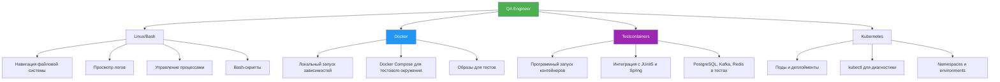
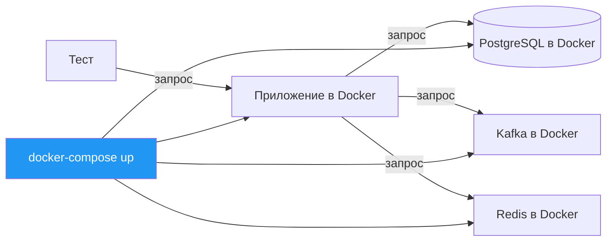
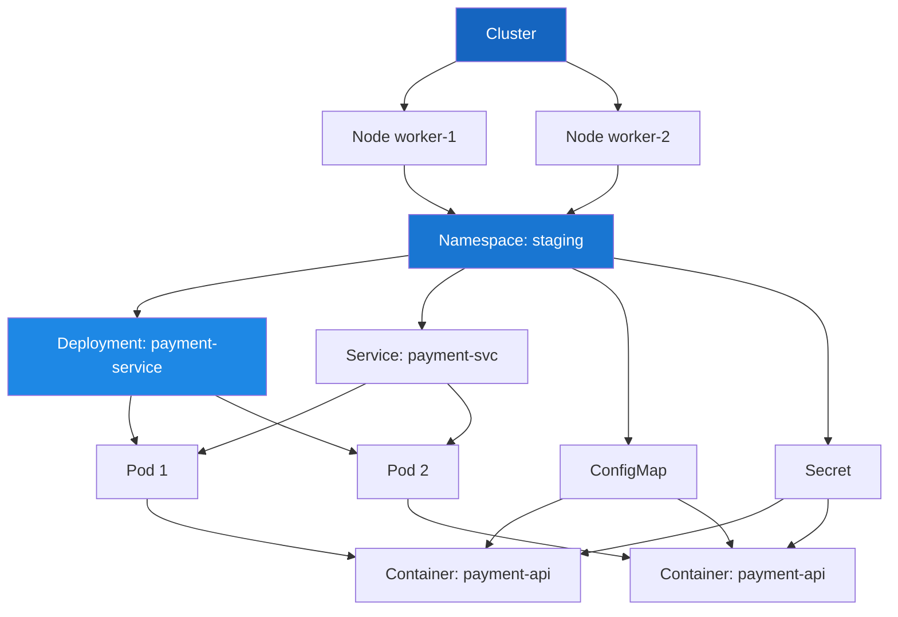
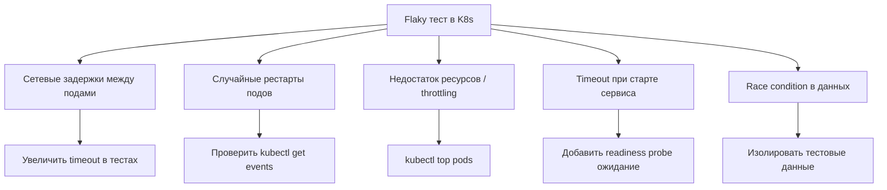

# Глава 11. Linux, Docker, Kubernetes для QA

[← Глава 10: SQL](10-sql.md) | [Содержание](README.md) | [Глава 12: CI/CD →](12-cicd.md)

---

## Быстрая навигация

- [Linux и Bash](#linux-и-bash)
- [Docker для тестирования](#docker-для-тестирования)
- [Testcontainers](#testcontainers)
- [Kubernetes основы](#kubernetes-основы)
- [Чеклист](#чеклист)

---

## Контекст



---

## Linux и Bash

### Вопрос 1. Какие команды Linux наиболее важны для QA-инженера?

**Навигация и файлы:**
```bash
# Навигация
pwd                    # текущая директория
ls -la                 # список файлов с правами и скрытыми
cd /var/log            # переход в директорию
cd ~                   # домашняя директория
cd -                   # предыдущая директория

# Файловые операции
cp -r src/ dst/        # рекурсивное копирование
mv old.txt new.txt     # переименование / перемещение
rm -rf target/         # удаление директории (осторожно!)
mkdir -p tests/e2e     # создать вложенные директории
find . -name "*.log"   # поиск файлов по маске
find . -name "*.java" -newer pom.xml  # новее определённой даты
```

**Просмотр и поиск в файлах:**
```bash
cat application.log              # вывести весь файл
less application.log             # постраничный просмотр (q — выход)
tail -f application.log          # следить за новыми строками (live)
tail -n 100 application.log      # последние 100 строк
head -n 50 application.log       # первые 50 строк

grep "ERROR" application.log     # найти строки с ERROR
grep -i "exception" *.log        # без учёта регистра, все .log
grep -n "NullPointer" app.log    # с номерами строк
grep -A 5 -B 5 "FATAL" app.log   # 5 строк до и после совпадения
grep -v "DEBUG" app.log          # строки без DEBUG
grep -E "ERROR|WARN" app.log     # регулярное выражение (|)
grep -c "ERROR" app.log          # количество совпадений
```

**Процессы и ресурсы:**
```bash
ps aux                     # все процессы
ps aux | grep java         # найти java-процессы
kill -9 <PID>              # принудительно завершить процесс
top                        # интерактивный мониторинг
htop                       # улучшенный top (если установлен)
df -h                      # использование дисков
du -sh target/             # размер директории
free -h                    # использование RAM
lsof -i :8080              # что занимает порт 8080
netstat -tlnp              # открытые порты (или ss -tlnp)
```

**Права доступа:**
```bash
chmod +x run-tests.sh      # сделать скрипт исполняемым
chmod 755 script.sh        # rwxr-xr-x
chown user:group file.txt  # изменить владельца
ls -la                     # посмотреть права: -rwxr-xr-x
```

---

### Вопрос 2. Как работать с логами приложения в Linux?

**Типичный сценарий отладки:**
```bash
# 1. Найти файлы логов
find /var/log -name "*.log" -mtime -1    # изменённые за последние сутки
ls -lt /var/log/app/                     # отсортировать по дате

# 2. Найти ошибки
grep -n "ERROR\|FATAL" /var/log/app/app.log | tail -50

# 3. Получить контекст вокруг ошибки
grep -n "PaymentException" app.log | head -5
# Допустим, нашли строку 1523
sed -n '1515,1535p' app.log    # показать строки 1515-1535

# 4. Подсчитать частоту ошибок
grep "ERROR" app.log | awk '{print $1, $2}' | sort | uniq -c | sort -rn

# 5. Следить за логами в реальном времени
tail -f /var/log/app/app.log | grep --line-buffered "ERROR"

# 6. Фильтрация по времени в журнале systemd
journalctl -u myapp.service --since "2024-01-15 14:00" --until "2024-01-15 15:00"
journalctl -u myapp.service -n 100 --no-pager    # последние 100 строк
```

**Конвейеры (pipes) для анализа:**
```bash
# Топ-10 самых частых ошибок
grep "ERROR" app.log \
  | awk '{$1=$2=$3=""; print $0}' \
  | sort \
  | uniq -c \
  | sort -rn \
  | head -10

# Количество запросов к каждому endpoint
grep "GET\|POST\|PUT\|DELETE" access.log \
  | awk '{print $7}' \
  | cut -d'?' -f1 \
  | sort \
  | uniq -c \
  | sort -rn

# Медленные запросы (время > 1000мс в логе)
grep "duration=" app.log \
  | grep -oP 'duration=\K[0-9]+' \
  | awk '$1 > 1000 {count++} END {print count " slow requests"}'
```

---

### Вопрос 3. Как написать базовый Bash-скрипт для запуска тестов?

```bash
#!/bin/bash
# run-tests.sh — запуск тестов с настройками окружения

set -euo pipefail    # e=выйти при ошибке, u=ошибка при неустановленных переменных, o pipefail

# Константы
SCRIPT_DIR="$(cd "$(dirname "${BASH_SOURCE[0]}")" && pwd)"
PROJECT_ROOT="$SCRIPT_DIR/.."
REPORTS_DIR="$PROJECT_ROOT/target/allure-results"
ENV="${1:-staging}"       # первый аргумент, по умолчанию staging

# Функции
log() { echo "[$(date '+%H:%M:%S')] $*"; }

check_dependencies() {
    for cmd in mvn docker java; do
        if ! command -v "$cmd" &>/dev/null; then
            echo "ERROR: $cmd не установлен"
            exit 1
        fi
    done
}

wait_for_service() {
    local url="$1"
    local max_attempts=30
    local attempt=0
    log "Ожидание сервиса: $url"
    until curl -sf "$url/health" > /dev/null 2>&1; do
        ((attempt++))
        if [[ $attempt -ge $max_attempts ]]; then
            log "ERROR: Сервис не поднялся за $max_attempts попыток"
            exit 1
        fi
        sleep 2
    done
    log "Сервис доступен"
}

cleanup() {
    log "Очистка..."
    docker-compose -f docker-compose.test.yml down --remove-orphans 2>/dev/null || true
}

# Основная логика
main() {
    log "Запуск тестов для окружения: $ENV"
    check_dependencies

    trap cleanup EXIT    # вызвать cleanup при любом завершении

    # Установить переменные окружения
    export BASE_URL="https://$ENV.example.com"
    export TEST_ENV="$ENV"

    # Поднять зависимости
    log "Запуск Docker Compose..."
    docker-compose -f docker-compose.test.yml up -d
    wait_for_service "http://localhost:5432"    # PostgreSQL

    # Очистить старые результаты
    rm -rf "$REPORTS_DIR"
    mkdir -p "$REPORTS_DIR"

    # Запуск тестов
    log "Запуск Maven тестов..."
    mvn -f "$PROJECT_ROOT/pom.xml" \
        test \
        -Denv="$ENV" \
        -Dallure.results.directory="$REPORTS_DIR" \
        -Dgroups="api,ui" \
        -T 4 \
        2>&1 | tee "$PROJECT_ROOT/test-run.log"

    local exit_code=${PIPESTATUS[0]}

    log "Генерация Allure отчёта..."
    allure generate "$REPORTS_DIR" --clean -o "$PROJECT_ROOT/allure-report" 2>/dev/null || true

    if [[ $exit_code -ne 0 ]]; then
        log "FAIL: Тесты завершились с ошибками (код $exit_code)"
        exit $exit_code
    fi

    log "SUCCESS: Все тесты пройдены"
}

main "$@"
```

**Использование:**
```bash
chmod +x run-tests.sh
./run-tests.sh staging
./run-tests.sh production
```

---

### Вопрос 4. Как использовать grep, awk, sed для анализа тест-репортов?

```bash
# --- grep: поиск ---

# Найти упавшие тесты в Surefire отчёте
grep -r "FAILED\|ERROR" target/surefire-reports/*.txt

# Найти тест по имени
grep -r "testPaymentIdempotency" target/surefire-reports/

# Тесты с длительностью > 5 секунд (в логе Maven)
grep "Tests run:" target/surefire-reports/*.txt \
  | grep -v "Failures: 0, Errors: 0, Skipped: 0"

# --- awk: обработка полей ---

# Извлечь время выполнения тестов
awk '/Time elapsed:/ {print $NF, $(NF-1)}' target/surefire-reports/*.txt \
  | sort -rn | head -20

# Подсчитать общее число тестов
awk '/Tests run:/ {
    match($0, /Tests run: ([0-9]+)/, arr); total += arr[1]
} END {print "Total:", total}' target/surefire-reports/*.txt

# Распечатать только имя теста и статус
awk '/FAILED|PASSED|ERROR/ {print $1, $NF}' test-results.log

# --- sed: трансформация ---

# Удалить ANSI escape-коды из цветного вывода
sed 's/\x1b\[[0-9;]*m//g' colored-output.log > clean.log

# Заменить localhost на staging URL в конфиге
sed -i 's|http://localhost:8080|https://staging.example.com|g' config.properties

# Извлечь блок между маркерами
sed -n '/\[ERROR\]/,/\[INFO\]/p' app.log

# --- Комбинирование ---

# Собрать имена упавших тестов в список
grep "FAILED" surefire-reports/*.txt \
  | sed 's/.*-- In //' \
  | sed 's/ Time elapsed.*//' \
  | sort -u \
  > failed-tests.txt

echo "Упавшие тесты: $(wc -l < failed-tests.txt)"
```

---

## Docker для тестирования

### Вопрос 5. Как Docker используется в тестировании?



**Основные команды:**
```bash
# Образы
docker pull postgres:15               # скачать образ
docker images                         # список локальных образов
docker rmi postgres:14                # удалить образ
docker build -t my-app:1.0 .          # собрать из Dockerfile

# Контейнеры
docker run -d \
  --name test-db \
  -e POSTGRES_PASSWORD=test \
  -p 5432:5432 \
  postgres:15                         # запустить в фоне

docker ps                             # запущенные контейнеры
docker ps -a                          # все контейнеры (включая остановленные)
docker stop test-db                   # остановить
docker rm test-db                     # удалить
docker rm -f test-db                  # остановить и удалить

# Логи и диагностика
docker logs test-db                   # логи контейнера
docker logs -f test-db                # следить в реальном времени
docker logs --tail 100 test-db        # последние 100 строк
docker exec -it test-db bash          # войти в контейнер
docker inspect test-db                # детальная информация
docker stats                          # мониторинг ресурсов

# Сети и тома
docker network ls                     # список сетей
docker volume ls                      # список томов
docker volume rm my-volume            # удалить том
```

---

### Вопрос 6. Как настроить docker-compose для тестового окружения?

```yaml
# docker-compose.test.yml
version: '3.8'

services:
  postgres:
    image: postgres:15-alpine
    environment:
      POSTGRES_DB: testdb
      POSTGRES_USER: test
      POSTGRES_PASSWORD: test
    ports:
      - "5432:5432"
    healthcheck:
      test: ["CMD-SHELL", "pg_isready -U test -d testdb"]
      interval: 5s
      timeout: 5s
      retries: 10
    volumes:
      - ./src/test/resources/db/init.sql:/docker-entrypoint-initdb.d/init.sql

  kafka:
    image: confluentinc/cp-kafka:7.5.0
    environment:
      KAFKA_BROKER_ID: 1
      KAFKA_ZOOKEEPER_CONNECT: zookeeper:2181
      KAFKA_ADVERTISED_LISTENERS: PLAINTEXT://kafka:9092
      KAFKA_OFFSETS_TOPIC_REPLICATION_FACTOR: 1
    depends_on:
      - zookeeper
    ports:
      - "9092:9092"

  zookeeper:
    image: confluentinc/cp-zookeeper:7.5.0
    environment:
      ZOOKEEPER_CLIENT_PORT: 2181

  redis:
    image: redis:7-alpine
    ports:
      - "6379:6379"
    command: redis-server --requirepass testpass

  wiremock:
    image: wiremock/wiremock:3.3.1
    ports:
      - "8089:8080"
    volumes:
      - ./src/test/resources/wiremock:/home/wiremock

networks:
  default:
    name: test-network
```

**Использование:**
```bash
# Запустить все сервисы
docker-compose -f docker-compose.test.yml up -d

# Дождаться готовности (healthcheck)
docker-compose -f docker-compose.test.yml up -d --wait

# Запустить только нужные сервисы
docker-compose -f docker-compose.test.yml up -d postgres redis

# Остановить и очистить
docker-compose -f docker-compose.test.yml down -v    # -v удаляет тома

# Просмотр логов всех сервисов
docker-compose -f docker-compose.test.yml logs -f

# Статус и healthcheck
docker-compose -f docker-compose.test.yml ps
```

---

### Вопрос 7. Как создать Dockerfile для запуска тестов?

```dockerfile
# Dockerfile.tests
FROM maven:3.9.5-eclipse-temurin-21 AS builder

WORKDIR /app

# Сначала копируем pom.xml для кэширования зависимостей
COPY pom.xml .
RUN mvn dependency:go-offline -q

# Копируем исходники
COPY src/ src/

# --- Вариант 1: запуск тестов при сборке образа ---
# RUN mvn test -Dgroups=api

# --- Вариант 2: образ для запуска тестов (без их выполнения при сборке) ---
FROM eclipse-temurin:21-jdk-alpine

WORKDIR /app
COPY --from=builder /app .
COPY --from=builder /root/.m2 /root/.m2

# Playwright требует системные зависимости
RUN apk add --no-cache \
    chromium \
    nss \
    freetype \
    harfbuzz \
    ca-certificates \
    ttf-freefont

ENV PLAYWRIGHT_BROWSERS_PATH=/usr/bin
ENV PLAYWRIGHT_SKIP_BROWSER_DOWNLOAD=1
ENV CHROMIUM_PATH=/usr/bin/chromium-browser

ENTRYPOINT ["mvn", "test"]
CMD ["-Dgroups=api"]
```

**Запуск:**
```bash
# Сборка
docker build -f Dockerfile.tests -t qa-tests:latest .

# Запуск API тестов
docker run --rm \
  --network test-network \
  -e BASE_URL=http://app:8080 \
  -v "$(pwd)/target:/app/target" \
  qa-tests:latest \
  -Dgroups=api

# Запуск UI тестов (с доступом к браузеру)
docker run --rm \
  --network test-network \
  --shm-size=2g \
  -e PLAYWRIGHT_HEADLESS=true \
  -v "$(pwd)/target:/app/target" \
  qa-tests:latest \
  -Dgroups=ui
```

---

## Testcontainers

### Вопрос 8. Что такое Testcontainers и зачем использовать вместо моков?

**Testcontainers** — Java-библиотека, запускающая реальные Docker-контейнеры прямо из JUnit5/Spring тестов. Контейнеры стартуют программно перед тестами и уничтожаются после.

**Сравнение подходов:**

| Критерий | Mock (Mockito) | H2 in-memory | Testcontainers |
|----------|---------------|--------------|----------------|
| Скорость | Быстро | Быстро | Медленнее (старт Docker) |
| Реализм | Низкий | Средний | Высокий |
| PostgreSQL-специфика | Нет | Нет | Да |
| Kafka behavior | Нет | Нет | Да |
| CI/CD | Просто | Просто | Нужен Docker |
| Рекомендация | Unit тесты | Избегать | Интеграционные тесты |

**Зависимости:**
```xml
<dependencies>
    <dependency>
        <groupId>org.testcontainers</groupId>
        <artifactId>testcontainers</artifactId>
        <version>1.19.3</version>
        <scope>test</scope>
    </dependency>
    <dependency>
        <groupId>org.testcontainers</groupId>
        <artifactId>postgresql</artifactId>
        <version>1.19.3</version>
        <scope>test</scope>
    </dependency>
    <dependency>
        <groupId>org.testcontainers</groupId>
        <artifactId>kafka</artifactId>
        <version>1.19.3</version>
        <scope>test</scope>
    </dependency>
    <dependency>
        <groupId>org.testcontainers</groupId>
        <artifactId>junit-jupiter</artifactId>
        <version>1.19.3</version>
        <scope>test</scope>
    </dependency>
</dependencies>
```

---

### Вопрос 9. Как интегрировать Testcontainers с JUnit5?

```java
// Вариант 1: аннотации (простой)
@Testcontainers
class PaymentRepositoryTest {

    @Container
    static PostgreSQLContainer<?> postgres = new PostgreSQLContainer<>("postgres:15-alpine")
            .withDatabaseName("testdb")
            .withUsername("test")
            .withPassword("test")
            .withInitScript("db/schema.sql");    // файл в test/resources

    @Test
    void shouldSavePayment() {
        // postgres.getJdbcUrl() — динамический порт
        String jdbcUrl = postgres.getJdbcUrl();
        // ...
    }
}

// Вариант 2: программное управление (полный контроль)
class KafkaConsumerTest {

    static KafkaContainer kafka;
    static Network network;

    @BeforeAll
    static void startContainers() {
        network = Network.newNetwork();
        kafka = new KafkaContainer(DockerImageName.parse("confluentinc/cp-kafka:7.5.0"))
                .withNetwork(network)
                .withNetworkAliases("kafka");
        kafka.start();
    }

    @AfterAll
    static void stopContainers() {
        kafka.stop();
        network.close();
    }

    @Test
    void shouldConsumeMessage() {
        String bootstrapServers = kafka.getBootstrapServers();
        // ...
    }
}

// Вариант 3: несколько контейнеров с зависимостями
@Testcontainers
class FullIntegrationTest {

    static Network network = Network.newNetwork();

    @Container
    static PostgreSQLContainer<?> postgres = new PostgreSQLContainer<>("postgres:15")
            .withNetwork(network)
            .withNetworkAliases("postgres");

    @Container
    static GenericContainer<?> redis = new GenericContainer<>("redis:7-alpine")
            .withNetwork(network)
            .withNetworkAliases("redis")
            .withExposedPorts(6379)
            .dependsOn(postgres);    // запустить после postgres

    @Container
    static GenericContainer<?> app = new GenericContainer<>("myapp:latest")
            .withNetwork(network)
            .withEnv("DB_URL", "jdbc:postgresql://postgres:5432/testdb")
            .withEnv("REDIS_URL", "redis://redis:6379")
            .withExposedPorts(8080)
            .waitingFor(Wait.forHttp("/actuator/health").forStatusCode(200))
            .dependsOn(postgres, redis);

    @Test
    void endToEndTest() {
        String appUrl = "http://localhost:" + app.getMappedPort(8080);
        // RestAssured или Playwright тест против реального приложения
    }
}
```

---

### Вопрос 10. Как интегрировать Testcontainers со Spring Boot тестами?

```java
// Базовая конфигурация — использовать в каждом интеграционном тесте
@SpringBootTest(webEnvironment = SpringBootTest.WebEnvironment.RANDOM_PORT)
@ActiveProfiles("test")
abstract class BaseIntegrationTest {

    // static — один контейнер на все тесты (переиспользование)
    static PostgreSQLContainer<?> postgres;
    static GenericContainer<?> redis;

    static {
        postgres = new PostgreSQLContainer<>("postgres:15-alpine")
                .withDatabaseName("testdb")
                .withUsername("test")
                .withPassword("test");
        redis = new GenericContainer<>("redis:7-alpine")
                .withExposedPorts(6379);

        Startables.deepStart(postgres, redis).join();    // параллельный старт
    }

    @DynamicPropertySource
    static void configureProperties(DynamicPropertyRegistry registry) {
        registry.add("spring.datasource.url", postgres::getJdbcUrl);
        registry.add("spring.datasource.username", postgres::getUsername);
        registry.add("spring.datasource.password", postgres::getPassword);
        registry.add("spring.data.redis.host", redis::getHost);
        registry.add("spring.data.redis.port", () -> redis.getMappedPort(6379));
    }
}

// Тест наследуется от базового
class PaymentServiceIntegrationTest extends BaseIntegrationTest {

    @Autowired
    private PaymentService paymentService;

    @Autowired
    private PaymentRepository paymentRepository;

    @Test
    void shouldProcessPaymentAndSaveToDb() {
        Payment payment = new Payment("ACC-001", "ACC-002", new BigDecimal("100.00"));
        PaymentResult result = paymentService.process(payment);

        assertThat(result.status()).isEqualTo(PaymentStatus.SUCCESS);
        assertThat(paymentRepository.findById(result.id())).isPresent();
    }
}
```

**Оптимизация: Spring Boot 3.1+ ServiceConnection:**
```java
// Spring Boot 3.1+ — автоматически настраивает properties
@SpringBootTest
class ModernIntegrationTest {

    @Bean
    @ServiceConnection                           // магия Spring Boot 3.1
    static PostgreSQLContainer<?> postgres() {
        return new PostgreSQLContainer<>("postgres:15-alpine");
    }

    @Bean
    @ServiceConnection
    static RedisContainer redis() {
        return new RedisContainer("redis:7-alpine");
    }

    // @DynamicPropertySource больше не нужен!
}
```

---

### Вопрос 11. Как тестировать Kafka с Testcontainers?

```java
@Testcontainers
@SpringBootTest
class PaymentEventConsumerTest {

    @Container
    static KafkaContainer kafka = new KafkaContainer(
            DockerImageName.parse("confluentinc/cp-kafka:7.5.0")
    );

    @DynamicPropertySource
    static void kafkaProperties(DynamicPropertyRegistry registry) {
        registry.add("spring.kafka.bootstrap-servers", kafka::getBootstrapServers);
    }

    @Autowired
    private KafkaTemplate<String, PaymentEvent> kafkaTemplate;

    @Autowired
    private PaymentRepository paymentRepository;

    @Test
    void shouldConsumePaymentCreatedEvent() throws Exception {
        PaymentEvent event = new PaymentEvent("pay-123", "CREATED", new BigDecimal("500.00"));

        kafkaTemplate.send("payments.events", event.paymentId(), event).get();

        // Ожидаем обработки consumer'ом
        await().atMost(10, SECONDS)
               .pollInterval(500, MILLISECONDS)
               .untilAsserted(() ->
                   assertThat(paymentRepository.findById("pay-123")).isPresent()
               );
    }

    // Прямой доступ к Kafka через AdminClient для проверки топиков
    @Test
    void shouldVerifyTopicExists() throws Exception {
        Properties props = new Properties();
        props.put(AdminClientConfig.BOOTSTRAP_SERVERS_CONFIG, kafka.getBootstrapServers());

        try (AdminClient client = AdminClient.create(props)) {
            Set<String> topics = client.listTopics().names().get();
            assertThat(topics).contains("payments.events");
        }
    }
}
```

---

### Вопрос 12. Как переиспользовать Testcontainers между тестами (Singleton pattern)?

```java
// Singleton контейнеры — реиспользуются всей JVM сессией
public abstract class ContainersSingleton {

    public static final PostgreSQLContainer<?> POSTGRES;
    public static final KafkaContainer KAFKA;
    public static final GenericContainer<?> REDIS;

    static {
        POSTGRES = new PostgreSQLContainer<>("postgres:15-alpine")
                .withDatabaseName("testdb")
                .withReuse(true);    // ключевое: переиспользовать между запусками

        KAFKA = new KafkaContainer(DockerImageName.parse("confluentinc/cp-kafka:7.5.0"))
                .withReuse(true);

        REDIS = new GenericContainer<>("redis:7-alpine")
                .withExposedPorts(6379)
                .withReuse(true);

        Startables.deepStart(POSTGRES, KAFKA, REDIS).join();
    }
}

// Базовый класс
@SpringBootTest
abstract class BaseTest {

    @DynamicPropertySource
    static void configure(DynamicPropertyRegistry registry) {
        registry.add("spring.datasource.url", ContainersSingleton.POSTGRES::getJdbcUrl);
        registry.add("spring.datasource.username", ContainersSingleton.POSTGRES::getUsername);
        registry.add("spring.datasource.password", ContainersSingleton.POSTGRES::getPassword);
        registry.add("spring.kafka.bootstrap-servers", ContainersSingleton.KAFKA::getBootstrapServers);
        registry.add("spring.data.redis.host", ContainersSingleton.REDIS::getHost);
        registry.add("spring.data.redis.port",
                () -> ContainersSingleton.REDIS.getMappedPort(6379));
    }
}
```

**Включение reuse в `~/.testcontainers.properties`:**
```properties
testcontainers.reuse.enable=true
```

---

### Вопрос 13. Как настроить WireMock через Testcontainers?

```java
@Testcontainers
@SpringBootTest
class ExternalApiIntegrationTest {

    @Container
    static GenericContainer<?> wiremock = new GenericContainer<>("wiremock/wiremock:3.3.1")
            .withExposedPorts(8080)
            .waitingFor(Wait.forHttp("/__admin/health").forStatusCode(200));

    static WireMock wireMockClient;

    @BeforeAll
    static void setup() {
        wireMockClient = new WireMock(
                wiremock.getHost(),
                wiremock.getMappedPort(8080)
        );
    }

    @DynamicPropertySource
    static void properties(DynamicPropertyRegistry registry) {
        String url = "http://localhost:" + wiremock.getMappedPort(8080);
        registry.add("external.payment-gateway.url", () -> url);
    }

    @BeforeEach
    void resetStubs() {
        wireMockClient.resetToDefaultMappings();
    }

    @Test
    void shouldHandlePaymentGatewaySuccess() {
        wireMockClient.register(
                post(urlEqualTo("/api/v1/charge"))
                        .willReturn(aResponse()
                                .withStatus(200)
                                .withHeader("Content-Type", "application/json")
                                .withBody("""
                                        {"transactionId": "txn-123", "status": "APPROVED"}
                                        """))
        );

        // тест через сервис, который вызывает внешний шлюз
        PaymentResult result = paymentService.charge("card-123", new BigDecimal("100"));
        assertThat(result.transactionId()).isEqualTo("txn-123");
    }

    @Test
    void shouldHandlePaymentGatewayTimeout() {
        wireMockClient.register(
                post(urlEqualTo("/api/v1/charge"))
                        .willReturn(aResponse()
                                .withFixedDelay(5000)    // 5 секунд — дольше timeout
                                .withStatus(200))
        );

        assertThatThrownBy(() -> paymentService.charge("card-123", new BigDecimal("100")))
                .isInstanceOf(PaymentTimeoutException.class);
    }
}
```

---

## Kubernetes основы

### Вопрос 14. Какие базовые понятия K8s нужно знать QA-инженеру?



**Ключевые объекты K8s:**

| Объект | Описание | Применение в QA |
|--------|----------|-----------------|
| **Pod** | Минимальная единица; один или несколько контейнеров | Смотреть логи тестируемого сервиса |
| **Deployment** | Управляет репликами Pod'ов | Проверить, сколько реплик запущено |
| **Service** | Постоянный endpoint для Pod'ов | URL для тестов |
| **Namespace** | Изоляция окружений (staging, qa, prod) | Переключаться между окружениями |
| **ConfigMap** | Конфигурация без секретов | Понять, какие настройки у сервиса |
| **Secret** | Зашифрованные значения | Не хранить в тестах открытым текстом |
| **Ingress** | HTTP-роутинг снаружи | Внешний URL для тестов |
| **Job/CronJob** | Одноразовые / периодические задачи | Запуск тестов в кластере |

---

### Вопрос 15. Какие команды kubectl нужны QA-инженеру?

```bash
# Контекст и namespace
kubectl config current-context                   # текущий кластер
kubectl config get-contexts                      # список кластеров
kubectl config use-context staging-cluster       # переключиться
kubectl config set-context --current --namespace=qa   # дефолтный namespace

# Просмотр ресурсов
kubectl get pods                                 # поды в текущем namespace
kubectl get pods -n staging                      # поды в staging
kubectl get pods -A                              # все namespace'ы
kubectl get pods -l app=payment-service          # фильтр по label
kubectl get pods -o wide                         # с IP и Node
kubectl describe pod payment-service-abc123-xyz  # детали пода

kubectl get deployments -n staging
kubectl get services -n staging
kubectl get ingress -n staging
kubectl get configmap payment-config -o yaml     # содержимое ConfigMap

# Логи
kubectl logs payment-service-abc123-xyz          # логи пода
kubectl logs payment-service-abc123-xyz -f       # следить в реальном времени
kubectl logs payment-service-abc123-xyz --tail=100
kubectl logs payment-service-abc123-xyz -c sidecar    # конкретный контейнер
kubectl logs -l app=payment-service --since=1h   # все поды сервиса за час

# Отладка
kubectl exec -it payment-service-abc123-xyz -- bash   # войти в контейнер
kubectl exec -it payment-service-abc123-xyz -- sh     # если нет bash
kubectl port-forward pod/payment-service-abc123 8080:8080    # проброс порта
kubectl port-forward svc/payment-service 8080:80             # через Service

# События (для диагностики падений)
kubectl get events -n staging --sort-by='.lastTimestamp' | tail -20
kubectl describe pod <имя-пода> | grep -A 10 Events:

# Ресурсы
kubectl top pods -n staging          # CPU/Memory
kubectl top nodes                    # нагрузка на узлы
```

---

### Вопрос 16. Как QA-инженер взаимодействует с K8s при тестировании?

**Сценарий 1: Диагностика падения теста**
```bash
# Тест упал — ищем причину в логах сервиса
kubectl logs -l app=payment-service -n staging --since=30m | grep "ERROR\|Exception"

# Смотрим события — был ли OOM Kill или CrashLoop
kubectl get events -n staging | grep payment-service

# Проверяем состояние подов
kubectl get pods -n staging -l app=payment-service
# STATUS: CrashLoopBackOff → проблема в самом сервисе
# STATUS: Pending → нет ресурсов на узлах
# STATUS: Running + RESTARTS > 0 → сервис падал
```

**Сценарий 2: Запуск тестов против конкретного окружения**
```bash
# Пробросить порт для локального запуска тестов против staging
kubectl port-forward svc/payment-service 8080:80 -n staging &
PF_PID=$!

# Запуск тестов
mvn test -Dbase.url=http://localhost:8080 -Dgroups=api

# Остановить port-forward
kill $PF_PID
```

**Сценарий 3: Запуск тестов как Kubernetes Job**
```yaml
# test-job.yaml
apiVersion: batch/v1
kind: Job
metadata:
  name: regression-tests
  namespace: staging
spec:
  template:
    spec:
      containers:
        - name: tests
          image: registry.example.com/qa-tests:latest
          env:
            - name: BASE_URL
              value: "http://payment-service:80"
            - name: TEST_ENV
              value: "staging"
          command: ["mvn", "test", "-Dgroups=api,regression"]
      restartPolicy: Never
  backoffLimit: 0    # не перезапускать при ошибке
```

```bash
# Запустить Job
kubectl apply -f test-job.yaml -n staging

# Следить за выполнением
kubectl wait --for=condition=complete job/regression-tests -n staging --timeout=600s

# Получить логи
kubectl logs job/regression-tests -n staging

# Очистить
kubectl delete job regression-tests -n staging
```

---

### Вопрос 17. Как читать ConfigMap и переменные окружения в K8s?

```bash
# Посмотреть все ConfigMap в namespace
kubectl get configmap -n staging

# Прочитать содержимое
kubectl get configmap payment-config -n staging -o yaml

# Прочитать переменные окружения конкретного пода
kubectl exec payment-service-abc123 -n staging -- env | sort

# Найти конкретную переменную
kubectl exec payment-service-abc123 -n staging -- env | grep "DB_URL\|KAFKA"

# Декодировать Secret (base64)
kubectl get secret payment-secrets -n staging -o jsonpath='{.data.db-password}' | base64 -d

# Проверить смонтированные конфиги
kubectl exec payment-service-abc123 -n staging -- cat /etc/config/application.yaml
```

---

### Вопрос 18. Что такое Helm и как он используется в тестировании?

**Helm** — пакетный менеджер для K8s. Упрощает деплой через шаблонизированные чарты.

```bash
# Просмотр установленных релизов
helm list -n staging

# Посмотреть значения конкретного релиза
helm get values payment-service -n staging

# Установить / обновить чарт с тестовыми настройками
helm upgrade --install payment-service ./charts/payment \
  --namespace staging \
  --set image.tag=feature-branch-123 \
  --set replicaCount=1 \
  --set resources.limits.memory=512Mi \
  --values values-staging.yaml

# Откатить к предыдущей версии
helm rollback payment-service 1 -n staging

# Шаблон без деплоя (проверить конфиг)
helm template payment-service ./charts/payment --values values-staging.yaml
```

**Использование Helm в тестировании:**
```bash
# Задеплоить тестовую версию приложения
helm upgrade --install payment-service-test ./charts/payment \
  --namespace test-pr-456 \
  --create-namespace \
  --set image.tag=pr-456 \
  --set ingress.host=pr-456.test.example.com

# Запуск тестов
mvn test -Dbase.url=https://pr-456.test.example.com

# Удалить тестовое окружение
helm uninstall payment-service-test -n test-pr-456
kubectl delete namespace test-pr-456
```

---

### Вопрос 19. Как настроить Playwright для запуска в Docker/K8s?

```java
// Playwright в Docker — headless режим, специфичный браузер
public class PlaywrightFactory {

    private static final boolean IS_CI = Boolean.parseBoolean(
            System.getenv().getOrDefault("CI", "false")
    );

    public static BrowserType.LaunchOptions getLaunchOptions() {
        BrowserType.LaunchOptions options = new BrowserType.LaunchOptions();
        options.setHeadless(IS_CI);    // headless в CI/Docker

        if (IS_CI) {
            options.setArgs(List.of(
                    "--no-sandbox",            // обязательно в Docker
                    "--disable-dev-shm-usage", // избежать нехватки /dev/shm
                    "--disable-gpu",
                    "--disable-extensions"
            ));
        }
        return options;
    }
}
```

**Dockerfile для UI-тестов с Playwright:**
```dockerfile
FROM mcr.microsoft.com/playwright/java:v1.40.0-jammy

WORKDIR /app
COPY pom.xml .
RUN mvn dependency:go-offline -q
COPY src/ src/

ENV CI=true
ENV PLAYWRIGHT_BROWSERS_PATH=/ms-playwright

ENTRYPOINT ["mvn", "test", "-Dgroups=ui"]
```

**Запуск в K8s Pod:**
```yaml
apiVersion: v1
kind: Pod
spec:
  containers:
    - name: playwright-tests
      image: registry.example.com/qa-tests-ui:latest
      env:
        - name: CI
          value: "true"
        - name: BASE_URL
          value: "http://frontend-service:3000"
      resources:
        requests:
          memory: "2Gi"
          cpu: "1"
        limits:
          memory: "4Gi"    # браузеру нужно много памяти
          cpu: "2"
      securityContext:
        capabilities:
          add:
            - SYS_ADMIN    # нужно для Chrome в некоторых конфигурациях
```

---

### Вопрос 20. Как диагностировать нестабильные (flaky) тесты в K8s-окружении?

**Типичные причины нестабильности в K8s:**



**Диагностические команды:**
```bash
# 1. Проверить рестарты за последние сутки
kubectl get pods -n staging --sort-by='.status.containerStatuses[0].restartCount'

# 2. Найти OOM Kill
kubectl get events -n staging | grep "OOMKilled\|BackOff"
kubectl describe pod <имя> | grep -A 5 "Last State"

# 3. Проверить нагрузку во время теста
kubectl top pods -n staging --containers
kubectl top nodes

# 4. Сетевая диагностика
kubectl exec -it debug-pod -- curl -v http://payment-service:80/health
kubectl exec -it debug-pod -- nslookup payment-service.staging.svc.cluster.local

# 5. Посмотреть метрики latency (если Prometheus)
# P99 latency через port-forward к Prometheus
```

---

## Чек-лист самопроверки

### Linux и Bash
- [ ] Навигация файловой системой: `ls`, `cd`, `find`, `pwd`
- [ ] Просмотр логов: `tail -f`, `grep`, конвейеры `|`
- [ ] Процессы и порты: `ps`, `kill`, `lsof -i`
- [ ] Написание bash-скриптов: `set -euo pipefail`, функции, `trap`
- [ ] `grep`, `awk`, `sed` для анализа файлов
- [ ] Права доступа: `chmod`, `chown`

### Docker
- [ ] Основные команды: `pull`, `run`, `ps`, `stop`, `rm`, `logs`, `exec`
- [ ] `docker-compose` для тестового окружения
- [ ] Написание `Dockerfile` для тестов
- [ ] Сети (`--network`), тома (`-v`), переменные окружения (`-e`)
- [ ] `--shm-size` для браузерных тестов

### Testcontainers
- [ ] `@Testcontainers` + `@Container` аннотации
- [ ] Интеграция с `@SpringBootTest` + `@DynamicPropertySource`
- [ ] `Startables.deepStart()` для параллельного старта
- [ ] Singleton pattern + `withReuse(true)` для оптимизации
- [ ] `PostgreSQLContainer`, `KafkaContainer`, `GenericContainer`
- [ ] `Wait.forHttp()`, `Wait.forListeningPort()` — условия готовности

### Kubernetes
- [ ] Объекты: Pod, Deployment, Service, Namespace, ConfigMap, Secret
- [ ] `kubectl get/describe/logs/exec/port-forward`
- [ ] Диагностика: `kubectl get events`, `kubectl top`
- [ ] Запуск тестов как K8s Job
- [ ] Helm basics: `list`, `get values`, `upgrade --install`

---

## Ресурсы

**Официальная документация:**
- [Testcontainers Java docs](https://java.testcontainers.org/)
- [Testcontainers + Spring Boot](https://docs.spring.io/spring-boot/docs/current/reference/html/features.html#features.testing.testcontainers)
- [kubectl Cheat Sheet](https://kubernetes.io/docs/reference/kubectl/cheatsheet/)
- [Docker docs](https://docs.docker.com/)

**Видео (YouTube):**
- "Testcontainers Best Practices" — Oleg Šelajev (Testcontainers team)
- "Docker Tutorial for Beginners" — TechWorld with Nana
- "Kubernetes Tutorial for Beginners" — TechWorld with Nana
- "Linux for Testers" — поиск на YouTube

---

[← Глава 10: SQL](10-sql.md) | [Содержание](README.md) | [Глава 12: CI/CD →](12-cicd.md)
