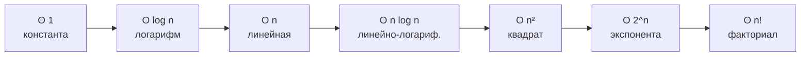
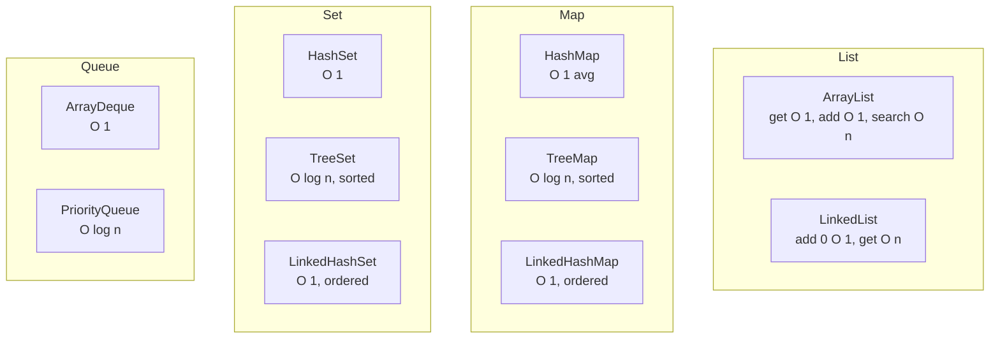
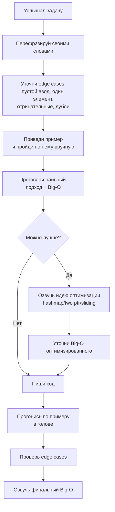

# 13. Алгоритмы и структуры данных

> **Цель главы:** дать необходимый минимум по алгоритмам для прохождения live-coding секции
> в РФ-продуктовых компаниях. Уровень QA Auto Middle+/Senior — это **Easy/Medium с LeetCode**:
> массивы, хэш-таблицы, двух указателей, sliding window, рекурсия, базовые сортировки.
> Hard-задачи (DP, графы) обычно НЕ спрашивают.

---

## Содержание

1. [Часть 1. Сложность алгоритмов (Big-O)](#часть-1-сложность-алгоритмов-big-o)
2. [Часть 2. Структуры данных и их сложности](#часть-2-структуры-данных-и-их-сложности)
3. [Часть 3. Паттерн «массивы и строки»](#часть-3-паттерн-массивы-и-строки)
4. [Часть 4. Паттерн «hash maps / sets»](#часть-4-паттерн-hash-maps--sets)
5. [Часть 5. Паттерн «two pointers»](#часть-5-паттерн-two-pointers)
6. [Часть 6. Паттерн «sliding window»](#часть-6-паттерн-sliding-window)
7. [Часть 7. Сортировки и бинарный поиск](#часть-7-сортировки-и-бинарный-поиск)
8. [Часть 8. Рекурсия и базовые деревья](#часть-8-рекурсия-и-базовые-деревья)
9. [Часть 9. Стратегия live-coding на собесе](#часть-9-стратегия-live-coding-на-собесе)
10. [Чек-лист самопроверки](#чек-лист-самопроверки)
11. [Видеоматериалы и тренажёры](#видеоматериалы-и-тренажёры)

---

## Часть 1. Сложность алгоритмов (Big-O)

### Q1. Что такое Big-O и зачем он нужен?

**Big-O** — асимптотическая верхняя граница роста времени/памяти алгоритма от размера входа `n`.
Описывает, как растёт сложность **в худшем случае**.

**Зачем:** сравнивать алгоритмы независимо от железа. `O(n)` всегда лучше `O(n²)` при достаточно большом `n`.

**Линейная шкала роста:**



| Сложность     | n=10        | n=100       | n=1000        | Где встречается                                  |
| ------------- | ----------- | ----------- | ------------- | ------------------------------------------------ |
| O(1)          | 1           | 1           | 1             | Доступ к элементу массива/HashMap                |
| O(log n)      | 3           | 7           | 10            | Бинарный поиск, операции на сбалансированном дереве |
| O(n)          | 10          | 100         | 1000          | Один проход по массиву                           |
| O(n log n)    | 30          | 700         | 10 000        | Эффективные сортировки (merge, quick avg)        |
| O(n²)         | 100         | 10 000      | 1 000 000     | Вложенный цикл                                   |
| O(2ⁿ)         | 1024        | 10³⁰        | ☠             | Наивная рекурсия Фибоначчи                       |

**Правило для собеса:** когда написал решение — **сразу скажи Big-O по времени и по памяти**, до того как тебя спросят.

---

### Q2. Best / average / worst case и амортизация

- **Worst case** — Big-O. По умолчанию говорим о нём.
- **Average case** — обычно та же или лучше.
- **Amortized** — усреднено по серии операций. Пример: `ArrayList.add()` — обычно `O(1)`, но при расширении массива `O(n)`. Амортизированно — `O(1)`.

**Пример амортизации в HashMap:**
```java
HashMap.put() // обычно O(1), но в худшем (все хэши совпали) — O(n) до Java 8 или O(log n) с tree-bins (Java 8+)
```

---

### Q3. Big-O по памяти (Space complexity)

Считаем **дополнительную память**, которую алгоритм использует помимо входа.

```java
// O(1) по памяти — переменные
int sum = 0;
for (int x : arr) sum += x;

// O(n) по памяти — копия массива
int[] copy = new int[arr.length];
System.arraycopy(arr, 0, copy, 0, arr.length);

// O(n) по памяти — рекурсивный стек
void traverse(Node n) {
    if (n == null) return;
    traverse(n.left);
    traverse(n.right);
}
// глубина рекурсии = высота дерева → O(h), для несбаланс. = O(n)
```

---

## Часть 2. Структуры данных и их сложности

### Q4. ArrayList vs LinkedList

| Операция                | ArrayList   | LinkedList |
| ----------------------- | ----------- | ---------- |
| `get(i)`                | **O(1)**    | O(n)       |
| `add(элемент)` (в конец)| O(1) аморт. | O(1)       |
| `add(0, элемент)`       | O(n)        | **O(1)**   |
| `remove(i)`             | O(n)        | O(n) (поиск) |
| `contains(x)`           | O(n)        | O(n)       |
| Память                  | компактнее  | +ссылки    |

**В практике:** `ArrayList` почти всегда. `LinkedList` — крайне редко (используют как `Deque`, но `ArrayDeque` быстрее).

---

### Q5. HashMap / HashSet — сложности и устройство

```java
HashMap<String, Integer> m = new HashMap<>();
m.put("a", 1);    // O(1) average, O(log n) worst (treeified bin)
m.get("a");       // O(1) average
m.containsKey("a"); // O(1) average
m.remove("a");    // O(1) average
```

**Устройство (упрощённо):**
- Внутри — массив бакетов (`Node<K,V>[] table`)
- `hash(key) % capacity` → индекс бакета
- Коллизии — связный список; с Java 8 при ≥8 элементов в бакете и capacity ≥64 → дерево (`O(log n)` по бакету)
- При load factor (default 0.75) превышает порог — `resize()` ×2, **rehash всех элементов**

**Контракт `equals()` / `hashCode()`:**
- Если `a.equals(b)` → `a.hashCode() == b.hashCode()` (обязательно)
- Обратное не требуется
- Если нарушить — `HashMap` не находит добавленные ключи

---

### Q6. TreeMap, ConcurrentHashMap, LinkedHashMap

| Реализация            | Порядок                  | Сложность get/put     | Когда                          |
| --------------------- | ------------------------ | --------------------- | ------------------------------ |
| `HashMap`             | без порядка              | O(1) avg              | дефолт                         |
| `LinkedHashMap`       | вставки или access-order | O(1)                  | LRU-кэш, упорядоченные итерации |
| `TreeMap`             | сортировка по ключу      | O(log n)              | нужен `firstKey/floor/ceiling/headMap` |
| `ConcurrentHashMap`   | без порядка              | O(1)                  | многопоточный код              |
| `Hashtable`           | устаревший               | O(1) с глобальным `synchronized` | не использовать |

---

### Q7. Stack, Queue, Deque

```java
// Stack (LIFO) — НЕ Stack-класс! Используем Deque
Deque<Integer> stack = new ArrayDeque<>();
stack.push(1); stack.push(2);
int top = stack.pop();   // 2
int peek = stack.peek(); // 1

// Queue (FIFO)
Deque<Integer> queue = new ArrayDeque<>();
queue.offer(1); queue.offer(2);
int first = queue.poll();   // 1

// PriorityQueue (heap)
PriorityQueue<Integer> pq = new PriorityQueue<>();
pq.offer(3); pq.offer(1); pq.offer(2);
pq.poll(); // 1 (min-heap по умолчанию)
```

| Структура     | push/peek/pop | Реализация               |
| ------------- | ------------- | ------------------------ |
| `ArrayDeque`  | O(1)          | кольцевой буфер          |
| `LinkedList`  | O(1)          | связный список           |
| `PriorityQueue` | O(log n) push, O(1) peek, O(log n) poll | бинарная куча |

> На собесе: `Stack` (java.util.Stack) считается legacy. **Используй `Deque<T> stack = new ArrayDeque<>()`**.

---

### Q8. Шпаргалка по сложностям коллекций Java



---

## Часть 3. Паттерн «массивы и строки»

### Q9. Развернуть строку

```java
String reverse(String s) {
    char[] chars = s.toCharArray();
    int l = 0, r = chars.length - 1;
    while (l < r) {
        char tmp = chars[l];
        chars[l++] = chars[r];
        chars[r--] = tmp;
    }
    return new String(chars);
}
// Time: O(n), Space: O(n) для char[]
```

> **Не `new StringBuilder(s).reverse().toString()`** — в собеседовании просят показать алгоритм.

---

### Q10. Является ли строка палиндромом

```java
boolean isPalindrome(String s) {
    int l = 0, r = s.length() - 1;
    while (l < r) {
        if (s.charAt(l) != s.charAt(r)) return false;
        l++; r--;
    }
    return true;
}
// Time: O(n), Space: O(1)
```

**Вариант с фильтрацией (LeetCode 125):**
```java
boolean isPalindromeAlphanum(String s) {
    int l = 0, r = s.length() - 1;
    while (l < r) {
        while (l < r && !Character.isLetterOrDigit(s.charAt(l))) l++;
        while (l < r && !Character.isLetterOrDigit(s.charAt(r))) r--;
        if (Character.toLowerCase(s.charAt(l)) != Character.toLowerCase(s.charAt(r)))
            return false;
        l++; r--;
    }
    return true;
}
```

---

### Q11. Anagram check

```java
// Подход 1: сортировка O(n log n)
boolean isAnagramSort(String a, String b) {
    if (a.length() != b.length()) return false;
    char[] x = a.toCharArray(), y = b.toCharArray();
    Arrays.sort(x); Arrays.sort(y);
    return Arrays.equals(x, y);
}

// Подход 2: счётчик символов O(n)
boolean isAnagramCount(String a, String b) {
    if (a.length() != b.length()) return false;
    int[] cnt = new int[26]; // только для a-z
    for (int i = 0; i < a.length(); i++) {
        cnt[a.charAt(i) - 'a']++;
        cnt[b.charAt(i) - 'a']--;
    }
    for (int c : cnt) if (c != 0) return false;
    return true;
}
```

> **На собесе:** показать оба, объяснить trade-off (память O(1) для алфавита vs O(n log n) времени).

---

### Q12. FizzBuzz — классика, не запорь

```java
List<String> fizzBuzz(int n) {
    List<String> res = new ArrayList<>(n);
    for (int i = 1; i <= n; i++) {
        if (i % 15 == 0) res.add("FizzBuzz");
        else if (i % 3 == 0) res.add("Fizz");
        else if (i % 5 == 0) res.add("Buzz");
        else res.add(Integer.toString(i));
    }
    return res;
}
```

---

### Q13. Найти максимум / минимум в массиве

```java
int max(int[] arr) {
    if (arr.length == 0) throw new IllegalArgumentException("empty");
    int max = arr[0];
    for (int i = 1; i < arr.length; i++) {
        if (arr[i] > max) max = arr[i];
    }
    return max;
}
// O(n)
```

---

### Q14. Найти второй максимум

```java
int secondMax(int[] arr) {
    int max = Integer.MIN_VALUE, second = Integer.MIN_VALUE;
    for (int x : arr) {
        if (x > max) { second = max; max = x; }
        else if (x > second && x < max) { second = x; }
    }
    return second;
}
// O(n), один проход
```

---

## Часть 4. Паттерн «hash maps / sets»

### Q15. Two Sum (LeetCode 1)

> Дан массив и target. Вернуть индексы двух чисел, сумма которых равна target.

```java
int[] twoSum(int[] nums, int target) {
    Map<Integer, Integer> seen = new HashMap<>(); // value → index
    for (int i = 0; i < nums.length; i++) {
        int need = target - nums[i];
        if (seen.containsKey(need)) {
            return new int[]{ seen.get(need), i };
        }
        seen.put(nums[i], i);
    }
    return new int[0]; // не найдено
}
// Time: O(n), Space: O(n)
```

**Наивно за O(n²):** два вложенных цикла. На интервью **никогда** не давайте такое решение — спросят сразу про оптимизацию.

---

### Q16. Содержит ли массив дубликаты

```java
boolean containsDuplicate(int[] nums) {
    Set<Integer> seen = new HashSet<>();
    for (int x : nums) {
        if (!seen.add(x)) return true; // add вернул false → уже есть
    }
    return false;
}
// O(n) / O(n)
```

---

### Q17. Первый уникальный символ в строке (LeetCode 387)

```java
int firstUniqChar(String s) {
    int[] cnt = new int[26];
    for (char c : s.toCharArray()) cnt[c - 'a']++;
    for (int i = 0; i < s.length(); i++) {
        if (cnt[s.charAt(i) - 'a'] == 1) return i;
    }
    return -1;
}
// O(n)
```

---

### Q18. Сгруппировать анаграммы (LeetCode 49)

```java
List<List<String>> groupAnagrams(String[] strs) {
    Map<String, List<String>> groups = new HashMap<>();
    for (String s : strs) {
        char[] key = s.toCharArray();
        Arrays.sort(key);
        groups.computeIfAbsent(new String(key), k -> new ArrayList<>()).add(s);
    }
    return new ArrayList<>(groups.values());
}
// O(n * k log k), где k — длина строки
```

---

### Q19. Подсчёт частот (классика)

```java
Map<String, Long> wordFrequency(List<String> words) {
    return words.stream()
        .collect(Collectors.groupingBy(w -> w, Collectors.counting()));
}

// Самые частые N
List<Map.Entry<String, Long>> topN(Map<String, Long> freq, int n) {
    return freq.entrySet().stream()
        .sorted(Map.Entry.<String, Long>comparingByValue().reversed())
        .limit(n)
        .toList();
}
```

---

## Часть 5. Паттерн «two pointers»

### Q20. Когда использовать two pointers?

**Сигналы задачи:**
- Отсортированный массив / строка
- Поиск пары / тройки с условием на сумму
- Палиндром
- Удаление дубликатов «in-place»
- Слияние двух отсортированных массивов

**Идея:** два указателя движутся навстречу или в одну сторону, экономя один цикл.

---

### Q21. Two Sum II — отсортированный массив

```java
int[] twoSumSorted(int[] arr, int target) {
    int l = 0, r = arr.length - 1;
    while (l < r) {
        int sum = arr[l] + arr[r];
        if (sum == target) return new int[]{l + 1, r + 1}; // 1-indexed
        if (sum < target) l++;
        else r--;
    }
    return new int[0];
}
// Time: O(n), Space: O(1)
```

---

### Q22. Удалить дубликаты из отсортированного массива «in-place» (LeetCode 26)

```java
int removeDuplicates(int[] nums) {
    if (nums.length == 0) return 0;
    int slow = 0;
    for (int fast = 1; fast < nums.length; fast++) {
        if (nums[fast] != nums[slow]) {
            slow++;
            nums[slow] = nums[fast];
        }
    }
    return slow + 1;
}
// O(n) / O(1)
```

---

### Q23. Слить два отсортированных массива (LeetCode 88)

```java
void merge(int[] nums1, int m, int[] nums2, int n) {
    int i = m - 1, j = n - 1, k = m + n - 1;
    while (i >= 0 && j >= 0) {
        if (nums1[i] > nums2[j]) nums1[k--] = nums1[i--];
        else                     nums1[k--] = nums2[j--];
    }
    while (j >= 0) nums1[k--] = nums2[j--];
}
// O(m+n) / O(1) — идём с конца, чтобы не перетирать nums1
```

---

## Часть 6. Паттерн «sliding window»

### Q24. Когда использовать sliding window?

- Подстрока / подмассив фиксированной длины
- Подмассив с условием (сумма ≤ X, максимум K разных элементов)
- Самая длинная / короткая подпоследовательность

**Идея:** окно `[l, r]` расширяется, при нарушении условия — сдвигается левый край.

---

### Q25. Самая длинная подстрока без повторов (LeetCode 3)

```java
int lengthOfLongestSubstring(String s) {
    Map<Character, Integer> last = new HashMap<>(); // char → последний индекс
    int max = 0, l = 0;
    for (int r = 0; r < s.length(); r++) {
        char c = s.charAt(r);
        if (last.containsKey(c) && last.get(c) >= l) {
            l = last.get(c) + 1;
        }
        last.put(c, r);
        max = Math.max(max, r - l + 1);
    }
    return max;
}
// O(n) / O(min(n, alphabet))
```

---

### Q26. Минимальный подмассив с суммой ≥ S (LeetCode 209)

```java
int minSubArrayLen(int s, int[] nums) {
    int min = Integer.MAX_VALUE, sum = 0, l = 0;
    for (int r = 0; r < nums.length; r++) {
        sum += nums[r];
        while (sum >= s) {
            min = Math.min(min, r - l + 1);
            sum -= nums[l++];
        }
    }
    return min == Integer.MAX_VALUE ? 0 : min;
}
// O(n) / O(1)
```

---

## Часть 7. Сортировки и бинарный поиск

### Q27. Сортировки — что должен знать QA Auto

| Сортировка        | Time avg / worst    | Space  | Stable | Когда обсуждают                         |
| ----------------- | ------------------- | ------ | ------ | --------------------------------------- |
| Bubble            | O(n²) / O(n²)       | O(1)   | yes    | Образовательная                         |
| Insertion         | O(n²) / O(n²)       | O(1)   | yes    | Хороша на коротких / почти отсортированных |
| Selection         | O(n²) / O(n²)       | O(1)   | no     | Образовательная                         |
| Merge             | O(n log n)          | O(n)   | yes    | Стабильная, гарантия. Используется в `Arrays.sort(Object[])` |
| Quick             | O(n log n) / O(n²)  | O(log n) | no   | В среднем быстрее всех. `Arrays.sort(int[])` (dual-pivot quicksort) |
| Heap              | O(n log n)          | O(1)   | no     | In-place, без квадрата в худшем          |
| Counting / Radix  | O(n + k)            | O(k)   | yes    | Целые числа в малом диапазоне           |

**Java под капотом:**
- `Arrays.sort(int[])` — **Dual-Pivot Quicksort** (Vladimir Yaroslavskiy)
- `Arrays.sort(Object[])` / `Collections.sort` — **TimSort** (адаптивный merge), **stable**

> **На собесе:** не пиши Bubble Sort — пиши `Collections.sort(...)` или `Arrays.sort(...)` и объясни сложность. Если просят реализовать — пиши Merge или Quick.

---

### Q28. Quick Sort — реализация

```java
void quickSort(int[] arr, int l, int r) {
    if (l >= r) return;
    int pivot = arr[(l + r) / 2];
    int i = l, j = r;
    while (i <= j) {
        while (arr[i] < pivot) i++;
        while (arr[j] > pivot) j--;
        if (i <= j) {
            int tmp = arr[i]; arr[i] = arr[j]; arr[j] = tmp;
            i++; j--;
        }
    }
    quickSort(arr, l, j);
    quickSort(arr, i, r);
}
// Time avg O(n log n), worst O(n²) / Space O(log n)
```

---

### Q29. Merge Sort — реализация

```java
void mergeSort(int[] a) { mergeSort(a, 0, a.length - 1); }

void mergeSort(int[] a, int l, int r) {
    if (l >= r) return;
    int m = (l + r) >>> 1;       // безопасное /2
    mergeSort(a, l, m);
    mergeSort(a, m + 1, r);
    merge(a, l, m, r);
}

void merge(int[] a, int l, int m, int r) {
    int[] tmp = new int[r - l + 1];
    int i = l, j = m + 1, k = 0;
    while (i <= m && j <= r) {
        tmp[k++] = a[i] <= a[j] ? a[i++] : a[j++];
    }
    while (i <= m) tmp[k++] = a[i++];
    while (j <= r) tmp[k++] = a[j++];
    System.arraycopy(tmp, 0, a, l, tmp.length);
}
// O(n log n) / O(n)
```

---

### Q30. Бинарный поиск — must-have

```java
int binarySearch(int[] arr, int target) {
    int l = 0, r = arr.length - 1;
    while (l <= r) {
        int m = l + (r - l) / 2;     // НЕ (l+r)/2 — overflow для больших l,r
        if (arr[m] == target) return m;
        if (arr[m] < target) l = m + 1;
        else                 r = m - 1;
    }
    return -1;
}
// O(log n) / O(1)
```

> **Ловушки:**
> - `(l + r) / 2` может переполниться. Используй `l + (r - l) / 2` или `(l + r) >>> 1`.
> - Перепутать `<` / `<=`, `m+1` / `m-1` — типичный баг. Всегда проверяй на `[1]`, `[1,2]`, `[1,2,3]`.

---

### Q31. Бинарный поиск с поворотом / в произвольной задаче

**Шаблон поиска левой границы:**
```java
// Найти первый индекс, где predicate(i) == true
int firstTrue(int lo, int hi, IntPredicate p) {
    while (lo < hi) {
        int m = lo + (hi - lo) / 2;
        if (p.test(m)) hi = m;
        else lo = m + 1;
    }
    return lo;
}
```

Запоминать одну реализацию и адаптировать под задачу.

---

## Часть 8. Рекурсия и базовые деревья

### Q32. Факториал — рекурсия и мемоизация

```java
long factorial(int n) {
    if (n <= 1) return 1;
    return n * factorial(n - 1);
}
// O(n) time, O(n) stack
```

**Итеративно (если стек глубокий):**
```java
long factorialIter(int n) {
    long res = 1;
    for (int i = 2; i <= n; i++) res *= i;
    return res;
}
```

---

### Q33. Фибоначчи — наивно vs DP

```java
// Наивно — O(2ⁿ), огромный стек
int fibSlow(int n) {
    if (n <= 1) return n;
    return fibSlow(n-1) + fibSlow(n-2);
}

// Мемоизация — O(n) / O(n)
int fibMemo(int n, int[] memo) {
    if (n <= 1) return n;
    if (memo[n] != 0) return memo[n];
    return memo[n] = fibMemo(n-1, memo) + fibMemo(n-2, memo);
}

// Итеративно — O(n) / O(1)
int fibIter(int n) {
    if (n <= 1) return n;
    int a = 0, b = 1;
    for (int i = 2; i <= n; i++) {
        int c = a + b; a = b; b = c;
    }
    return b;
}
```

> На собесе обычно достаточно **итеративного решения** + упомянуть про memo/DP.

---

### Q34. Бинарное дерево — обходы

```java
class TreeNode {
    int val;
    TreeNode left, right;
    TreeNode(int v) { val = v; }
}

// Pre-order: корень → левое → правое
void preOrder(TreeNode n, List<Integer> out) {
    if (n == null) return;
    out.add(n.val);
    preOrder(n.left, out);
    preOrder(n.right, out);
}

// In-order: левое → корень → правое (для BST даёт отсортированный список)
void inOrder(TreeNode n, List<Integer> out) {
    if (n == null) return;
    inOrder(n.left, out);
    out.add(n.val);
    inOrder(n.right, out);
}

// Post-order: левое → правое → корень
void postOrder(TreeNode n, List<Integer> out) {
    if (n == null) return;
    postOrder(n.left, out);
    postOrder(n.right, out);
    out.add(n.val);
}

// BFS / Level-order (через Queue)
List<List<Integer>> levelOrder(TreeNode root) {
    List<List<Integer>> res = new ArrayList<>();
    if (root == null) return res;
    Queue<TreeNode> q = new ArrayDeque<>();
    q.offer(root);
    while (!q.isEmpty()) {
        int size = q.size();
        List<Integer> level = new ArrayList<>(size);
        for (int i = 0; i < size; i++) {
            TreeNode n = q.poll();
            level.add(n.val);
            if (n.left  != null) q.offer(n.left);
            if (n.right != null) q.offer(n.right);
        }
        res.add(level);
    }
    return res;
}
```

---

### Q35. Глубина бинарного дерева (LeetCode 104)

```java
int maxDepth(TreeNode root) {
    if (root == null) return 0;
    return 1 + Math.max(maxDepth(root.left), maxDepth(root.right));
}
// Time O(n), Space O(h) — высота дерева
```

---

## Часть 9. Стратегия live-coding на собесе

### Q36. Алгоритм решения задачи на интервью



---

### Q37. Что говорить вслух

1. **Уточни задачу:** «Массив отсортирован?», «Можно ли иметь дубликаты?», «Что вернуть, если решений несколько?»
2. **Приведи пример:** «Допустим, `[2, 7, 11, 15], target=9` → `[0, 1]`. Правильно понимаю?»
3. **Озвучь подходы:** «Самое наивное — два цикла за `O(n²)`. Можно лучше через hashmap за `O(n)`. Идея: на каждой итерации искать `target - nums[i]`».
4. **Пиши код:** медленно, поясняя каждую строку.
5. **Тестируй:** «Прогоню на пустом, на одном элементе, на твоём примере...»
6. **Big-O:** «Время `O(n)`, память `O(n)` под hashmap».

> **Молчаливый кандидат — отказ.** Интервьюеру нужен ход твоих мыслей.

---

### Q38. Чего НЕ делать

- ❌ Молча писать код 15 минут
- ❌ Сразу прыгать в код без обсуждения
- ❌ Делать вид, что знаешь решение, и копировать с MEMO («это же стандартная»)
- ❌ Не уточнять edge-cases: пустой массив → NPE на собесе = провал
- ❌ Игнорировать подсказку интервьюера («может, есть быстрее?» — намёк, что решение не оптимально)
- ❌ Не запускать решение на примере
- ❌ Не озвучивать Big-O

---

### Q39. QA Auto-специфика на live-coding

В РФ-продуктовых компаниях для QA Auto дают:
- Easy/Medium **типовые алгоритмы** (Two Sum, Reverse, Anagram, Sliding Window)
- **Задачи на парсинг строк** (логи, JSON, CSV) — здесь хэш-таблицы и regex
- **Задачи на коллекции Java** (топ-N, дедуп, группировка)
- **Иногда — на написание теста**: «напиши JUnit-тест для функции `isLeapYear(int)` с покрытием граничных случаев»

**Что почти НЕ дают (но бывает в банках топ-уровня):**
- DP средней-сложной (LIS, knapsack)
- Графы (BFS/DFS на графе, Dijkstra)
- Hard-задачи (LeetCode Hard)

---

### Q40. План тренировок (4 недели до собеса)

```mermaid
gantt
    title План тренировок
    dateFormat  D
    axisFormat  День %d

    section Неделя 1: основы
    Big-O и коллекции          :a1, 1, 2d
    Массивы и строки (10 задач):a2, after a1, 5d

    section Неделя 2: hash + ptr
    Hash maps (8 задач)        :b1, 8, 4d
    Two pointers (6 задач)     :b2, after b1, 3d

    section Неделя 3: окна + поиск
    Sliding window (5 задач)   :c1, 15, 3d
    Бинарный поиск (5 задач)   :c2, after c1, 4d

    section Неделя 4: сорт + дерево + mock
    Сортировки + рекурсия      :d1, 22, 3d
    Деревья базовые (3 задачи) :d2, after d1, 2d
    Mock-интервью              :d3, after d2, 2d
```



**LeetCode подборка (Easy + 3-5 Medium):**

```
1.   Two Sum                       (Easy)
20.  Valid Parentheses             (Easy)
21.  Merge Two Sorted Lists        (Easy)
26.  Remove Duplicates from Array  (Easy)
49.  Group Anagrams                (Medium)
88.  Merge Sorted Array            (Easy)
121. Best Time to Buy/Sell Stock   (Easy)
125. Valid Palindrome              (Easy)
217. Contains Duplicate            (Easy)
242. Valid Anagram                 (Easy)
3.   Longest Substring W/O Repeat  (Medium)  ← sliding window
209. Min Size Subarray Sum         (Medium)  ← sliding window
704. Binary Search                 (Easy)
35.  Search Insert Position        (Easy)    ← бинарный поиск
104. Max Depth Binary Tree         (Easy)
102. Binary Tree Level Order       (Medium)
```

---

## Чек-лист самопроверки

- [ ] Объясняю Big-O и приведу 5 примеров разных классов сложности
- [ ] Знаю сложности `ArrayList`, `LinkedList`, `HashMap`, `TreeMap`, `ArrayDeque`, `PriorityQueue`
- [ ] Знаю контракт `equals/hashCode` и как ломается `HashMap`
- [ ] Решаю Two Sum за `O(n)` с hashmap «с листа»
- [ ] Решаю палиндром / анаграмму с двумя подходами
- [ ] Знаю когда применять two pointers vs sliding window
- [ ] Пишу бинарный поиск без багов на `(l+r)/2` и границах
- [ ] Пишу Quick Sort и Merge Sort, знаю их сложности и стабильность
- [ ] Знаю что `Arrays.sort(int[])` — quick, `Collections.sort` — TimSort
- [ ] Делаю pre/in/post/level-order обход бинарного дерева
- [ ] Решаю 70%+ Easy с LeetCode за 20–25 мин
- [ ] Решаю 30%+ Medium из списка выше за 30–40 мин
- [ ] Прохожу алгоритм на собесе по схеме: уточнение → пример → naive → optimal → код → тест → Big-O

---

## Видеоматериалы и тренажёры

### Тренажёры (главное)

- **LeetCode** — https://leetcode.com — стандарт. Делай **«Top Interview 150»** (раздел Study Plan).
- **NeetCode 150** — https://neetcode.io — структурированный список Easy/Medium/Hard с видео-разборами.
- **HackerRank Java** — https://www.hackerrank.com/domains/java — для прокачки Java-синтаксиса.
- **CodeWars** — https://www.codewars.com — мелкие задачи для разминки.

### Русскоязычные

- **Алгоритмы для разработчиков, Tinkoff Education** — на YouTube искать «Tinkoff Алгоритмы».
- **Школа АЛГ Алёны Пузенко** — https://www.youtube.com/@alenapuzenko
- **Тимофей Хирьянов, ШАД** — https://www.youtube.com/@tkhirianov — лекции МФТИ, фундамент.
- **Иван Бенке (Senior Developer Talk)** — https://www.youtube.com/@SeniorDeveloperTalk — собеседования по алгоритмам с разбором.

### Англоязычные

- **NeetCode** — https://www.youtube.com/@NeetCode — лучший канал по LeetCode-разборам.
- **Back to Back SWE** — https://www.youtube.com/@BackToBackSWE — глубокие пошаговые объяснения.
- **William Fiset** — https://www.youtube.com/@WilliamFiset-videos — структуры данных и алгоритмы серьёзно.
- **Abdul Bari** — https://www.youtube.com/@abdul_bari — лучшие лекции по сортировкам и графам.

### Книги

- **«Cracking the Coding Interview», Gayle Laakmann McDowell** — классика.
- **«Грокаем алгоритмы», Адитья Бхаргава** — простое введение для тех, кто никогда не учил алгоритмы.

---

[← Назад: 12. CI/CD](./12-cicd.md) · [К оглавлению](./README.md) · [Следующая: 14. System Design для QA →](./14-system-design-qa.md)
