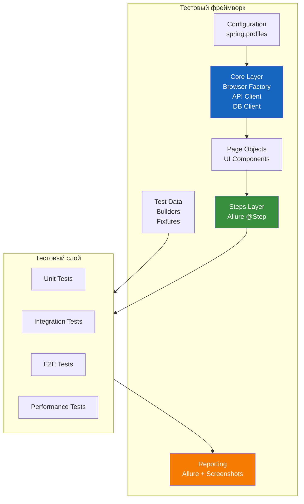
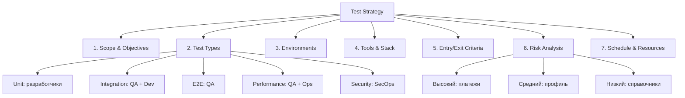
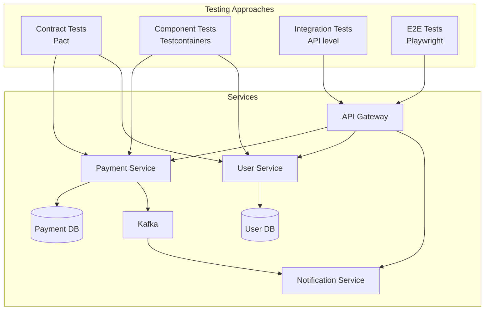
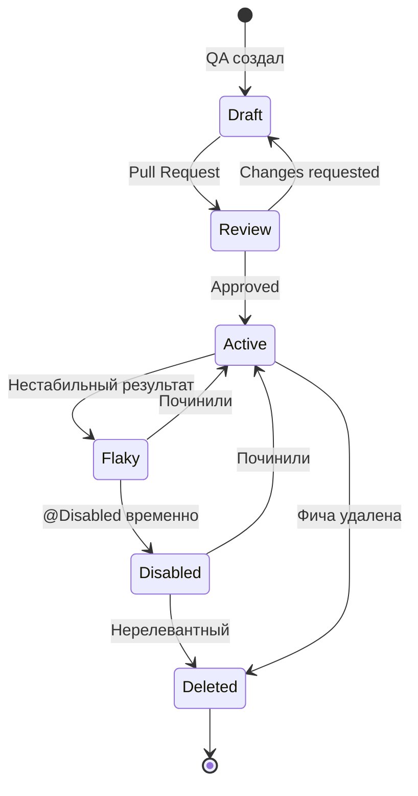

# Глава 14. System Design для QA

[← Глава 13: Алгоритмы](13-algorithms.md) | [Содержание](README.md) | [Глава 15: Fintech →](15-fintech-specifics.md)

---

## Быстрая навигация

- [Проектирование фреймворка](#проектирование-фреймворка)
- [Тест-стратегия](#тест-стратегия)
- [Отчётность и метрики](#отчётность-и-метрики)
- [Чеклист](#чеклист)

---

## Проектирование фреймворка

### Вопрос 1. Как вы бы спроектировали тестовый фреймворк с нуля?



**Структура проекта:**
```
qa-framework/
├── pom.xml
├── src/
│   ├── main/java/com/example/qa/
│   │   ├── core/
│   │   │   ├── browser/
│   │   │   │   ├── BrowserFactory.java      # создание браузера
│   │   │   │   └── PlaywrightManager.java   # ThreadLocal<Page>
│   │   │   ├── api/
│   │   │   │   ├── ApiClient.java           # базовый REST клиент
│   │   │   │   └── specifications/
│   │   │   │       └── BaseSpec.java        # RequestSpecification
│   │   │   └── db/
│   │   │       └── DatabaseClient.java      # JDBC утилиты
│   │   ├── pages/
│   │   │   ├── BasePage.java
│   │   │   └── payment/
│   │   │       ├── PaymentPage.java
│   │   │       └── PaymentResultPage.java
│   │   ├── steps/
│   │   │   └── PaymentSteps.java
│   │   ├── data/
│   │   │   ├── builders/
│   │   │   │   └── PaymentBuilder.java
│   │   │   └── providers/
│   │   │       └── TestDataProvider.java
│   │   └── config/
│   │       ├── TestConfig.java
│   │       └── EnvironmentConfig.java
│   └── test/java/com/example/qa/
│       ├── BaseTest.java
│       ├── api/
│       │   └── PaymentApiTest.java
│       ├── ui/
│       │   └── PaymentUiTest.java
│       └── integration/
│           └── PaymentFlowTest.java
└── src/test/resources/
    ├── application-test.yml
    ├── allure.properties
    └── testcontainers.properties
```

---

### Вопрос 2. Как организовать конфигурацию фреймворка для разных окружений?

```java
// Центральная конфигурация через Spring
@Configuration
@ConfigurationProperties(prefix = "test")
public class TestConfig {
    private String baseUrl;
    private String apiKey;
    private BrowserConfig browser = new BrowserConfig();
    private DatabaseConfig database = new DatabaseConfig();

    public record BrowserConfig(
            String type,        // chromium, firefox, webkit
            boolean headless,
            int timeout,        // мс
            boolean traceOnFailure
    ) {
        public BrowserConfig() {
            this("chromium", true, 30000, true);
        }
    }

    public record DatabaseConfig(
            String url,
            String username,
            String password
    ) {
        public DatabaseConfig() { this(null, null, null); }
    }

    // getters/setters
}
```

```yaml
# application-test.yml (дефолт)
test:
  browser:
    type: chromium
    headless: true
    timeout: 30000
    trace-on-failure: true

---
spring:
  config:
    activate:
      on-profile: staging
test:
  base-url: https://staging.example.com
  api-key: ${STAGING_API_KEY}

---
spring:
  config:
    activate:
      on-profile: local
test:
  base-url: http://localhost:8080
  browser:
    headless: false    # показывать браузер локально
```

---

### Вопрос 3. Как спроектировать слой управления браузером для параллельных тестов?

```java
// ThreadLocal для изоляции браузеров в параллельных тестах
@Component
public class PlaywrightManager {

    private static final ThreadLocal<Playwright> PLAYWRIGHT = new ThreadLocal<>();
    private static final ThreadLocal<Browser> BROWSER = new ThreadLocal<>();
    private static final ThreadLocal<BrowserContext> CONTEXT = new ThreadLocal<>();
    private static final ThreadLocal<Page> PAGE = new ThreadLocal<>();

    @Autowired
    private TestConfig config;

    public Page getPage() {
        if (PAGE.get() == null) {
            initBrowser();
        }
        return PAGE.get();
    }

    public void initBrowser() {
        Playwright playwright = Playwright.create();
        PLAYWRIGHT.set(playwright);

        BrowserType.LaunchOptions launchOptions = new BrowserType.LaunchOptions()
                .setHeadless(config.getBrowser().headless());

        Browser browser = switch (config.getBrowser().type()) {
            case "firefox" -> playwright.firefox().launch(launchOptions);
            case "webkit"  -> playwright.webkit().launch(launchOptions);
            default        -> playwright.chromium().launch(launchOptions);
        };
        BROWSER.set(browser);

        BrowserContext context = browser.newContext(new Browser.NewContextOptions()
                .setViewportSize(1920, 1080)
                .setLocale("ru-RU")
                .setTimezoneId("Europe/Moscow"));

        if (config.getBrowser().traceOnFailure()) {
            context.tracing().start(new Tracing.StartOptions()
                    .setScreenshots(true)
                    .setSnapshots(true));
        }
        CONTEXT.set(context);
        PAGE.set(context.newPage());
        PAGE.get().setDefaultTimeout(config.getBrowser().timeout());
    }

    public void closeAll(boolean testFailed) {
        try {
            if (testFailed && config.getBrowser().traceOnFailure()) {
                saveTrace();
            }
        } finally {
            if (PAGE.get() != null) PAGE.get().close();
            if (CONTEXT.get() != null) CONTEXT.get().close();
            if (BROWSER.get() != null) BROWSER.get().close();
            if (PLAYWRIGHT.get() != null) PLAYWRIGHT.get().close();
            PAGE.remove();
            CONTEXT.remove();
            BROWSER.remove();
            PLAYWRIGHT.remove();
        }
    }

    private void saveTrace() {
        String tracePath = "target/playwright-traces/trace-" +
                Thread.currentThread().getId() + "-" +
                System.currentTimeMillis() + ".zip";
        CONTEXT.get().tracing().stop(new Tracing.StopOptions().setPath(Paths.get(tracePath)));
        Allure.addAttachment("Playwright Trace", "application/zip",
                new FileInputStream(tracePath), ".zip");
    }
}
```

---

### Вопрос 4. Как спроектировать Data Management в тестах?

```java
// Test Data Builder паттерн
public class PaymentBuilder {
    private String senderId = "ACC-" + UUID.randomUUID().toString().substring(0, 8);
    private String receiverId = "ACC-" + UUID.randomUUID().toString().substring(0, 8);
    private BigDecimal amount = new BigDecimal("100.00");
    private String currency = "RUB";
    private String description = "Test payment";

    public PaymentBuilder withAmount(BigDecimal amount) {
        this.amount = amount;
        return this;
    }

    public PaymentBuilder withCurrency(String currency) {
        this.currency = currency;
        return this;
    }

    public PaymentBuilder asLargePayment() {    // Object Mother метод
        this.amount = new BigDecimal("1000000.00");
        this.description = "Large payment for limit testing";
        return this;
    }

    public PaymentRequest build() {
        return new PaymentRequest(senderId, receiverId, amount, currency, description);
    }

    public static PaymentBuilder aPayment() { return new PaymentBuilder(); }
    public static PaymentBuilder aLargePayment() { return new PaymentBuilder().asLargePayment(); }
}

// Использование
PaymentRequest payment = PaymentBuilder.aPayment()
        .withAmount(new BigDecimal("500.00"))
        .withCurrency("USD")
        .build();
```

**Управление состоянием БД:**
```java
@Component
public class DatabaseFixture {

    @Autowired
    private JdbcTemplate jdbcTemplate;

    @BeforeEach
    void setupTestData() {
        jdbcTemplate.execute("DELETE FROM payments WHERE description LIKE 'Test%'");
    }

    public String createTestAccount(BigDecimal balance) {
        String accountId = "ACC-TEST-" + UUID.randomUUID().toString().substring(0, 8);
        jdbcTemplate.update(
                "INSERT INTO accounts (id, balance, status) VALUES (?, ?, ?)",
                accountId, balance, "ACTIVE"
        );
        return accountId;
    }
}
```

---

## Тест-стратегия

### Вопрос 5. Как составить тест-стратегию для нового проекта?

**Структура тест-стратегии:**



**Что включить в стратегию:**

| Раздел | Содержание |
|--------|-----------|
| **Цели** | Что считается успешным тестированием |
| **Объём** | Что тестируем, что НЕ тестируем |
| **Подходы** | Risk-based, BDD, TDD — что применяем |
| **Типы тестов** | Какие уровни, кто ответственен |
| **Окружения** | local, dev, staging, prod |
| **Инструменты** | Весь стек, обоснование выбора |
| **Entry criteria** | Когда начинаем тестирование |
| **Exit criteria** | Когда считаем тестирование завершённым |
| **Риски** | Что может пойти не так, митигация |
| **Метрики** | Как измеряем качество |

---

### Вопрос 6. Как приоритизировать тест-кейсы по рискам?

**Risk-based testing — матрица приоритетов:**

|                        | Низкое влияние   | Высокое влияние       |
|------------------------|------------------|-----------------------|
| **Высокая вероятность**| Средний (P2)     | **Критический (P0)**  |
| **Низкая вероятность** | Низкий (P3)      | Высокий (P1)          |

**Примеры по квадрантам:**
- **P0 — Критический:** Обработка платежей, Авторизация
- **P1 — Высокий:** Смена пароля, Экспорт отчёта
- **P2 — Средний:** Настройка уведомлений
- **P3 — Низкий:** Настройка языка интерфейса

**Критерии приоритета:**
```java
// Теги для приоритизации в JUnit5
@Tag("P0")    // Smoke — всегда запускать
@Tag("P1")    // Critical path — запускать в каждом PR
@Tag("P2")    // Important — запускать ночью
@Tag("P3")    // Nice-to-have — запускать еженедельно

@Tag("P0")
@Tag("smoke")
@Test
void shouldProcessPaymentSuccessfully() { ... }

@Tag("P2")
@Test
void shouldDisplayCorrectTimezone() { ... }
```

---

### Вопрос 7. Как организовать тестирование микросервисной архитектуры?



**Consumer-Driven Contract Testing (Pact):**
```java
// Consumer сторона — определяет ожидания
@ExtendWith(PactConsumerTestExt.class)
@PactTestFor(providerName = "payment-service")
class PaymentServiceContractTest {

    @Pact(consumer = "notification-service")
    public RequestResponsePact paymentCreatedPact(PactDslWithProvider builder) {
        return builder
                .given("payment exists with id pay-123")
                .uponReceiving("get payment by id")
                    .path("/api/v1/payments/pay-123")
                    .method("GET")
                .willRespondWith()
                    .status(200)
                    .body(new PactDslJsonBody()
                        .stringValue("id", "pay-123")
                        .stringValue("status", "COMPLETED")
                        .decimalType("amount")
                    )
                .toPact();
    }

    @Test
    @PactTestFor(pactMethod = "paymentCreatedPact")
    void shouldGetPaymentById(MockServer mockServer) {
        PaymentClient client = new PaymentClient(mockServer.getUrl());
        Payment payment = client.getById("pay-123");
        assertThat(payment.status()).isEqualTo("COMPLETED");
    }
}
```

---

## Отчётность и метрики

### Вопрос 8. Какие метрики качества важны для QA?

**Ключевые метрики:**

| Метрика | Формула | Хорошее значение |
|---------|---------|------------------|
| **Pass Rate** | passed / total × 100% | > 95% |
| **Test Coverage** | покрытые строки / всего × 100% | > 80% |
| **Defect Detection Rate** | баги QA / (баги QA + баги prod) × 100% | > 90% |
| **Mean Time to Detect** | среднее время обнаружения бага | Как можно меньше |
| **Flakiness Rate** | flaky тесты / всего × 100% | < 2% |
| **Test Execution Time** | общее время прогона | Зависит от уровня |
| **Automation Rate** | автоматизировано / всего тест-кейсов | > 70% |

```java
// Сбор метрик через Allure listener
public class MetricsListener implements AllureLifecycle {

    private final Map<String, AtomicInteger> counters = new ConcurrentHashMap<>();

    @Override
    public void afterTestStop(TestResult result) {
        String status = result.getStatus().value();
        counters.computeIfAbsent(status, k -> new AtomicInteger()).incrementAndGet();

        // Логировать метрики в систему мониторинга
        long duration = result.getStop() - result.getStart();
        if (duration > 30_000) {    // > 30 секунд — подозрительно долго
            System.err.printf("SLOW TEST: %s took %d ms%n",
                    result.getName(), duration);
        }
    }
}
```

---

### Вопрос 9. Как организовать дашборд качества для команды?

```yaml
# Пример структуры Allure environment.properties
# (что публиковать в отчёте)
Environment=staging
Branch=main
Build=1.5.0-SNAPSHOT
Commit=abc123def
Test.Groups=api,ui,integration
Test.Total=450
Test.Passed=430
Test.Failed=15
Test.Skipped=5
Pass.Rate=95.6%
Duration=18m 32s
```

**Интеграция с Grafana/InfluxDB:**
```java
// Отправка результатов в InfluxDB после каждого прогона
public class MetricsReporter {

    private final InfluxDB influxDB;

    public void reportTestResults(TestSuiteResult suite) {
        Point point = Point.measurement("test_run")
                .time(System.currentTimeMillis(), TimeUnit.MILLISECONDS)
                .tag("environment", suite.environment())
                .tag("branch", suite.branch())
                .field("total", suite.total())
                .field("passed", suite.passed())
                .field("failed", suite.failed())
                .field("pass_rate", suite.passRate())
                .field("duration_ms", suite.durationMs())
                .build();

        influxDB.write("qa-metrics", "autogen", point);
    }
}
```

---

### Вопрос 10. Как ответить на вопрос "Как вы бы улучшили текущий процесс тестирования"?

**Фреймворк ответа (STAR + данные):**

```
1. Оценить текущее состояние (Assess)
   - Собрать метрики: pass rate, time, flakiness rate
   - Найти самые дорогие/медленные/нестабильные тесты

2. Определить проблемы (Identify)
   - Долгое выполнение? → Параллелизация
   - Много flaky? → Стабилизация/изоляция
   - Позднее обнаружение? → Shift-Left
   - Плохая видимость? → Улучшить reporting

3. Предложить решения (Propose)
   - Конкретные инструменты и подходы
   - Оценить трудоёмкость и эффект
   - Приоритизировать по ROI

4. Измерить результат (Measure)
   - До/после для каждого улучшения
   - Метрики качества через 1-3 месяца
```

**Пример реального улучшения:**
```
Проблема: E2E тесты занимают 2 часа, блокируют CI
↓
Анализ: 80% времени — 20% самых медленных тестов
↓
Решение:
  1. Параллелизация: 4 потока → время 35 мин
  2. Топ-20 медленных тестов → рефакторинг → 15 мин
  3. Перевод стабильных тестов в API-уровень
↓
Результат: 2ч → 22 мин (сокращение на 82%)
```

---

### Вопрос 11. Как организовать review тест-кейсов и поддерживать их актуальность?

**Жизненный цикл тест-кейса:**



**Политики поддержки:**
```java
// Документировать причину отключения
@Disabled("JIRA-1234: Flaky из-за race condition в payment-service, ETA fix: 2024-02-15")
@Test
void shouldProcessConcurrentPayments() { ... }

// Периодический аудит
@Tag("audit-needed")    // помечать тесты для проверки
@Test
void shouldDisplayLegacyReport() { ... }
```

```bash
# Найти давно не трогавшиеся тесты (кандидаты на удаление)
git log --diff-filter=M --name-only --format="" -- "**Test.java" \
  | sort | uniq -c | sort -n | head -20
```

---

### Вопрос 12. Как оценить трудоёмкость автоматизации?

**Факторы оценки:**

| Фактор | Вес | Пример |
|--------|-----|--------|
| Сложность UI (динамика, AJAX) | +30-50% | SPA с lazy loading |
| Нестабильность окружения | +20-40% | Частые деплои, недоступность |
| Наличие тестовых данных | ±20% | Нет API создания данных → ручная подготовка |
| Переиспользование Page Objects | -20-30% | Уже есть BasePage |
| Сложность проверок | +10-30% | PDF/изображения vs текст |

**Формула:**
```
Базовая оценка × коэффициент сложности × (1 + риск-буфер)

Пример:
- Базовая: 3 дня (написать тест + отладка)
- Коэффициент UI сложности: 1.3
- Нет тестовых данных: 1.2
- Риск-буфер: 30%
- Итого: 3 × 1.3 × 1.2 × 1.3 = ~6 дней
```

---

## Чек-лист самопроверки

### Проектирование фреймворка
- [ ] Слоистая архитектура: Core → Pages → Steps → Tests
- [ ] Конфигурация через Spring profiles + `@ConfigurationProperties`
- [ ] ThreadLocal для параллельных UI-тестов
- [ ] Test Data Builder + Object Mother паттерны
- [ ] Автоматическая очистка данных: `@BeforeEach` / `@AfterEach`

### Тест-стратегия
- [ ] Знать компоненты стратегии: scope, types, environments, criteria
- [ ] Risk-based приоритизация: вероятность × влияние
- [ ] Test Pyramid для микросервисов
- [ ] Contract Testing (Pact) для межсервисного взаимодействия

### Отчётность и метрики
- [ ] Ключевые метрики: pass rate, coverage, flakiness, defect detection rate
- [ ] Allure: environment.properties, categories.json, history
- [ ] Уметь объяснить, что значит "хорошее" значение метрики
- [ ] Дашборд для команды: что показывать PM, что Dev, что QA

### Коммуникация
- [ ] Уметь объяснить ROI автоматизации нетехническому менеджеру
- [ ] Предлагать улучшения с данными (до/после)
- [ ] Оценивать трудоёмкость с обоснованием

---

[← Глава 13: Алгоритмы](13-algorithms.md) | [Содержание](README.md) | [Глава 15: Fintech →](15-fintech-specifics.md)
