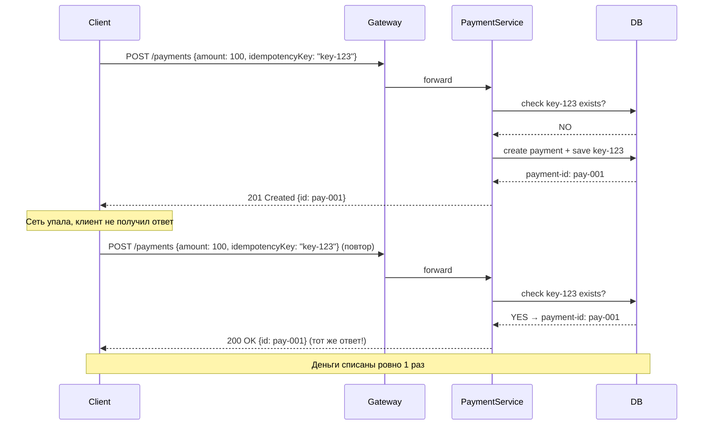
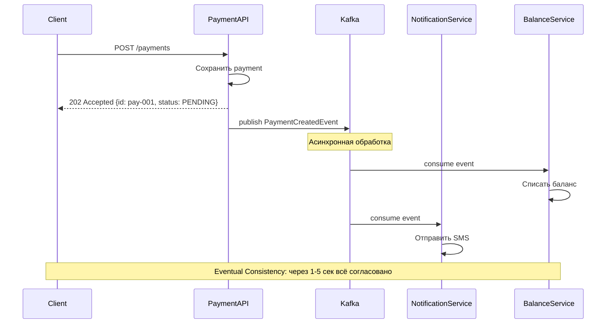
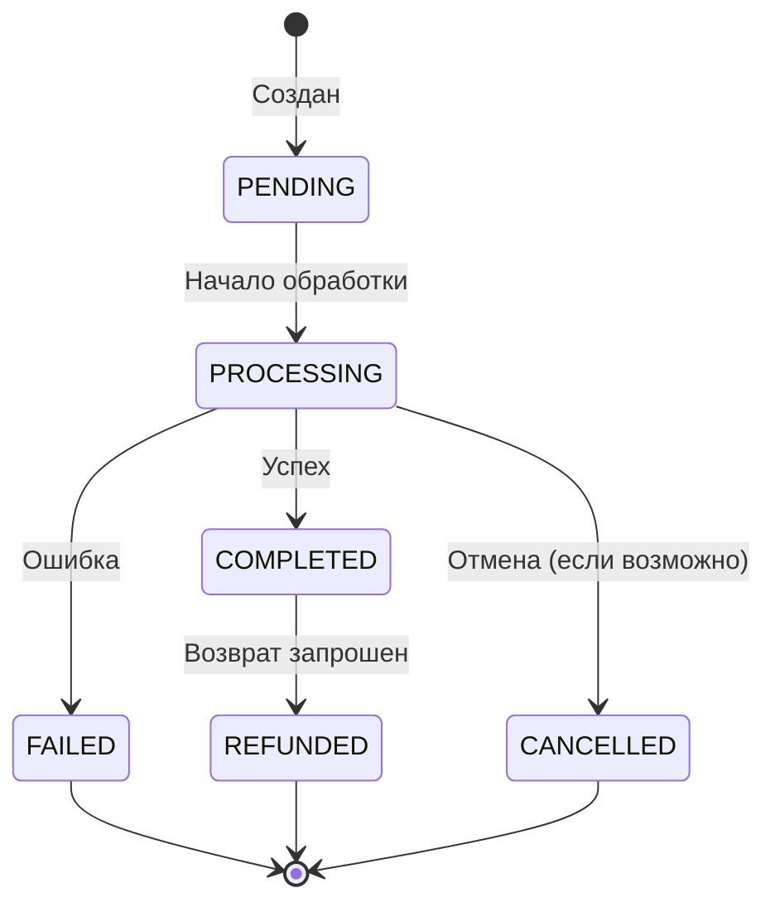

# Глава 15. Специфика тестирования в Fintech

[← Глава 14: System Design](14-system-design-qa.md) | [Содержание](README.md) | [Глава 16: Soft Skills →](16-soft-skills.md)

---

## Быстрая навигация

- [Идемпотентность](#идемпотентность)
- [Eventual Consistency](#eventual-consistency)
- [Аудит и безопасность](#аудит-и-безопасность)
- [Тестирование платежей](#тестирование-платежей)
- [Чеклист](#чеклист)

---

## Идемпотентность

### Вопрос 1. Что такое идемпотентность и почему она критична в финтехе?

**Идемпотентность** — свойство операции давать одинаковый результат при многократном выполнении. Для финансовых операций это значит: повторный запрос не создаёт дублирующий платёж.



**Тест идемпотентности:**
```java
@Test
@DisplayName("Повторный запрос с тем же idempotency key не создаёт дубликат")
void shouldBeIdempotent() {
    String idempotencyKey = UUID.randomUUID().toString();
    PaymentRequest request = PaymentBuilder.aPayment()
            .withAmount(new BigDecimal("100.00"))
            .build();

    // Первый запрос
    PaymentResponse first = given()
            .header("Idempotency-Key", idempotencyKey)
            .body(request)
            .when()
            .post("/api/v1/payments")
            .then()
            .statusCode(201)
            .extract().as(PaymentResponse.class);

    // Повторный запрос — тот же key
    PaymentResponse second = given()
            .header("Idempotency-Key", idempotencyKey)
            .body(request)
            .when()
            .post("/api/v1/payments")
            .then()
            .statusCode(anyOf(is(200), is(201)))    // допустимо оба кода
            .extract().as(PaymentResponse.class);

    // Ключевые проверки
    assertThat(first.id()).isEqualTo(second.id());              // тот же ID
    assertThat(first.amount()).isEqualByComparingTo(second.amount()); // та же сумма

    // Проверить в БД — ровно один платёж
    long count = jdbcTemplate.queryForObject(
            "SELECT COUNT(*) FROM payments WHERE idempotency_key = ?",
            Long.class, idempotencyKey
    );
    assertThat(count).isEqualTo(1);
}

@Test
@DisplayName("Разные idempotency keys создают разные платежи")
void shouldCreateDuplicateWithDifferentKey() {
    PaymentRequest request = PaymentBuilder.aPayment().build();

    String id1 = createPayment(UUID.randomUUID().toString(), request);
    String id2 = createPayment(UUID.randomUUID().toString(), request);

    assertThat(id1).isNotEqualTo(id2);    // разные платежи
}

@Test
@DisplayName("Idempotency key с другим телом возвращает ошибку")
void shouldRejectSameKeyWithDifferentBody() {
    String idempotencyKey = UUID.randomUUID().toString();
    createPayment(idempotencyKey, PaymentBuilder.aPayment().withAmount(new BigDecimal("100")).build());

    // Тот же ключ, другая сумма
    given()
            .header("Idempotency-Key", idempotencyKey)
            .body(PaymentBuilder.aPayment().withAmount(new BigDecimal("200")).build())
            .when()
            .post("/api/v1/payments")
            .then()
            .statusCode(422)    // Unprocessable Entity
            .body("error", containsString("idempotency key conflict"));
}
```

---

### Вопрос 2. Как тестировать конкурентные запросы на идемпотентность?

```java
@Test
@DisplayName("Одновременные запросы с одним ключом создают ровно один платёж")
void shouldHandleConcurrentRequests() throws Exception {
    String idempotencyKey = UUID.randomUUID().toString();
    PaymentRequest request = PaymentBuilder.aPayment().build();
    int threadCount = 10;

    ExecutorService executor = Executors.newFixedThreadPool(threadCount);
    List<Future<String>> futures = new ArrayList<>();

    CountDownLatch latch = new CountDownLatch(1);

    for (int i = 0; i < threadCount; i++) {
        futures.add(executor.submit(() -> {
            latch.await();    // все потоки стартуют одновременно
            return given()
                    .header("Idempotency-Key", idempotencyKey)
                    .body(request)
                    .when()
                    .post("/api/v1/payments")
                    .then()
                    .statusCode(anyOf(is(200), is(201)))
                    .extract().path("id");
        }));
    }

    latch.countDown();    // старт всех потоков

    Set<String> ids = new HashSet<>();
    for (Future<String> future : futures) {
        ids.add(future.get(10, TimeUnit.SECONDS));
    }

    executor.shutdown();

    // Все запросы вернули один и тот же ID
    assertThat(ids).hasSize(1);

    // В БД ровно одна запись
    long count = jdbcTemplate.queryForObject(
            "SELECT COUNT(*) FROM payments WHERE idempotency_key = ?",
            Long.class, idempotencyKey
    );
    assertThat(count).isEqualTo(1);
}
```

---

## Eventual Consistency

### Вопрос 3. Что такое Eventual Consistency и как её тестировать?

**Eventual Consistency** — данные в распределённой системе в конечном счёте станут согласованными, но не мгновенно.



**Паттерн тестирования — Polling с Awaitility:**
```java
@Test
@DisplayName("Баланс обновляется после проведения платежа (eventual consistency)")
void shouldUpdateBalanceEventually() {
    String accountId = fixture.createAccountWithBalance(new BigDecimal("1000.00"));
    PaymentRequest payment = PaymentBuilder.aPayment()
            .withSender(accountId)
            .withAmount(new BigDecimal("300.00"))
            .build();

    // Отправить платёж — принят асинхронно
    String paymentId = given()
            .body(payment)
            .post("/api/v1/payments")
            .then()
            .statusCode(202)
            .extract().path("id");

    // Ждать финального статуса платежа
    await()
            .pollInterval(Duration.ofMillis(500))
            .atMost(Duration.ofSeconds(30))
            .untilAsserted(() -> {
                String status = given()
                        .get("/api/v1/payments/{id}", paymentId)
                        .then()
                        .statusCode(200)
                        .extract().path("status");
                assertThat(status).isIn("COMPLETED", "FAILED");
            });

    // Проверить баланс (eventual consistency)
    await()
            .pollInterval(Duration.ofMillis(500))
            .atMost(Duration.ofSeconds(10))
            .untilAsserted(() -> {
                BigDecimal balance = getBalance(accountId);
                assertThat(balance).isEqualByComparingTo(new BigDecimal("700.00"));
            });
}

@Test
@DisplayName("Уведомление приходит после обработки платежа")
void shouldSendNotificationAfterPayment() {
    String paymentId = createAndCompletePayment();

    // Проверить через Kafka consumer
    await()
            .atMost(Duration.ofSeconds(15))
            .untilAsserted(() -> {
                List<NotificationRecord> notifications =
                        notificationRepository.findByPaymentId(paymentId);
                assertThat(notifications)
                        .hasSize(1)
                        .first()
                        .satisfies(n -> {
                            assertThat(n.type()).isEqualTo("SMS");
                            assertThat(n.status()).isEqualTo("SENT");
                        });
            });
}
```

---

### Вопрос 4. Как тестировать saga-паттерн (компенсирующие транзакции)?

```java
@Test
@DisplayName("При ошибке на втором шаге — первый шаг откатывается (компенсация)")
void shouldRollbackOnSagaFailure() {
    // Настроить заглушку: получатель недоступен
    wireMock.stubFor(post(urlEqualTo("/api/v1/accounts/credit"))
            .willReturn(aResponse().withStatus(503)));

    String senderId = fixture.createAccountWithBalance(new BigDecimal("500.00"));
    PaymentRequest payment = PaymentBuilder.aPayment()
            .withSender(senderId)
            .withAmount(new BigDecimal("200.00"))
            .build();

    String paymentId = given()
            .body(payment)
            .post("/api/v1/payments")
            .then()
            .statusCode(202)
            .extract().path("id");

    // Ждать финального статуса — должен быть FAILED
    await().atMost(30, SECONDS).untilAsserted(() ->
            given().get("/api/v1/payments/{id}", paymentId)
                    .then()
                    .body("status", equalTo("FAILED"))
                    .body("failureReason", containsString("credit_failed"))
    );

    // Компенсация: деньги должны вернуться на счёт отправителя
    await().atMost(10, SECONDS).untilAsserted(() -> {
        BigDecimal balance = getBalance(senderId);
        assertThat(balance).isEqualByComparingTo(new BigDecimal("500.00"));
    });
}
```

---

## Аудит и безопасность

### Вопрос 5. Как тестировать аудит-лог финансовых операций?

```java
@Test
@DisplayName("Каждое изменение платежа записывается в аудит-лог")
void shouldCreateAuditLogForPaymentStateChanges() {
    String paymentId = createPayment();

    // Ждать завершения платежа
    waitForPaymentStatus(paymentId, "COMPLETED");

    // Проверить аудит-лог
    List<AuditEntry> auditLog = auditRepository.findByEntityIdOrderByTimestamp(paymentId);

    // Ожидаемые переходы статусов
    assertThat(auditLog)
            .extracting(AuditEntry::action)
            .containsExactly("PAYMENT_CREATED", "PAYMENT_PROCESSING", "PAYMENT_COMPLETED");

    // Каждая запись должна содержать обязательные поля
    assertThat(auditLog).allSatisfy(entry -> {
        assertThat(entry.timestamp()).isNotNull();
        assertThat(entry.userId()).isNotBlank();
        assertThat(entry.entityId()).isEqualTo(paymentId);
        assertThat(entry.entityType()).isEqualTo("PAYMENT");
        assertThat(entry.oldValue()).isNotNull();
        assertThat(entry.newValue()).isNotNull();
        assertThat(entry.ipAddress()).matches("\\d+\\.\\d+\\.\\d+\\.\\d+");
    });
}

@Test
@DisplayName("Аудит-лог нельзя изменить после записи")
void auditLogShouldBeImmutable() {
    String paymentId = createAndCompletePayment();
    List<AuditEntry> originalLog = auditRepository.findByEntityId(paymentId);

    // Попытка изменить запись аудита должна быть отклонена
    given()
            .body(Map.of("action", "PAYMENT_CREATED"))
            .put("/api/v1/audit/{id}", originalLog.get(0).id())
            .then()
            .statusCode(anyOf(is(403), is(405)));    // Forbidden или Method Not Allowed

    // Лог не изменился
    List<AuditEntry> currentLog = auditRepository.findByEntityId(paymentId);
    assertThat(currentLog).isEqualTo(originalLog);
}
```

---

### Вопрос 6. Как тестировать авторизацию и разграничение доступа (RBAC)?

```java
// Тест матрица доступа
@ParameterizedTest
@MethodSource("accessControlMatrix")
@DisplayName("Права доступа: {0} к {1} = {2}")
void shouldEnforceAccessControl(String role, String endpoint, int expectedStatus) {
    String token = authService.getTokenForRole(role);

    given()
            .header("Authorization", "Bearer " + token)
            .get(endpoint)
            .then()
            .statusCode(expectedStatus);
}

static Stream<Arguments> accessControlMatrix() {
    return Stream.of(
            // role,          endpoint,                        expectedStatus
            Arguments.of("ADMIN",    "/api/v1/payments",         200),
            Arguments.of("ADMIN",    "/api/v1/admin/reports",    200),
            Arguments.of("OPERATOR", "/api/v1/payments",         200),
            Arguments.of("OPERATOR", "/api/v1/admin/reports",    403),
            Arguments.of("CLIENT",   "/api/v1/payments/my",      200),
            Arguments.of("CLIENT",   "/api/v1/payments",         403),    // чужие платежи
            Arguments.of("CLIENT",   "/api/v1/admin/reports",    403),
            Arguments.of(null,       "/api/v1/payments",         401)     // без токена
    );
}

@Test
@DisplayName("Клиент видит только свои платежи")
void clientShouldSeeOnlyOwnPayments() {
    String client1Token = authService.getTokenForUser("client-1");
    String client2Token = authService.getTokenForUser("client-2");

    String paymentId = createPaymentAsUser("client-1");

    // client-1 видит свой платёж
    given()
            .header("Authorization", "Bearer " + client1Token)
            .get("/api/v1/payments/{id}", paymentId)
            .then()
            .statusCode(200);

    // client-2 не видит чужой платёж
    given()
            .header("Authorization", "Bearer " + client2Token)
            .get("/api/v1/payments/{id}", paymentId)
            .then()
            .statusCode(403);
}
```

---

### Вопрос 7. Как тестировать защиту от SQL Injection и XSS?

```java
@ParameterizedTest
@ValueSource(strings = {
        "' OR '1'='1",
        "'; DROP TABLE payments; --",
        "1; SELECT * FROM users",
        "1' UNION SELECT * FROM secrets --"
})
@DisplayName("Система устойчива к SQL-инъекциям")
void shouldResistSqlInjection(String maliciousInput) {
    given()
            .queryParam("search", maliciousInput)
            .get("/api/v1/payments")
            .then()
            .statusCode(anyOf(is(200), is(400)))    // 200 (пустой результат) или 400 (валидация)
            .body("size()", lessThanOrEqualTo(100))  // не вернул всю таблицу
            .body("$", not(hasItem(hasKey("password"))))  // нет секретных полей
            .body("$", not(hasItem(hasKey("secret"))));
}

@ParameterizedTest
@ValueSource(strings = {
        "<script>alert('XSS')</script>",
        "javascript:alert(1)",
        "",
        "' onclick='alert(1)"
})
@DisplayName("API экранирует XSS в ответах")
void shouldSanitizeXssInResponses(String xssPayload) {
    // Создать ресурс с XSS в описании
    String paymentId = given()
            .body(Map.of("description", xssPayload, "amount", 100))
            .post("/api/v1/payments")
            .then()
            .statusCode(anyOf(is(201), is(400)))    // принять или отклонить
            .extract().path("id");

    if (paymentId != null) {
        String description = given()
                .get("/api/v1/payments/{id}", paymentId)
                .then()
                .extract().path("description");

        // Ответ не должен содержать исполняемый JS
        assertThat(description).doesNotContain("<script>");
        assertThat(description).doesNotContain("javascript:");
        assertThat(description).doesNotContain("onerror=");
    }
}
```

---

## Тестирование платежей

### Вопрос 8. Как тестировать лимиты и бизнес-правила платежей?

```java
@Nested
@DisplayName("Лимиты платежей")
class PaymentLimitsTest {

    @Test
    @DisplayName("Платёж в пределах лимита проходит")
    void shouldAcceptPaymentWithinLimit() {
        String accountId = fixture.createAccountWithBalance(new BigDecimal("10000.00"));

        given()
                .body(PaymentBuilder.aPayment()
                        .withSender(accountId)
                        .withAmount(new BigDecimal("9999.99"))    // ниже лимита 10000
                        .build())
                .post("/api/v1/payments")
                .then()
                .statusCode(anyOf(is(200), is(201), is(202)));
    }

    @Test
    @DisplayName("Платёж сверх суточного лимита отклоняется")
    void shouldRejectPaymentExceedingDailyLimit() {
        String accountId = fixture.createAccountWithBalance(new BigDecimal("1000000.00"));

        // Суточный лимит — 500 000 RUB
        given()
                .body(PaymentBuilder.aPayment()
                        .withSender(accountId)
                        .withAmount(new BigDecimal("500001.00"))
                        .build())
                .post("/api/v1/payments")
                .then()
                .statusCode(422)
                .body("error.code", equalTo("DAILY_LIMIT_EXCEEDED"))
                .body("error.limit", equalTo(500000));
    }

    @Test
    @DisplayName("Платёж при недостатке средств отклоняется")
    void shouldRejectPaymentWithInsufficientFunds() {
        String accountId = fixture.createAccountWithBalance(new BigDecimal("50.00"));

        given()
                .body(PaymentBuilder.aPayment()
                        .withSender(accountId)
                        .withAmount(new BigDecimal("100.00"))
                        .build())
                .post("/api/v1/payments")
                .then()
                .statusCode(422)
                .body("error.code", equalTo("INSUFFICIENT_FUNDS"))
                .body("error.available", equalTo(50.0f));
    }

    @Test
    @DisplayName("Накопительный лимит: несколько платежей не превышают суточный")
    void shouldTrackCumulativeDailyLimit() {
        String accountId = fixture.createAccountWithBalance(new BigDecimal("1000000.00"));

        // 4 платежа по 100 000 = 400 000 (в рамках лимита)
        for (int i = 0; i < 4; i++) {
            createPaymentAndWaitCompletion(accountId, new BigDecimal("100000.00"));
        }

        // 5-й платёж — уже 500 001 суммарно
        given()
                .body(PaymentBuilder.aPayment()
                        .withSender(accountId)
                        .withAmount(new BigDecimal("100001.00"))
                        .build())
                .post("/api/v1/payments")
                .then()
                .statusCode(422)
                .body("error.code", equalTo("DAILY_LIMIT_EXCEEDED"));
    }
}
```

---

### Вопрос 9. Как тестировать статус-машину платежей?



```java
@Test
@DisplayName("Нельзя отменить уже завершённый платёж")
void shouldNotCancelCompletedPayment() {
    String paymentId = createAndCompletePayment();

    given()
            .post("/api/v1/payments/{id}/cancel", paymentId)
            .then()
            .statusCode(409)    // Conflict
            .body("error.code", equalTo("INVALID_STATUS_TRANSITION"))
            .body("error.currentStatus", equalTo("COMPLETED"))
            .body("error.requestedStatus", equalTo("CANCELLED"));
}

@Test
@DisplayName("Возврат уменьшает баланс отправителя обратно")
void shouldRefundPaymentAndRestoreBalance() {
    String senderId = fixture.createAccountWithBalance(new BigDecimal("1000.00"));
    String paymentId = createAndCompletePayment(senderId, new BigDecimal("300.00"));

    // Запросить возврат
    given()
            .body(Map.of("reason", "Customer request", "amount", 300.00))
            .post("/api/v1/payments/{id}/refund", paymentId)
            .then()
            .statusCode(202);

    // Дождаться обработки возврата
    await().atMost(30, SECONDS).untilAsserted(() ->
            given()
                    .get("/api/v1/payments/{id}", paymentId)
                    .then()
                    .body("status", equalTo("REFUNDED"))
    );

    // Баланс восстановлен
    await().atMost(10, SECONDS).untilAsserted(() ->
            assertThat(getBalance(senderId))
                    .isEqualByComparingTo(new BigDecimal("1000.00"))
    );
}
```

---

### Вопрос 10. Как тестировать работу с курсами валют?

```java
@Test
@DisplayName("Конвертация валюты использует актуальный курс")
void shouldConvertCurrencyAtCurrentRate() {
    // Заглушить курс обмена
    wireMock.stubFor(get(urlEqualTo("/api/rates/USD"))
            .willReturn(okJson("""
                    {"currency": "USD", "rate": 90.50, "timestamp": "%s"}
                    """.formatted(Instant.now()))));

    String paymentId = given()
            .body(Map.of(
                    "amount", 100,
                    "fromCurrency", "USD",
                    "toCurrency", "RUB"
            ))
            .post("/api/v1/payments/exchange")
            .then()
            .statusCode(201)
            .extract().path("id");

    // Проверить итоговую сумму
    given()
            .get("/api/v1/payments/{id}", paymentId)
            .then()
            .body("originalAmount", equalTo(100.0f))
            .body("originalCurrency", equalTo("USD"))
            .body("convertedAmount", closeTo(9050.0f, 1.0f))    // 100 × 90.50
            .body("convertedCurrency", equalTo("RUB"))
            .body("exchangeRate", equalTo(90.50f));
}

@Test
@DisplayName("Используется курс на момент создания, а не на момент исполнения")
void shouldUseRateAtCreationTime() {
    // Курс на момент создания
    wireMock.stubFor(get(urlEqualTo("/api/rates/USD"))
            .inScenario("rate-change")
            .whenScenarioStateIs(STARTED)
            .willReturn(okJson("{\"rate\": 90.00}"))
            .willSetStateTo("rate-changed"));

    String paymentId = createExchangePayment(100, "USD", "RUB");

    // Курс изменился
    wireMock.stubFor(get(urlEqualTo("/api/rates/USD"))
            .inScenario("rate-change")
            .whenScenarioStateIs("rate-changed")
            .willReturn(okJson("{\"rate\": 95.00}")));

    waitForPaymentCompletion(paymentId);

    // Должен использоваться старый курс
    given()
            .get("/api/v1/payments/{id}", paymentId)
            .then()
            .body("exchangeRate", equalTo(90.00f));
}
```

---

### Вопрос 11. Как тестировать устойчивость к ошибкам внешних систем?

```java
@Nested
@DisplayName("Устойчивость к сбоям внешних систем")
class ResilienceTest {

    @Test
    @DisplayName("Retry при временной недоступности внешнего шлюза")
    void shouldRetryOnTemporaryGatewayFailure() {
        // Первые 2 запроса — 503, потом — 200
        wireMock.stubFor(post(urlEqualTo("/gateway/charge"))
                .inScenario("intermittent-failure")
                .whenScenarioStateIs(STARTED)
                .willReturn(serverError())
                .willSetStateTo("first-failure"));

        wireMock.stubFor(post(urlEqualTo("/gateway/charge"))
                .inScenario("intermittent-failure")
                .whenScenarioStateIs("first-failure")
                .willReturn(serverError())
                .willSetStateTo("second-failure"));

        wireMock.stubFor(post(urlEqualTo("/gateway/charge"))
                .inScenario("intermittent-failure")
                .whenScenarioStateIs("second-failure")
                .willReturn(okJson("{\"transactionId\": \"txn-123\", \"status\": \"APPROVED\"}")));

        String paymentId = createPayment();

        // Несмотря на ошибки, платёж должен пройти через retry
        await().atMost(60, SECONDS).untilAsserted(() ->
                given()
                        .get("/api/v1/payments/{id}", paymentId)
                        .then()
                        .body("status", equalTo("COMPLETED"))
        );

        // Проверить что было 3 попытки (через аудит или WireMock verify)
        wireMock.verify(3, postRequestedFor(urlEqualTo("/gateway/charge")));
    }

    @Test
    @DisplayName("Circuit breaker открывается после 5 ошибок подряд")
    void shouldOpenCircuitBreakerAfterConsecutiveFailures() {
        wireMock.stubFor(post(anyUrl()).willReturn(serverError()));

        // 5 запросов → все упадут → circuit breaker откроется
        for (int i = 0; i < 5; i++) {
            createPaymentAndWaitFailure();
        }

        // 6-й запрос должен сразу отклоняться circuit breaker'ом
        // без обращения к шлюзу
        long before = wireMock.countRequestsMatching(postRequestedFor(anyUrl()).build()).getCount();

        createPaymentAndWaitFailure();

        long after = wireMock.countRequestsMatching(postRequestedFor(anyUrl()).build()).getCount();
        assertThat(after - before).isEqualTo(0L);    // нет новых запросов к шлюзу
    }
}
```

---

### Вопрос 12. Как тестировать производительность платёжных операций?

```java
// Нагрузочный тест с RestAssured + JMeter альтернатива
@Test
@Tag("performance")
@DisplayName("API выдерживает 100 RPS с P99 < 500ms")
void shouldHandleHighLoad() throws Exception {
    int requestsPerSecond = 100;
    int durationSeconds = 30;
    List<Long> responseTimes = Collections.synchronizedList(new ArrayList<>());

    ScheduledExecutorService scheduler = Executors.newScheduledThreadPool(20);
    ScheduledFuture<?> task = scheduler.scheduleAtFixedRate(() -> {
        long start = System.currentTimeMillis();
        given()
                .body(PaymentBuilder.aPayment().build())
                .post("/api/v1/payments")
                .then()
                .statusCode(anyOf(is(200), is(201), is(202)));
        responseTimes.add(System.currentTimeMillis() - start);
    }, 0, 1000 / requestsPerSecond, TimeUnit.MILLISECONDS);

    Thread.sleep(durationSeconds * 1000L);
    task.cancel(false);
    scheduler.shutdown();

    // Вычислить P99
    Collections.sort(responseTimes);
    long p99Index = (long) (responseTimes.size() * 0.99);
    long p99 = responseTimes.get((int) p99Index);
    long p95 = responseTimes.get((int) (responseTimes.size() * 0.95));
    double avgMs = responseTimes.stream().mapToLong(Long::longValue).average().orElse(0);

    System.out.printf("Requests: %d, Avg: %.1f ms, P95: %d ms, P99: %d ms%n",
            responseTimes.size(), avgMs, p95, p99);

    assertThat(p99).isLessThan(500);    // SLA: P99 < 500ms
    assertThat(p95).isLessThan(300);    // SLA: P95 < 300ms
}
```

---

## Чек-лист самопроверки

### Идемпотентность
- [ ] Повторный запрос с тем же Idempotency-Key не создаёт дубликат
- [ ] Тот же ключ с другим телом → ошибка (конфликт)
- [ ] Конкурентные запросы → ровно один результат
- [ ] Срок жизни ключа (expired key → новый запрос или ошибка)

### Eventual Consistency
- [ ] Тест не проверяет состояние мгновенно — использует Awaitility
- [ ] Проверка всех конечных состояний: COMPLETED, FAILED, CANCELLED
- [ ] Тест компенсирующих транзакций (saga rollback)
- [ ] Проверка согласованности данных в нескольких сервисах

### Аудит
- [ ] Все изменения состояния записаны в аудит-лог
- [ ] Обязательные поля: timestamp, userId, entityId, oldValue, newValue
- [ ] Аудит-лог нельзя изменить или удалить
- [ ] IP-адрес и User-Agent сохраняются

### Безопасность
- [ ] RBAC матрица: каждая роль видит только своё
- [ ] SQL-инъекции: параметризованные тесты
- [ ] XSS: специальные символы экранируются в ответах
- [ ] Неавторизованный запрос → 401, недостаточно прав → 403

### Платёжная логика
- [ ] Лимиты: разовый, суточный, накопительный
- [ ] Статус-машина: все допустимые и недопустимые переходы
- [ ] Недостаток средств → 422 с понятным сообщением
- [ ] Возврат восстанавливает баланс отправителя
- [ ] Курс валюты: используется на момент создания

### Устойчивость
- [ ] Retry при временных ошибках внешних систем
- [ ] Circuit breaker открывается после N ошибок
- [ ] Timeout: что происходит при медленном шлюзе
- [ ] Dead letter queue для необработанных сообщений Kafka

---

[← Глава 14: System Design](14-system-design-qa.md) | [Содержание](README.md) | [Глава 16: Soft Skills →](16-soft-skills.md)
