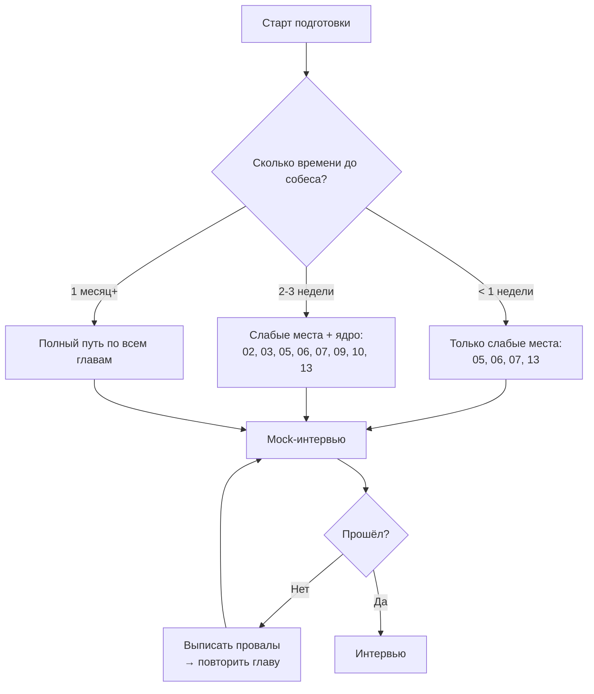
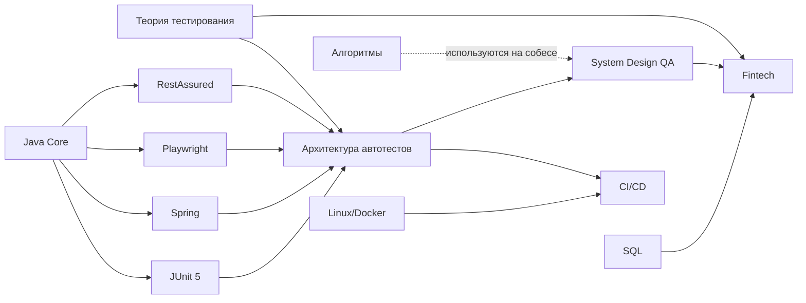
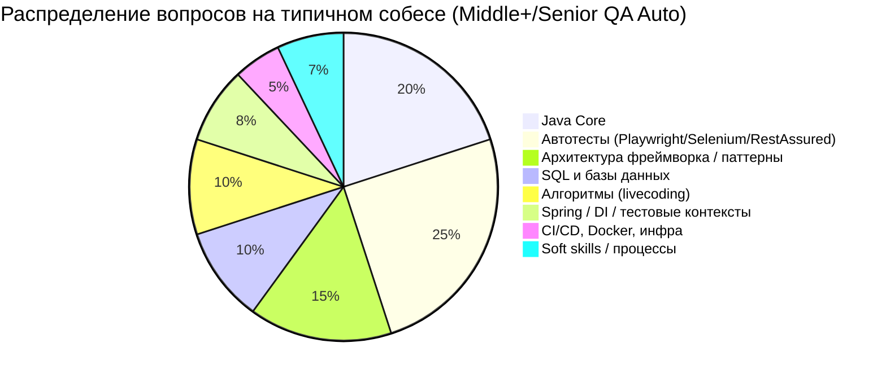
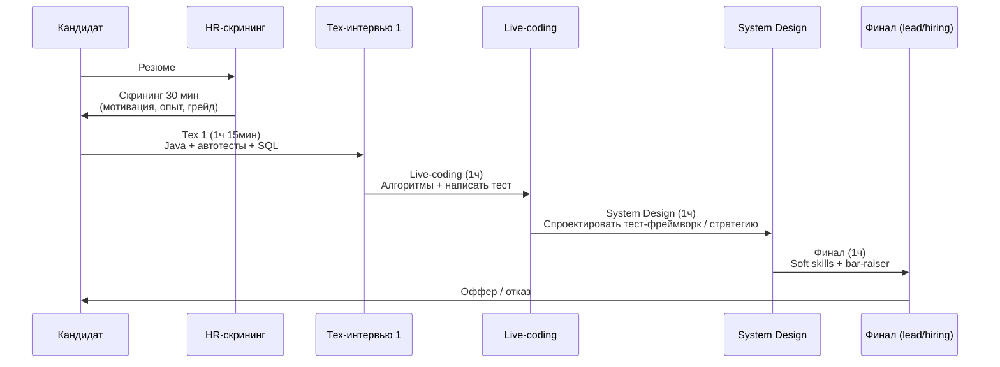

# Гайд по подготовке к собеседованию: QA Automation Java (Middle+ / Senior)

> **Цель:** дать структурированный набор вопросов и ответов с примерами кода и диаграммами,
> покрывающий ~95% типовых тем интервью в российских продуктовых компаниях (с упором на fintech).
>
> **Стек:** Java + JUnit 5 + Maven + Playwright (UI) + RestAssured (API) + Allure + Spring.
>
> **Формат:** markdown с mermaid-диаграммами и фрагментами кода.

---

## Как пользоваться гайдом

1. Сначала пройди **[00. Roadmap и стратегия подготовки](#roadmap-подготовки)** ниже.
2. Закрой пробелы по слабым темам в первую очередь:
   - `05` — Playwright Java
   - `06` — RestAssured (чистый синтаксис)
   - `07` — Spring для тестировщика
   - `13` — Алгоритмы и структуры данных
3. Каждая глава = отдельный `.md` файл с вопросами/ответами и кодом.
4. В конце каждой главы — **чек-лист самопроверки** и ссылки на видео.

---

## Структура гайда

| #   | Глава                                                                  | Приоритет     | Прим. кол-во вопросов |
| --- | ---------------------------------------------------------------------- | ------------- | --------------------- |
| 01  | [Теория тестирования](./01-testing-theory.md)                          | средний       | 30                    |
| 02  | [Java Core (средний уровень)](./02-java-core.md)                       | высокий       | 40                    |
| 03  | [JUnit 5](./03-junit5.md)                                              | высокий       | 25                    |
| 04  | [Maven](./04-maven.md)                                                 | средний       | 18                    |
| 05  | [Playwright Java](./05-playwright-java.md)                             | **критичный** | 35                    |
| 06  | [RestAssured (чистый синтаксис)](./06-rest-assured.md)                 | **критичный** | 30                    |
| 07  | [Spring для QA Automation](./07-spring-for-qa.md)                      | **критичный** | 40                    |
| 08  | [Allure Report](./08-allure.md)                                        | средний       | 18                    |
| 09  | [Архитектура автотестов и паттерны](./09-test-architecture.md)         | высокий       | 25                    |
| 10  | [SQL и базы данных](./10-sql.md)                                       | высокий       | 30                    |
| 11  | [Linux / Bash / Docker / K8s](./11-linux-docker-k8s.md)                | средний       | 25                    |
| 12  | [CI/CD (Jenkins, GitLab CI, GitHub Actions)](./12-cicd.md)             | средний       | 18                    |
| 13  | [Алгоритмы и структуры данных](./13-algorithms.md)                     | **критичный** | 30                    |
| 14  | [System Design для QA](./14-system-design-qa.md)                       | высокий       | 12                    |
| 15  | [Fintech-специфика тестирования](./15-fintech-specifics.md)            | высокий       | 18                    |
| 16  | [Soft skills и поведенческое интервью](./16-soft-skills.md)            | средний       | 18                    |

**Итого:** ~410 вопросов с развёрнутыми ответами, кодом и диаграммами.

---

## Roadmap подготовки

### Карта зависимостей тем

---

## Что спрашивают на интервью в РФ-продуктовых (по опыту 2025–2026)

### Типовая воронка собеседования (fintech, продуктовая компания)

---

## Видеоматериалы (общие, по конкретным темам — внутри глав)

### Русскоязычные каналы и доклады

- **Heisenbug** — https://www.youtube.com/@HeisenbugConf — главная российская конференция по тестированию, доклады по автоматизации, архитектуре, fintech-тестированию.
- **QA Guild** — https://www.youtube.com/@QAGuild — митапы, разборы инструментов.
- **Test IT** — https://www.youtube.com/@TestIT_TMS — практика автоматизации.
- **JUG Ru / Joker** — https://www.youtube.com/@JUGRU — Java-фундаментал, нужен для прокачки Core.
- **Артём Русов** — каналы с практикой Selenium/Playwright.

### Англоязычные

- **Test Automation University** — https://testautomationu.applitools.com — бесплатные курсы по всем инструментам, включая Playwright, RestAssured, Allure.
- **JetBrains TV** — https://www.youtube.com/@JetBrainsTV — IntelliJ + Java.
- **Spring Developer** — https://www.youtube.com/@SpringSourceDev — официальный канал Spring.
- **ToolsQA** — https://toolsqa.com — статьи и видео по RestAssured/Selenium.

---

## Чек-лист готовности к интервью

- [ ] Могу за 60 секунд объяснить архитектуру моего текущего тест-фреймворка
- [ ] Знаю, какие задачи решает Spring и могу написать тест с `@SpringBootTest`
- [ ] Пишу Page Object на Playwright Java «с листа» без подсматривания
- [ ] Пишу запрос на чистом RestAssured (`given().when().then()`) без обёрток
- [ ] Решаю задачи Easy/Medium с LeetCode за 20–30 мин (массивы, hash maps, строки)
- [ ] Пишу SQL-запрос с JOIN + GROUP BY + window function
- [ ] Объясняю разницу между `==` и `equals`, `HashMap` и `ConcurrentHashMap`
- [ ] Знаю, как настроить параллельный прогон в JUnit 5 + Maven Surefire
- [ ] Понимаю идемпотентность, eventual consistency, ACID — и как это тестировать
- [ ] Могу спроектировать стратегию автотестов для нового сервиса за 30 мин на доске

---

## Лицензия и обновления

Гайд написан под конкретного кандидата с учётом слабых мест.
Регулярно обновляй чек-листы по итогам пройденных собесов — это самый ценный источник правок.
